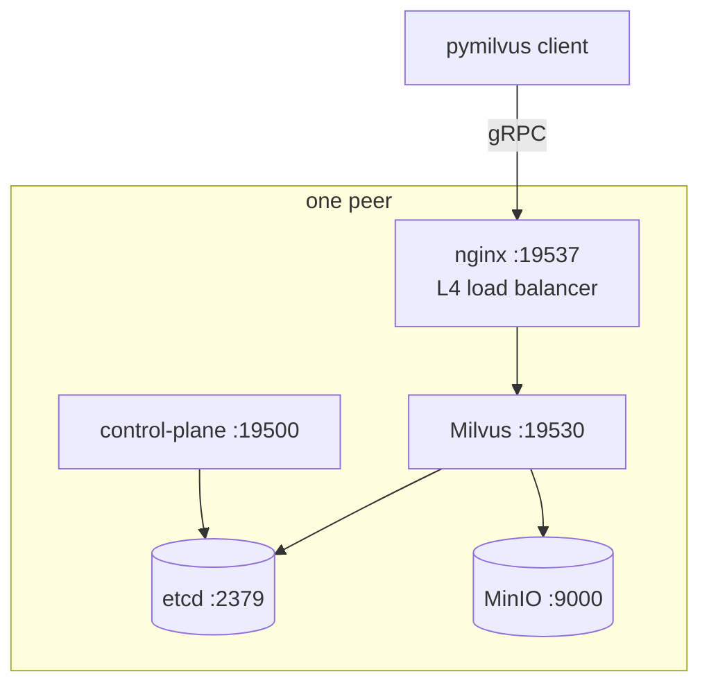

## Introduction

Vector search has become a working tool for production search, recommendations, RAG pipelines, and similarity workloads. [Milvus](https://milvus.io) is one of the leading open-source vector databases, and most teams running it at scale are running it the way the docs recommend — through the Milvus Operator on a Kubernetes cluster.

That's a great fit when you already have Kubernetes. It's a poor fit when you don't.

A surprising number of teams sit between two extremes. They've outgrown single-host Milvus standalone (one VM, no replicas, downtime when the VM blinks) but they don't run Kubernetes — and don't want to bring it in just to host a vector database. They have a fleet of plain Linux VMs: physical, virtual, on-prem, in a private subnet, on a cloud provider, in a regulated environment where Kubernetes isn't permitted, or simply on a budget where a full operator deploy is overkill.

[milvus-onprem](https://github.com/codeadeel/milvus-onprem) is for those teams. It's a single CLI that deploys high-availability Milvus across N Linux VMs without Kubernetes. The cluster runs on plain Docker Compose with a small Python control-plane daemon co-located on every peer. There is no orchestrator. Every peer is identical. The cluster is self-organizing.

This post walks through the design and the trade-offs.

## What "no orchestrator" actually means

Kubernetes solves a real problem. It manages container lifecycle across a fleet of hosts, schedules work onto healthy nodes, drains failed ones, and exposes a single API for cluster state. The Milvus Operator builds on top of this to manage Milvus-specific lifecycle: rolling upgrades, replica counts, backups, and so on.

When you remove Kubernetes, you don't get to skip those problems — you have to solve them another way. milvus-onprem's answer:

- **Container lifecycle** is handled by Docker's `restart: always` plus a per-peer health watcher. Healthy containers stay up, unhealthy ones are restarted in place, and broken peers are visible to operators via journal alerts.
- **Cluster state** lives in etcd. Every peer runs an etcd member. Cluster-wide configuration is stored as etcd keys; topology changes are coordinated through etcd transactions.
- **Coordination** is handled by leader election. Every peer runs the control-plane daemon; one is elected leader via an etcd lease; the leader serves writes and the followers serve reads, redirecting writes to the leader.
- **Object storage** runs as distributed MinIO across all peers, erasure-coded so a host loss doesn't take the bucket offline.
- **Load balancing** runs as nginx Layer-4 on every peer. Clients connect to any peer's nginx and are routed to a healthy Milvus.

A 3-VM cluster ends up with 3 etcd members, 3 distributed MinIO drives, 3 Milvus instances behind 3 nginx LBs, and 3 control-plane daemons electing a leader. Lose any one peer and the other two stay healthy and serving.

## The shape per peer

Per VM, the deployment lands roughly five containers:



Every peer carries the full set. Cross-peer, etcd participates in Raft, MinIO drives erasure-code together, the control-plane daemons participate in leader election, and the Milvus instances share the same etcd metadata and MinIO segment storage so they form a single logical Milvus cluster. nginx round-robins gRPC traffic across all peers' Milvus.

Milvus 2.6 added an embedded WAL (Woodpecker), so the message-queue dependency that older versions required is gone — that's the recommended version for new deploys. Milvus 2.5 still uses Pulsar as its MQ, which means a 2.5 cluster also has a Pulsar singleton on one designated peer. The CLI handles both versions transparently.

## Five-minute deploy

The whole flow is three commands, with the second one running on every peer except the first:

```bash
# clone on every peer
git clone https://github.com/codeadeel/milvus-onprem.git ~/milvus-onprem
cd ~/milvus-onprem

# on the first peer (the bootstrap)
./milvus-onprem init --mode=distributed \
                     --milvus-version=v2.6.11 \
                     --ha-cluster-size=3
# init prints a `./milvus-onprem join <bootstrap-ip>:19500 <token>` line

# on every other peer
./milvus-onprem join <bootstrap-ip>:19500 <token>

# on any peer
./milvus-onprem status     # all green
./milvus-onprem smoke      # functional test
```

There's no Kubernetes to install, no operator pod to run, no cluster CRD to define. `init` and `join` handle the work — rendering compose templates per peer, prepping host data directories, bringing up containers in dependency order, joining etcd via member-add, distributing the cluster's shared configuration to peers via the control plane.

Adding a 4th VM later is the same one command. `./milvus-onprem join ...` on the new peer; the leader fans the topology change out to existing peers, and the new node falls into the existing etcd Raft and MinIO pool.

## The control plane

Cluster-mutating operations don't run via SSH-to-each-peer scripting. They go through the control-plane daemon, which runs as one container per peer. The daemon exposes an authenticated HTTP API with a job system for long-running operations:

- `create-backup` — milvus-backup snapshot to MinIO
- `export-backup` / `restore-backup` — move backups between filesystems and clusters
- `backup-etcd` — snapshot etcd
- `rotate-token` — rotate the cluster's bearer token across every peer atomically
- `remove-node` — graceful peer removal with drain
- `migrate-pulsar` — move the 2.5 Pulsar singleton to a different peer
- `upgrade` — rolling Milvus image-tag upgrade

When an operator runs the corresponding CLI command, the CLI POSTs a job to the leader's `/jobs` endpoint and the leader's worker executes it, fanning out to other peers via daemon-to-daemon HTTP. There's no SSH between peers anywhere in the codebase — production environments rarely allow it, and the daemon's HTTP control plane is the supported transport.

A watchdog runs inside the same daemon. It polls every container's healthcheck and, if a local container goes unhealthy for N consecutive ticks, restarts it in place. Cross-peer reachability is also probed; if a peer disappears for N ticks, the leader emits a `PEER_DOWN_ALERT` line to the journal so monitoring picks it up.

## The MinIO trade-off worth knowing about

MinIO is the storage layer underneath Milvus. There are two practical ways to lay out a multi-host MinIO cluster, and milvus-onprem supports both via an `init --ha-cluster-size=N` flag:

| Layout | Scale-out | Host-loss tolerance |
|---|---|---|
| Default (per-host pools) | Trivial — joining a peer just appends a new pool. | None. Losing a host loses a pool, and any read against the bucket errors until that host comes back. Milvus's streamingnode crashes on boot in that state and the cluster goes dark. |
| `--ha-cluster-size=N` (wide pool) | First N peers form one pool with N drives, erasure-coded. Peers joining beyond N land as additional per-host pools. | Loss of any single host tolerated for both reads and writes. |

For an operator who values host-loss tolerance more than effortless scale-out — most production deploys — passing `--ha-cluster-size=3` (or whatever the cluster size is) at init is the right move. The repo's failover doc has the full trade-off; the README's quickstart uses the wide-pool layout by default.

## Backups and migrations

Every cluster gets the official `milvus-backup` binary integrated as a daemon worker. Backups land in MinIO, `export-backup` copies them out to a filesystem path, and `restore-backup` brings them back into the same or a different cluster — including across major versions (a 2.5 backup restores cleanly into a 2.6 cluster). Etcd snapshots are a separate, smaller knob via `backup-etcd`.

For the rare case of a totally lost peer (VM gone, disk wiped), the troubleshooting doc walks through the `etcdctl member remove` plus `member add` plus fresh `join --existing` recovery procedure. The cluster heals itself: MinIO erasure coding reconstructs the dead peer's drive share automatically once the replacement comes online.

## What this isn't

milvus-onprem is intentionally not:

- A replacement for the Milvus Operator on Kubernetes. If you already run Kubernetes, the Operator is the right tool.
- A managed service. There's no SaaS layer; you run it on your own VMs.
- A multi-tenant Milvus. It's a single cluster per deployment. Multi-tenancy lives in Milvus's own database and collection model, not at the deploy layer.

It's also intentionally simple. The whole codebase is a few hundred lines of Bash plus a small FastAPI daemon, well under five thousand lines of code total. Every concern lives in its own file under `lib/` or `daemon/`. If something doesn't work, it's the kind of codebase you can read in an afternoon and patch.

## Conclusion

Vector databases at HA don't have to mean Kubernetes. For teams with a fleet of plain Linux VMs and no orchestrator, milvus-onprem fills the gap between single-host standalone and a full operator deploy. Three commands, N peers, self-organizing, transparent to operate.

The repository is on GitHub at [codeadeel/milvus-onprem](https://github.com/codeadeel/milvus-onprem) under Apache 2.0. Issues, PRs, and feedback are welcome.

## References

- [milvus-onprem on GitHub](https://github.com/codeadeel/milvus-onprem)
- [Milvus](https://milvus.io)
- [Milvus 2.6 release notes](https://milvus.io/docs/release_notes.md)
- [milvus-backup](https://github.com/zilliztech/milvus-backup)
- [etcd](https://etcd.io)
- [MinIO](https://min.io)
- [nginx](https://nginx.org)
- [Apache Pulsar](https://pulsar.apache.org)
