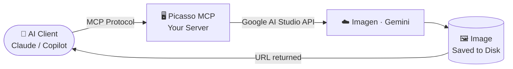
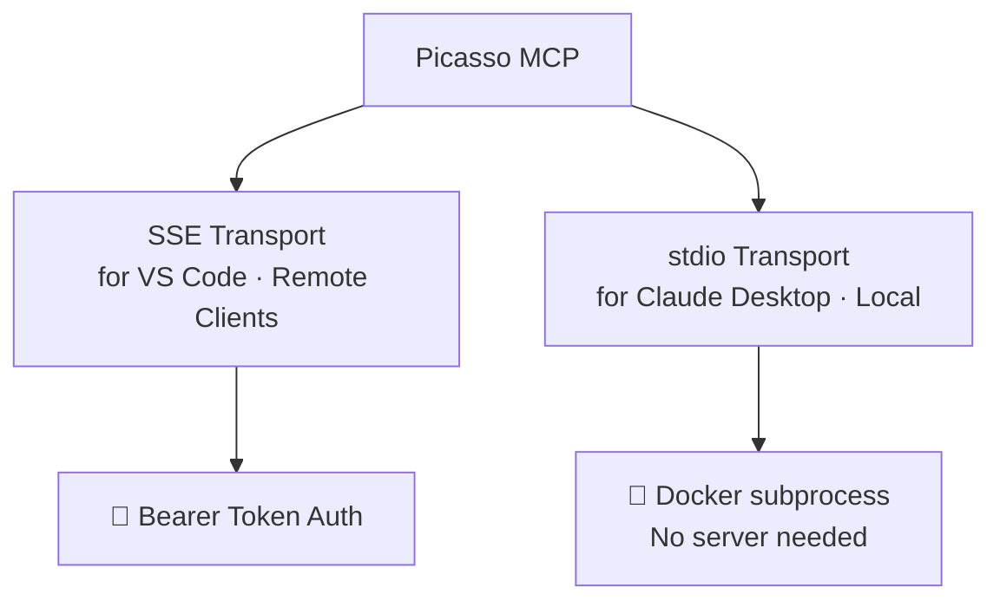
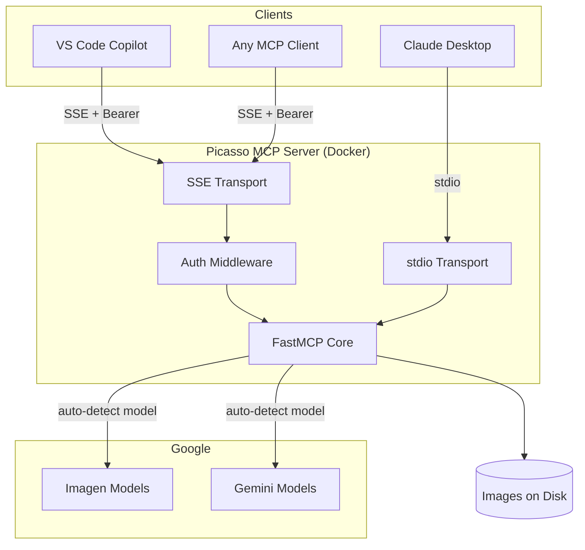
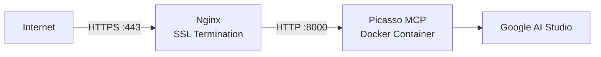

# Picasso MCP

> Give your AI assistant a paintbrush. Self-hosted. One command.

---

## The Problem

You're deep in a project with Claude Desktop or VS Code Copilot, and you need an image — a diagram, a mockup, a placeholder asset. Your AI assistant is great at code, but image generation? That requires jumping to another tab, another tool, another workflow.

**Picasso MCP** closes that gap. It's a self-hosted [MCP (Model Context Protocol)](https://modelcontextprotocol.io/) server that wires Google AI Studio's image generation models directly into your AI coding assistant.

---

## How It Works

At its core, Picasso MCP is a thin bridge between your AI client and Google's Imagen / Gemini image models. Here's the full picture:



The client asks for an image. Picasso MCP forwards the prompt to Google AI Studio, saves the result to disk, and hands back a URL. That's it.

---

## Supported Transports

The server ships with two transport modes, covering both local and remote setups:



- **SSE** — HTTP-based transport, ideal for VS Code + GitHub Copilot or any remote MCP client
- **stdio** — process-based transport, Claude Desktop spawns the container directly as a subprocess

---

## Quick Start

Clone and configure in under two minutes:

```bash
git clone https://github.com/codeadeel/picasso-mcp.git
cd picasso-mcp
```

Edit `docker-compose.yml` with your credentials:

```yaml
GOOGLE_API_KEY: "AIza..."
GOOGLE_MODEL:   "gemini-2.0-flash-exp"
MCP_AUTH_TOKEN: "your-secret-token"
BASE_URL:       "https://mcp.yourdomain.com"
```

Deploy:

```bash
docker compose up -d
```

Done. Your MCP server is live.

---

## Connecting Your AI Client

### VS Code + GitHub Copilot

Add to `.vscode/mcp.json`, switch Copilot to **Agent mode**, and ask it to generate an image:

```json
{
  "servers": {
    "picasso-mcp": {
      "type": "sse",
      "url": "http://YOUR_SERVER_IP:8000/sse",
      "headers": { "Authorization": "Bearer your-secret-token" }
    }
  }
}
```

### Claude Desktop (Remote)

Requires [`mcp-remote`](https://www.npmjs.com/package/mcp-remote) as a bridge and a domain with HTTPS:

```bash
npm install -g mcp-remote
```

```json
{
  "mcpServers": {
    "picasso-mcp": {
      "command": "mcp-remote",
      "args": [
        "https://mcp.yourdomain.com/sse",
        "--header", "Authorization: Bearer your-secret-token"
      ]
    }
  }
}
```

### Claude Desktop (Local, No Server)

Zero infrastructure. Docker runs as a subprocess on your machine:

```json
{
  "mcpServers": {
    "picasso-mcp": {
      "command": "docker",
      "args": [
        "run", "--rm", "-i",
        "-e", "GOOGLE_API_KEY=your-api-key",
        "-e", "GOOGLE_MODEL=gemini-2.0-flash-exp",
        "-e", "MCP_TRANSPORT=stdio",
        "-v", "/tmp/picasso-images:/images",
        "picasso-mcp:latest"
      ]
    }
  }
}
```

---

## Architecture at a Glance



Model selection is automatic — the server detects whether to use Imagen or Gemini based on the `GOOGLE_MODEL` environment variable. No manual switching needed.

---

## Features Summary

| Feature | Details |
|---|---|
| Models | Imagen 3, Gemini 2.0 Flash (auto-detected) |
| Transports | SSE (remote), stdio (local) |
| Auth | Bearer token |
| Deployment | Docker Compose, single command |
| Reverse Proxy | Nginx example config included |
| Images | Saved to disk, URL returned to client |

---

## Production Setup

For a domain + HTTPS deployment, an Nginx example config is included in the repo. Full walkthrough in the [wiki](https://github.com/codeadeel/picasso-mcp/wiki/Nginx-and-HTTPS).



---

## Links

- **GitHub**: [codeadeel/picasso-mcp](https://github.com/codeadeel/picasso-mcp)
- **Wiki — Configuration**: [models & env vars](https://github.com/codeadeel/picasso-mcp/wiki/Configuration)
- **Wiki — AI Clients**: [VS Code & Claude Desktop setup](https://github.com/codeadeel/picasso-mcp/wiki/AI-Clients)
- **Wiki — Authentication**: [Bearer token setup](https://github.com/codeadeel/picasso-mcp/wiki/Authentication)
- **Wiki — MCP Tools**: [tool reference & parameters](https://github.com/codeadeel/picasso-mcp/wiki/MCP-Tools)

