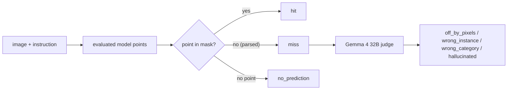
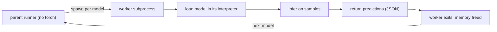

## Introduction

A growing class of vision-language models can do something deceptively simple: look at an image, read a short instruction like "point to the mug on the left," and return a coordinate. That capability, *pointing*, sits underneath a lot of practical systems: robot manipulation, assistive tools that act on what a user describes, UI agents, and any pipeline that has to turn "that one" into a location.

The usual way to evaluate a pointing model is a single number: how often its point lands on the right thing. That number is useful, and it is also incomplete. It tells you the *rate* of failure but nothing about the *kind*. For anything that acts on the output, the kind of failure is often what decides whether the model is usable at all.

[pointfail](https://github.com/codeadeel/pointfail) is a small study and toolkit built around that gap. It evaluates four small, open vision-language models on three pointing benchmarks, and it sorts every miss into one of four failure modes, so the result is not just how often each model is right, but how it tends to be wrong.

This post walks through the idea, the methodology, and what the numbers say.

## Why the kind of failure matters

Two models can share a hit rate and be nothing alike in practice. Picture two that each land on the target 40% of the time. One is a few pixels off on almost every miss; the other, when it misses, points at empty background. With a small tolerance the first is nearly a perfect model; the second is a coin flip that sometimes lands on nothing. The averaged score hides that completely.

pointfail makes the distinction explicit with a four-bucket taxonomy:

| Bucket | Meaning |
|---|---|
| `off_by_pixels` | Correct object, point just outside the target region. |
| `wrong_instance` | Right category, wrong instance. |
| `wrong_category` | Wrong object category. |
| `hallucinated` | A point placed where no valid target exists. |

The buckets run from least to most severe, and the ordering reflects recoverability. A model whose misses cluster in `off_by_pixels` found the right thing and was slightly off; a small spatial tolerance recovers most of those. A model whose misses are mostly `hallucinated` is not locating the target at all. That difference is the whole point of the study.

## Methodology

### Task and outcomes

Each benchmark sample consists of an image, a natural-language instruction, and a binary ground-truth mask marking the acceptable target region. The evaluated model produces free-form text from the image and instruction; a family-specific parser extracts zero or more points, normalized to the unit square. The first extracted point is taken as the primary prediction, and each sample resolves to exactly one outcome:

| Outcome | Condition |
|---|---|
| `hit` | The primary point falls inside the ground-truth mask. |
| `miss` | A point was parsed but falls outside the mask. |
| `no_prediction` | No point could be parsed from the output. |

The hit test is a pixel lookup, so the primary metric involves no model judgment.

### The two-stage protocol



**Stage 1 (geometric).** Prompts are constructed per model family: benchmark-supplied answer-format directives are removed, and the core instruction is wrapped in the phrasing that elicits each family's native output format (point tags for Molmo, a grounding template for InternVL3, an explicit pixel-coordinate request for Qwen2.5-VL). Parsing follows each family's coordinate convention (0 to 100 for Molmo, box centers on a 0 to 1000 scale for InternVL3, absolute pixels for Qwen2.5-VL). Scoring is the mask lookup defined above.

**Stage 2 (semantic).** Each miss is rendered as an annotated image: the ground-truth region tinted, the predicted point marked. The annotated image and the original instruction are presented to a judge model, which must select exactly one taxonomy label. The judge may abstain when no single label fits; abstentions are reported rather than forced into a bucket.

### The judge

The judge is Gemma 4 in its 32B variant, accessed through Ollama. Two design constraints motivate the choice. First, the judge is out-of-family: none of the evaluated models is a Gemma derivative, so no model is graded by a system that shares its training lineage or output habits. Second, the judge sees only misses. Hits and unparseable outputs never reach it, so the headline hit rate is unaffected by any judge bias or error. If you distrust the judge entirely, the hit / miss / no-prediction numbers still stand on their own. Classification requests are independent per sample and are issued concurrently; the judge is never resident on the evaluation machine.

### One model at a time

The evaluated models require mutually incompatible dependency sets (the Molmo family and InternVL3 target one `transformers` release line; Qwen2.5-VL requires a newer one). Each model therefore runs in its own subprocess and interpreter:



The parent process performs no model inference: it dispatches requests as JSON and collects predictions. Exactly one model is resident at any time, the operating system reclaims all model memory when each worker exits, and every model loads in exactly the environment that can run it.

## Running it

The library is import-light: `import pointfail` pulls in no torch or transformers until you touch something that needs them.

```python
from pointfail import scorePrediction

# parse a model's raw output in its own coordinate convention and test it
result = scorePrediction(
    family="molmo",
    rawText='<point x="50.0" y="50.0">mug</point>',
    imagePath="image.png",
    maskPath="mask.png",
)
print(result["primary"], result["inMask"])
```

The per-sample records ship in the repository, so the summary table and figures regenerate offline, with no GPU, from committed data, and a notebook does exactly that.

## What the numbers say

Four models (Molmo-7B-D, MolmoE-1B, Qwen2.5-VL-3B, InternVL3-2B) across Point-Bench, Where2Place, and RefSpatial-Bench, for 5,436 individual pointing attempts. Point-in-mask hit rate (percent):

| Model | Point-Bench | Where2Place | RefSpatial-Bench |
|---|--:|--:|--:|
| Molmo-7B-D | 68.3 | 24.0 | 46.9 |
| Qwen2.5-VL-3B | 38.6 | 25.0 | 25.6 |
| InternVL3-2B | 15.7 | 17.0 | 1.1 |
| MolmoE-1B | 14.3 | 10.0 | 2.5 |


The rate is only half the story. The failure profile is the other half:


Reading the two together:

- **Molmo-7B-D** is the strongest by a wide margin and also fails the most gracefully: a large share of its misses are `off_by_pixels`, the near-miss bucket.
- **Qwen2.5-VL-3B** is second on hit rate, but on Point-Bench it returns no parseable point 221 times out of 982. Its usable accuracy is lower than the headline suggests, and it needs a fallback path for the answers it declines to give.
- **InternVL3-2B** and **MolmoE-1B** are weak everywhere, and their misses are dominated by `hallucinated`: when they are wrong, they are usually pointing at nothing in particular. That is a more dangerous failure than being slightly off.
- **RefSpatial-Bench** is the most discriminating of the three. It pulls the field apart (Molmo-7B-D at 46.9% against roughly 1 to 3% for the two weakest), which makes it the most useful benchmark for telling these models apart.

The practical reading: hit rate alone is a weak way to pick a model. If a small tolerance is acceptable, Molmo-7B-D's near-misses are often recoverable; a model that mostly hallucinates gives you nothing to recover from. (One bookkeeping note: the judge may decline a label on genuinely ambiguous misses, so bucket counts can sum to slightly less than the miss count; the repository's results table shows that gap explicitly.)

## What this isn't

pointfail is intentionally not:

- A leaderboard of the best pointing models. It studies the small, open, locally-runnable segment on purpose; there is no large proprietary ceiling model in the pool.
- A training method. It measures and diagnoses; it doesn't fine-tune anything.
- A general grounding benchmark. It is about pointing specifically (a single coordinate against a target mask), not boxes, captions, or VQA.

It is also small by design. The pipeline is a handful of readable modules: coordinate parsers per model family, a point-in-mask geometric pass, a judge, a subprocess runner, and an aggregator. It's the kind of codebase you can read in a sitting and adapt to your own models or benchmarks.

## Conclusion

For pointing models, *how* a model fails is often as important as how often. A single accuracy number flattens that away; a failure taxonomy brings it back. pointfail is a compact, reproducible way to measure both: geometry for the rate, an out-of-family judge for the kind. The result is a per-model profile you can actually make a deployment decision from.

The study in numbers:

| | |
|---|--:|
| Models evaluated | 4 |
| Benchmarks | 3 |
| Pointing attempts scored | 5,436 |
| Misses judged | 3,415 |
| Misses cleanly classified into the four modes | 3,151 |
| Overall hit-rate spread | 60.7% (best) to 11.6% (worst) |

The repository is on GitHub at [codeadeel/pointfail](https://github.com/codeadeel/pointfail) under the MIT license, with the full per-sample results, generated tables and figures, documentation, runnable examples, and a reproducibility notebook. Issues, PRs, and feedback are welcome.

## References

- [pointfail on GitHub](https://github.com/codeadeel/pointfail)
- Molmo and PixMo ([arXiv:2409.17146](https://arxiv.org/abs/2409.17146))
- Qwen2.5-VL Technical Report ([arXiv:2502.13923](https://arxiv.org/abs/2502.13923))
- InternVL3 ([arXiv:2504.10479](https://arxiv.org/abs/2504.10479))
- PointArena / Point-Bench ([arXiv:2505.09990](https://arxiv.org/abs/2505.09990))
- RoboPoint / Where2Place ([arXiv:2406.10721](https://arxiv.org/abs/2406.10721))
- RoboRefer / RefSpatial-Bench ([arXiv:2506.04308](https://arxiv.org/abs/2506.04308))
- [Ollama](https://ollama.com)
