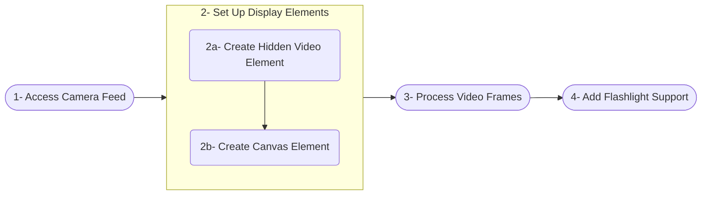

<div style="display: flex; justify-content: center; align-items: center; height: 100%;">
  <video src="https://storage.googleapis.com/codeadeel-github/Generic/Blogger/reactQrCameraVideo.mov" width="35%" height="35%" autoplay loop muted></video>
</div>

## Introduction

QR codes—those small, square patterns of black and white dots—might look simple, but they’re incredibly powerful. Short for Quick Response codes, they can store anything from website URLs to payment details or even Wi-Fi login credentials. You’ve likely scanned one to view a digital menu at a restaurant, join a WhatsApp group, or check in at an event. Today, QR codes are everywhere, bridging the physical and digital worlds with a quick camera snap.

As web applications evolve, there’s a growing need to bring this scanning capability directly into the browser. Imagine a user scanning a QR code on your site to redeem a coupon, share contact info, or log into a service—all without downloading an app. That’s what we’ll build in this guide: a QR code scanner that uses the browser’s camera and even supports the flashlight for dim lighting. We’ll use React.js for the interface and [jsQR](https://github.com/cozmo/jsQR) to detect the codes, keeping everything client-side for simplicity and speed.

## Overview of the Approach

To create the QR code scanner, we’ll follow these steps:



Let’s explore each step in detail.

### Step 1: Accessing the Camera Feed

The first step is to access the user’s camera. We use the [MediaDevices.getUserMedia()](https://developer.mozilla.org/en-US/docs/Web/API/MediaDevices/getUserMedia) API, a standard way to request video or audio from a device. Here, we ask for the rear-facing camera, which is ideal for scanning QR codes.

```jsx
navigator.mediaDevices
    .getUserMedia({ video: { facingMode: "environment" } }) // Use the rear-facing camera
    .then((stream) => {
        video.srcObject = stream; // Set the video source to the camera stream
        video.setAttribute("playsinline", true); // Prevent fullscreen on iOS Safari
        video.play(); // Start video playback

        const track = stream.getVideoTracks()[0]; // Get the video track from the stream
        trackRef.current = track; // Store the track reference for later use
    })
    .catch((err) => {
        console.error("Error accessing camera: ", err); // Log any errors
    });
```

Let’s break it down:
- **`facingMode: "environment"`**: This tells the browser to use the rear camera. If we wanted the front-facing selfie camera, we’d use `"user"`.
- **`srcObject`**: This links the camera stream to our `<video>` element, turning it into a live feed.
- **`playsinline`**: On iOS, videos often go fullscreen by default. This keeps it embedded in our page.
- **`trackRef`**: We save the video track (a stream’s “channel”) in a React ref so we can toggle the flashlight later.
- **`catch`**: If something goes wrong—like the user denying permission—we log the error to debug it.

This step sets the foundation. Once the camera is rolling, we’re ready to process what it sees.

### Step 2: Setting Up Video and Canvas Elements

Now we need a way to capture and analyze the camera feed. We’ll use two HTML elements:
- A **hidden `<video>` element** to stream the camera feed.
- A **visible `<canvas>` element** to draw frames and show the results.

Here’s the setup in our React component:

```jsx
const video = videoRef.current;
const canvas = canvasRef.current;
const ctx = canvas.getContext("2d");

...
return (
    <div>
      <video ref={videoRef} style={{ display: "none" }} /> {/* Hidden video element */}
      <canvas ref={canvasRef} /> {/* Canvas for rendering processed video frames */}
    </div>
);
```

Why this approach?
- **Hidden Video**: The `<video>` element streams the camera feed but stays invisible. We don’t need users staring at a raw video—they’ll see the processed output on the canvas.
- **Canvas Power**: The `<canvas>` is like a digital sketchpad. We can draw each video frame on it, analyze it, and even add graphics (like a red outline around a QR code).
- **Refs**: React’s `useRef` lets us access these DOM elements directly in our code.

Think of the `<video>` as a backstage worker and the `<canvas>` as the stage where the magic happens. This separation keeps our UI clean and our processing flexible.

### Step 3: Create a Function to Process the Video Frame
Here’s where the real action happens: scanning for QR codes. We’ll capture frames from the video, draw them on the canvas, and use the `jsQR` library to detect codes. This needs to run continuously, so it feels like real-time scanning.

```jsx
import jsQR from "jsqr";

...

useEffect(() => {
    ...
    
    // Function to continuously capture frames and detect QR codes
    const tick = () => {
        if (video.readyState === video.HAVE_ENOUGH_DATA) { // Ensure video is ready
            canvas.height = video.videoHeight; // Match canvas height to video
            canvas.width = video.videoWidth; // Match canvas width to video
            ctx.drawImage(video, 0, 0, canvas.width, canvas.height); // Draw the video frame on the canvas
            const imageData = ctx.getImageData(0, 0, canvas.width, canvas.height); // Get image data from the canvas
            const code = jsQR(imageData.data, canvas.width, canvas.height, {
                inversionAttempts: "dontInvert", // QR code detection options
            });
            if (code) {
                drawPolygon(ctx, code.location); // Highlight the QR code location
                onDecode(code.data); // Pass the decoded data to the callback
            }
        }
        requestAnimationFrame(tick); // Schedule the next frame
    };

    requestAnimationFrame(tick); // Start the frame capture loop
}, [onDecode]);
```

Here’s what’s happening:
- **`readyState`**: We check if the video has enough data to process. This avoids errors with an unready stream.
- **`Canvas Sizing`**: We match the canvas to the video’s resolution for accurate scanning.
- **`drawImage`**: This copies the current video frame onto the canvas, like taking a snapshot.
- **`getImageData`**: This grabs the pixel data—every color value in the frame—for `jsQR` to analyze.
- **`jsQR`**: The library scans the pixels and returns a QR code’s data (like a URL) and its position if found.
- **`drawPolygon`**: A helper function (defined later) that outlines the QR code in red.
- **`requestAnimationFrame`**: This browser API runs `tick` before each screen refresh, keeping the scanner smooth and efficient.

This loop is the heart of our scanner. It’s fast enough to feel instant but light enough not to crash your browser.

### Step 4: Adding Flashlight Support
To enable flashlight support, we can use the `track.applyConstraints` method to activate the camera's torch mode. This feature is available through the video track in the stream, which is stored in `trackRef`. To handle this functionality, we can use a separate `useEffect` that runs whenever the flashlight state changes. By setting the `torch` constraint to `true`, we can turn the flashlight on. Additionally, we can create a prop to allow toggling the flashlight on or off as needed.

```jsx
useEffect(() => {
    const track = trackRef.current;
    // Check if the device supports torch (flashlight) control
    if (track && track.getCapabilities().torch) {
        track.applyConstraints({
            advanced: [{ torch: flashlight }], // Toggle the flashlight based on the `flashlight` prop
        }).catch((err) => {
            console.error("Error toggling flashlight: ", err); // Log any errors
        });
    }
}, [flashlight]); // Re-run when flashlight state changes
```

What’s going on:
- **`getCapabilities().torch`**: This checks if the device supports flashlight control. Not all do!
- **`applyConstraints`**: This flips the torch on or off based on the `flashlight` prop (a boolean).
- **Error Handling**: If the toggle fails (e.g., no torch support), we log it quietly.

This feature makes the scanner practical in low-light settings, like a dimly lit room or evening event.

## Full Implementation
Here’s the complete `Camera` component, tying everything together:

```jsx
// camera.jsx
import { useEffect, useRef } from "react";
import jsQR from "jsqr";

export default function Camera({ onDecode, flashlight }) {
    const videoRef = useRef(null); // Reference to the video element
    const canvasRef = useRef(null); // Reference to the canvas element
    const trackRef = useRef(null); // Reference to the video track

    useEffect(() => {
        const video = videoRef.current;
        const canvas = canvasRef.current;
        const ctx = canvas.getContext("2d");

        // Request access to the user's camera
        navigator.mediaDevices
            .getUserMedia({ video: { facingMode: "environment" } }) // Use the rear-facing camera
            .then((stream) => {
                video.srcObject = stream; // Set the video source to the camera stream
                video.setAttribute("playsinline", true); // Prevent fullscreen on iOS Safari
                video.play(); // Start video playback

                const track = stream.getVideoTracks()[0]; // Get the video track from the stream
                trackRef.current = track; // Store the track reference for later use
            })
            .catch((err) => {
                console.error("Error accessing camera: ", err); // Log any errors
            });
        
        // Function to draw a polygon around the detected QR code
        const drawPolygon = (ctx, location) => {
            const {
                bottomLeftCorner,
                bottomRightCorner,
                topRightCorner,
                topLeftCorner,
            } = location;

            ctx.beginPath();
            ctx.moveTo(topLeftCorner.x, topLeftCorner.y); // Start at the top-left corner
            ctx.lineTo(topRightCorner.x, topRightCorner.y); // Draw line to the top-right corner
            ctx.lineTo(bottomRightCorner.x, bottomRightCorner.y); // Draw line to the bottom-right corner
            ctx.lineTo(bottomLeftCorner.x, bottomLeftCorner.y); // Draw line to the bottom-left corner
            ctx.closePath(); // Close the path (back to the starting point)
            ctx.strokeStyle = "red"; // Set the stroke color
            ctx.lineWidth = 2; // Set the line width
            ctx.stroke(); // Render the outline of the polygon
        };
        
        // Function to continuously capture frames and detect QR codes
        const tick = () => {
            if (video.readyState === video.HAVE_ENOUGH_DATA) { // Ensure video is ready
                canvas.height = video.videoHeight; // Match canvas height to video
                canvas.width = video.videoWidth; // Match canvas width to video
                ctx.drawImage(video, 0, 0, canvas.width, canvas.height); // Draw the video frame on the canvas
                const imageData = ctx.getImageData(0, 0, canvas.width, canvas.height); // Get image data from the canvas
                const code = jsQR(imageData.data, canvas.width, canvas.height, {
                    inversionAttempts: "dontInvert", // QR code detection options
                });
                if (code) {
                    drawPolygon(ctx, code.location); // Highlight the QR code location
                    onDecode(code.data); // Pass the decoded data to the callback
                }
            }
            requestAnimationFrame(tick); // Schedule the next frame
        };

        requestAnimationFrame(tick); // Start the frame capture loop
    }, [onDecode]);

    useEffect(() => {
        const track = trackRef.current;
        // Check if the device supports torch (flashlight) control
        if (track && track.getCapabilities().torch) {
            track.applyConstraints({
                advanced: [{ torch: flashlight }], // Toggle the flashlight based on the `flashlight` prop
            }).catch((err) => {
                console.error("Error toggling flashlight: ", err); // Log any errors
            });
        }
    }, [flashlight]); // Re-run when flashlight state changes

  return (
    <div>
      <video ref={videoRef} style={{ display: "none" }} /> {/* Hidden video element */}
      <canvas ref={canvasRef} /> {/* Canvas for rendering video frames and QR code detection */}
    </div>
  );
}
```

## How to Use It?

Integrate the `Camera` component into your app like this:

```jsx
// App.jsx
import { useState } from "react";
import { Button } from "@heroui/button";
import Camera from "./components/camera";

export default function App() {
  const [qrData, setQrData] = useState("");
  const [flashlight, setFlashlight] = useState(false);

  const handleDecode = (data) => {
    // Handle the decoded QR code data
    // For example, you can display it or send it to a server
    setQrData(data);
  };

  const handleFlashlightToggle = () => {
    // Toggle the flashlight state
    // This will turn the flashlight on or off
    setFlashlight((prev) => !prev);
  }

  return (
    <div>
      <Camera onDecode={handleDecode} flashlight={flashlight} />
      <Button color="danger" variant="shadow" onPress={handleFlashlightToggle}>Flashlight</Button>
      <p>QR Code Data: {qrData}</p>
    </div>
  );
}
```
This app:
- Displays the scanner via the `<canvas>`.
- Toggles the flashlight with a button.
- Shows the decoded QR code text below.

## Conclusion

We’ve built a QR code scanner from scratch using React.js and the browser’s camera API. It accesses the camera, processes frames with `jsQR`, highlights detected codes, and even controls the flashlight—all in a lightweight, client-side package. This is a practical example of how modern web tech can solve real-world problems without extra apps or servers.

The beauty of this project is its flexibility. You can drop it into an e-commerce site, a ticketing system, or a personal tool. Play with the code—adjust the frame rate, tweak the UI, or add new features. If you run into snags or have ideas to share, drop a comment below. Happy scanning!

## References

- [QR code detection in JavaScript](https://github.com/cozmo/jsQR)
- [Camera access API](https://developer.mozilla.org/en-US/docs/Web/API/MediaDevices/getUserMedia)
- [Flashlight control docs](https://developer.mozilla.org/en-US/docs/Web/API/MediaTrackConstraints)
- [Smooth animation API](https://developer.mozilla.org/en-US/docs/Web/API/window/requestAnimationFrame)
- [Background on QR codes](https://en.wikipedia.org/wiki/QR_code)
