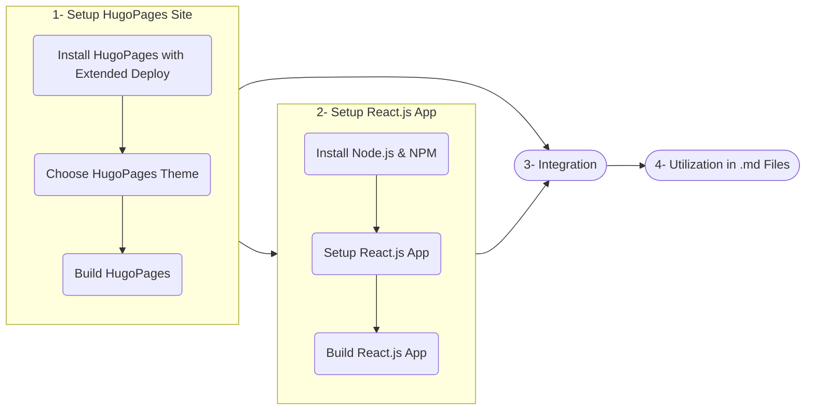

## Introduction

Hugo, a static site generator written in Go, is renowned for its speed and flexibility, making it a popular choice for building static websites. React.js, on the other hand, is a powerful JavaScript library for creating dynamic and interactive user interfaces. Combining these two technologies allows developers to leverage Hugo's static site generation capabilities while enhancing interactivity with React.js components. This guide provides a detailed walkthrough of integrating React.js with Hugo, using the Hextra theme as an example.

## Why Integrate React.js with Hugo?

Static site generators like Hugo excel in performance and simplicity but often lack interactivity. By integrating React.js, you can:

- Add dynamic components to your static site.
- Enhance user experience with interactive elements.
- Maintain the benefits of a static site, such as fast load times and SEO optimization.

## Base Steps
Integrating React.js with Hugo involves setting up a Hugo site with the extended version, selecting a theme, and building the static site. Next, a React.js application is created using modern tools like Vite, with additional configurations for styling and accessibility. The integration process combines the outputs of both Hugo and React.js, ensuring seamless embedding of React.js components within the static site. Finally, React.js components are utilized in Hugo Markdown files to enhance interactivity while maintaining the performance and SEO benefits of a static site.



## Step 1: Setting Up a Hugo Site
Setting up a Hugo site involves installing the Hugo extended version, selecting a theme, and building the site. Hugo's extended version provides additional features like Sass/SCSS processing, which are essential for modern web development. Choosing a theme, such as the Hextra theme, simplifies the process of creating visually appealing and functional websites. Once the setup is complete, you can build and serve the site locally or prepare it for production deployment.

### Installing Hugo Extended Version

To get started, install the extended version of Hugo, which includes additional features like Sass/SCSS processing. Follow these steps:

1. **Install Go**: Hugo requires Go to be installed. Download the latest version from [Go's official site](https://go.dev/dl/).
   ```bash
   wget https://go.dev/dl/go1.24.3.linux-amd64.tar.gz
   sudo tar -C /usr/local -xzf go1.24.3.linux-amd64.tar.gz
   export PATH=$PATH:/usr/local/go/bin
   go version
   ```

2. **Install Hugo**: Download the latest Hugo extended version from [Hugo's GitHub releases](https://github.com/gohugoio/hugo/releases).
   ```bash
   wget https://github.com/gohugoio/hugo/releases/download/v0.147.2/hugo_extended_withdeploy_0.147.2_linux-amd64.deb
   sudo dpkg -i hugo_extended_withdeploy_0.147.2_linux-amd64.deb
   ```

### Choosing a Theme

For this guide, we use the [Hextra theme](https://imfing.github.io/hextra/), a lightweight and feature-rich Hugo theme. Clone the starter template from its [GitHub repository](https://github.com/imfing/hextra-starter-template) to get started.


*Figure 1: Hextra Page Template Theme*

### Building the Hugo Site

Run the following commands to build and serve your Hugo site:
```bash
# For local development
hugo server --bind 0.0.0.0

# For production
hugo --gc --minify --baseURL="http://localhost:1313/"
```

## Step 2: Setting Up a React.js Application
Setting up a React.js application involves installing Node.js and NPM, creating a React.js app using Vite, and configuring additional tools like Tailwind CSS and HeroUI. Vite is chosen for its modern build capabilities and fast development environment. Tailwind CSS and HeroUI enhance the styling and accessibility of the React.js components, ensuring a seamless integration with the Hugo site.

### Installing Node.js and NPM

Install Node.js and NPM using [nvm](https://github.com/nvm-sh/nvm):
```bash
curl -o- https://raw.githubusercontent.com/nvm-sh/nvm/v0.40.3/install.sh | bash
nvm install 22
```

### Creating a React.js App with Vite

Vite is a modern build tool that offers fast development and optimized builds. Create a new React.js app using Vite:
```bash
npm create vite@latest
# Choose React and JavaScript
```

### Adding Tailwind CSS and HeroUI

Tailwind CSS is a utility-first CSS framework, and HeroUI provides accessible React.js components. Follow the [Tailwind CSS installation guide](https://tailwindcss.com/docs/installation) and [HeroUI documentation](https://www.heroui.com/) to set them up.

### Building the React.js App

After developing your React.js app, build it using:
```bash
npm run build
```

To ensure compatibility with Hugo's public directory structure, update the `base` path in `vite.config.js`:
```javascript
import { defineConfig } from 'vite';
import react from '@vitejs/plugin-react';

export default defineConfig({
  plugins: [react()],
  base: './', // Ensures relative paths for assets
});
```

## Step 3: Integrating React.js with Hugo

Integrating React.js with Hugo involves building both the Hugo site and the React.js app, and then combining their outputs. This step ensures that the React.js components are seamlessly embedded within the Hugo-generated static site. Automation tools like GitHub Actions can further streamline this process, making it efficient and repeatable.


*Figure 2: Demo Card Structure Main Page*

### Building and Copying Files

1. Build the Hugo site:
   ```bash
   hugo --gc --minify --baseURL="http://localhost:1313/"
   ```

2. Build the React.js app:
   ```bash
   npm run build
   ```

3. Copy the React.js app's output to Hugo's `public` directory:
   ```bash
   cp -r dist/* ../public/
   ```

### Automating with GitHub Actions

Automate the integration process using GitHub Actions. Below is a sample workflow:
```yaml
- name: Setup Go
  uses: actions/setup-go@v5
  with:
    go-version: '1.24'

- name: Setup Hugo Pages
  uses: actions/configure-pages@v4

- name: Setup Node.js
  uses: actions/setup-node@v4
  with:
    node-version: '22'

- name: Install & Build Node Modules
  run: |
    cd cardmaker
    npm install
    npm run build
    cd ../

- name: Build Hugo Site
  run: |
    hugo --gc --minify --baseURL="${{ steps.pages.outputs.base_url }}/"

- name: Move React.js App to Public
  run: |
    mv ./cardmaker/dist ./public
```

## Step 4: Utilizing React.js in Hugo Markdown Files

Utilizing React.js components in Hugo Markdown files involves embedding them using `<iframe>` tags. This approach allows you to integrate dynamic React.js elements into the static content generated by Hugo, enhancing the overall user experience.

Embed React.js components in Hugo's Markdown files using `<iframe>` tags. For example:
```html
<iframe src="/path-to-react-app/index.html" width="100%" height="100%"></iframe>
```

## Conclusion

Integrating React.js with Hugo combines the best of both worlds: Hugo's speed and simplicity with React.js's interactivity. This approach is ideal for developers looking to build fast, interactive, and SEO-friendly websites. By following this guide, you can create a seamless integration that enhances user experience while maintaining the benefits of a static site.

## References

- [Hugo Documentation](https://gohugo.io/)
- [React.js Documentation](https://react.dev/)
- [Vite Documentation](https://vitejs.dev/)
- [Tailwind CSS Documentation](https://tailwindcss.com/)
- [HeroUI Documentation](https://www.heroui.com/)
- [Hextra Theme Documentation](https://imfing.github.io/hextra/)
