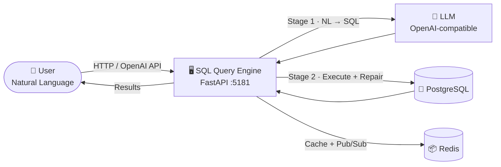
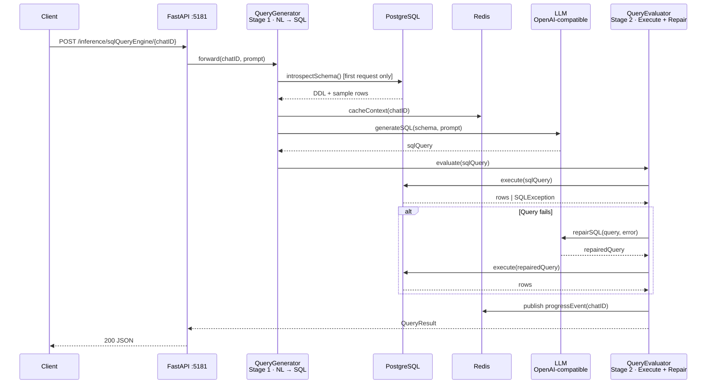
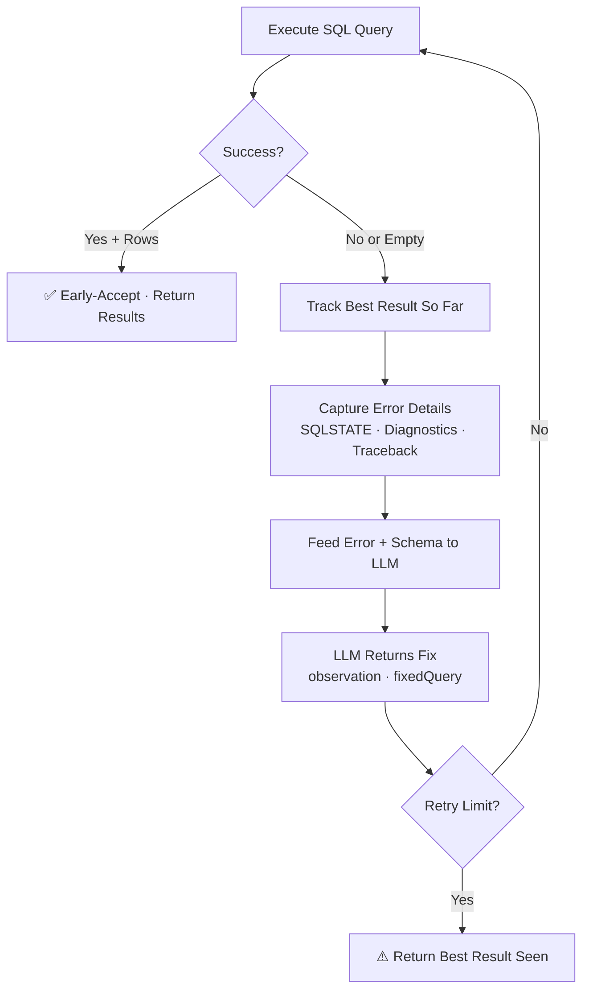
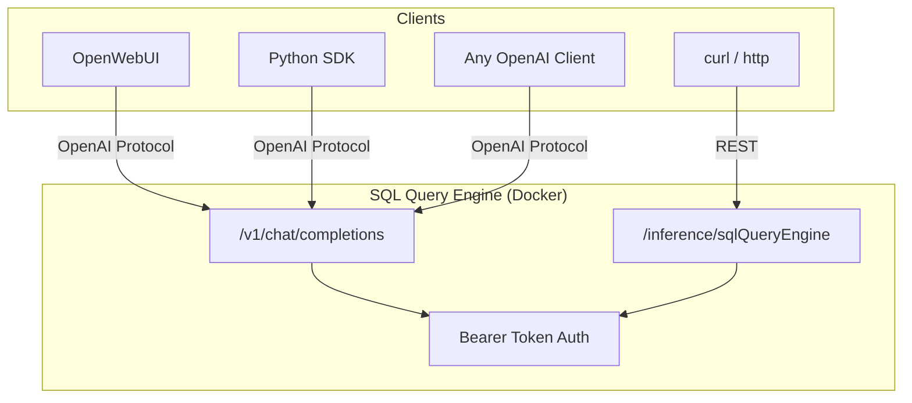
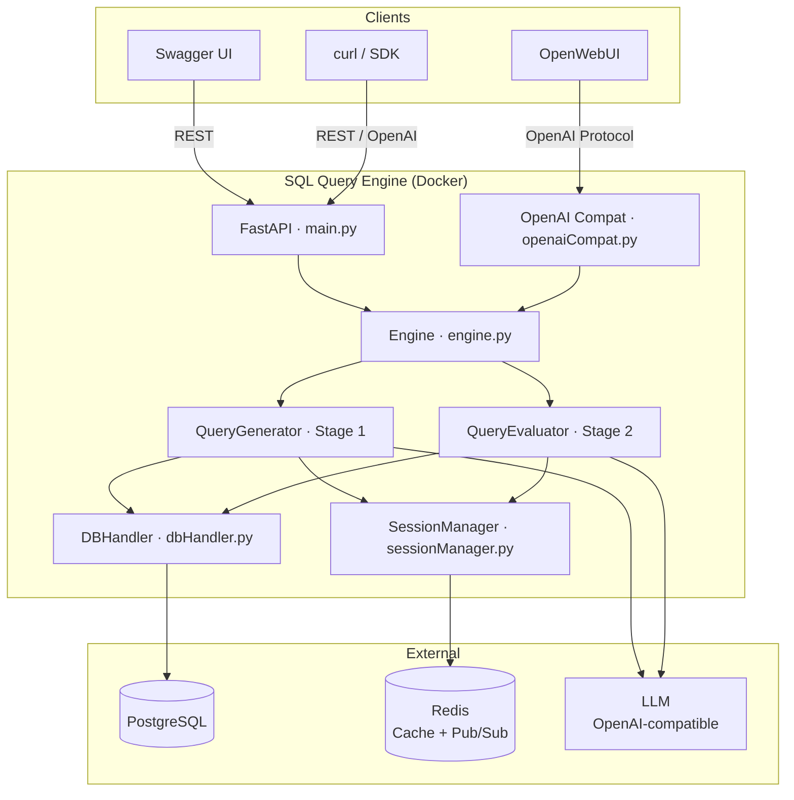

# SQL Query Engine
> Point it at a database. Ask questions in plain English. Get back SQL results.
## The Problem
You have a PostgreSQL database full of data, and stakeholders who need answers — fast. They don't write SQL. They shouldn't have to. But every text-to-SQL tool you've tried either chokes on schema complexity, generates broken queries with no recovery, or needs you to adopt someone else's entire platform.
**SQL Query Engine** closes that gap. It's a self-hosted [FastAPI](https://fastapi.tiangolo.com/) service that translates natural language into executed PostgreSQL queries through a two-stage LLM pipeline — powered by any OpenAI-compatible model (Ollama, vLLM, OpenAI, LiteLLM). It also ships with full [OpenWebUI](https://github.com/open-webui/open-webui) integration out of the box.
## How It Works
At its core, SQL Query Engine is a two-stage inference pipeline sitting between your users and PostgreSQL. Here's the full picture:

The user asks a question. The engine asks the LLM to write a SQL query. The query is executed against PostgreSQL. If it fails, the engine captures the error and asks the LLM to fix it — automatically, up to N times. That's it.
## Two-Stage Pipeline
The engine splits every request into two stages, each handled by a dedicated module:

- **Stage 1 — SQL Generation** — On the first request for a session, the engine introspects the database schema from PostgreSQL, samples rows from every table, and asks the LLM to produce a detailed schema description. This context is cached in Redis per `chatID`, so subsequent questions skip introspection entirely. The LLM then generates a SQL query, which is extracted via a multi-strategy response parser — a 5-strategy cascade (JSON → embedded JSON → code blocks → regex → raw text) that works with any model, no structured output or function calling required.
- **Stage 2 — SQL Evaluation & Repair** — The generated query is executed against PostgreSQL. If it succeeds and returns rows, the result is **accepted immediately** — no LLM re-evaluation, no risk of regression. If it fails — syntax errors, schema mismatches, empty results — the engine captures the full error output (SQLSTATE codes, PostgreSQL diagnostics, tracebacks) and feeds it back to the LLM along with the schema context. The LLM returns a fix, extracted via the same multi-strategy parser. This loop repeats until the query succeeds or the retry limit is reached. The engine tracks the **best result seen** across all attempts, so if retries exhaust without a perfect fix, it returns the best partial result rather than nothing. Every step publishes real-time progress to a Redis Pub/Sub channel.
## The Self-Healing Loop
This is the key differentiator. When a query goes wrong, the engine doesn't give up — it enters an iterative repair loop:

Two design choices make this loop safe. First, **early-accept**: if a query executes successfully and returns rows, it's accepted immediately — the LLM is never asked to second-guess a working result, which prevents regressions where the model "fixes" a correct query into a broken one. Second, **best-result tracking**: the engine records the best result seen across all retry iterations, so even if the loop exhausts without a perfect fix, the user gets the closest successful result rather than an empty failure.
The evaluator captures PostgreSQL errors at the `psycopg` level — including SQLSTATE codes, diagnostic messages, and hints — and feeds the full context back to the LLM. The LLM's `isValid` self-assessment is ignored by design; the engine only trusts execution outcomes. If the query returns empty results, the loop continues — because an empty result on a reasonable question usually means the query is wrong, not the data. The database connection is set to read-only mode, so the engine can never accidentally modify data.
## OpenAI-Compatible API
The engine exposes `/v1/chat/completions`, `/v1/completions`, and `/v1/models` endpoints — making it a drop-in replacement for any OpenAI-compatible client.

The streaming implementation subscribes to Redis Pub/Sub *before* launching the engine in a thread pool, then forwards progress messages as SSE chunks wrapped in `<think>` tags — so reasoning-capable clients like OpenWebUI display them as chain-of-thought while the query is being built and validated. The final result (SQL + markdown table) renders cleanly below.
Bearer token authentication is supported via `OPENAI_API_KEY`. Comma-separate multiple keys for multi-user setups. Leave empty to disable auth entirely.
## Quick Start
Clone, configure, deploy:
```bash
git clone https://github.com/codeadeel/sqlqueryengine.git
cd sqlqueryengine
```
Edit `docker-compose.yml` with your LLM and PostgreSQL details:
```yaml
# LLM endpoint — Ollama, vLLM, OpenAI, LiteLLM, etc.
- LLM_BASE_URL=http://host.docker.internal:11434/v1
- LLM_MODEL=qwen2.5-coder:7b
- LLM_API_KEY=ollama
# Your PostgreSQL instance
- POSTGRES_HOST=host.docker.internal
- POSTGRES_PORT=5432
- POSTGRES_DB=mydb
- POSTGRES_USER=myuser
- POSTGRES_PASSWORD=mypassword
```
Start the stack:
```bash
docker compose up --build
```
Done. The engine, Redis, and OpenWebUI are all running.
| Service | URL |
|---|---|
| SQL Query Engine API | `http://localhost:5181` |
| Swagger UI | `http://localhost:5181/docs` |
| OpenWebUI | `http://localhost:5182` |
## Architecture at a Glance

Each module has a single responsibility. `dbHandler.py` handles PostgreSQL introspection and safe query execution (read-only connections). `sessionManager.py` manages per-user context in Redis hashes. `promptTemplates.py` holds the LLM prompt templates. `connConfig.py` reads environment variables and provides a shared FastAPI dependency for connection parameters.
## Features Summary
| Feature | Details |
|---|---|
| Pipeline | Two-stage: NL → SQL generation + execution with self-healing repair loop |
| LLM Support | Any OpenAI-compatible endpoint (Ollama, vLLM, OpenAI, LiteLLM) |
| Database | PostgreSQL (read-only connections enforced) |
| Caching | Redis — schema context cached per session, skips re-introspection |
| Streaming | Redis Pub/Sub → SSE with `<think>` tag support for chain-of-thought |
| API | REST + OpenAI-compatible `/v1/chat/completions` |
| Auth | Bearer token (comma-separate multiple keys) |
| Chat UI | OpenWebUI pre-configured in Docker Compose |
| Deployment | Docker Compose, single command |
| Module Mode | Import `SQLQueryEngine` directly in Python, no HTTP layer needed |
| Response Parsing | Multi-strategy cascade (JSON → embedded JSON → code blocks → regex → raw text) — works with any model |
| Reasoning Models | `<think>` tag stripping for models like Qwen3 and DeepSeek-R1 |
## Evaluation & Benchmarks

The repository includes two independent evaluation pipelines that quantify the impact of the self-healing loop. Both use a **3-configuration ablation study** tested across **5 LLM backends**.

**Three configurations** isolate each pipeline stage:

| Config | retryCount | What It Tests |
| --- | --- | --- |
| Config C | 0 | Generation only — no evaluation, no repair |
| Config B | 1 | Single evaluation + one repair attempt |
| Config A | 5 | Full pipeline — up to 5 repair iterations |

### Synthetic Evaluation (Controlled Environment)

The synthetic pipeline seeds 3 PostgreSQL databases (e-commerce, hospital, university) with reproducible Faker-generated data and runs 75 gold-standard questions (25 per database) across 4 difficulty tiers.

| Model | Config C (gen only) | Config A (full pipeline) | Self-Healing Delta | Regressions |
| --- | --- | --- | --- | --- |
| **llama-4-scout-17b** | 48.0% | **57.3%** | **+9.3pp** | **0** |
| gpt-oss-20b | 45.3% | 53.3% | +8.0pp | 0 |
| llama-3.3-70b | 53.3% | 54.7% | +1.4pp | 2 |
| gpt-oss-120b | 50.7% | 48.0% | −2.7pp | 4 |
| qwen3-32b | 48.0% | 46.7% | −1.3pp | 6 |

**Key finding**: Llama 4 Scout (17B MoE) achieves the highest accuracy (57.3%), the largest self-healing delta (+9.3 percentage points), and zero regressions — meaning the repair loop never degraded a previously correct query. The early-accept and best-result-tracking design choices directly enable the zero-regression property.

Where does self-healing help most? On hard-difficulty queries. Scout 17B jumps from 5.6% to 44.4% on hard questions (+38.8pp), while easy questions stay at 100% across all configs. The loop adds the most value exactly where raw generation struggles.

### BIRD Benchmark (Real-World Databases)

To validate these findings beyond synthetic data, we also evaluated against [BIRD](https://bird-bench.github.io/) — one of the most widely cited NL-to-SQL benchmarks in the research community. BIRD's mini-dev set contains 500 questions across 11 real-world databases spanning finance, healthcare, sports, education, and more.

Since SQL Query Engine runs against PostgreSQL and BIRD ships its databases as SQLite files, the evaluation pipeline includes an automatic **SQLite-to-PostgreSQL migration** layer. It converts schemas, transforms gold SQL queries across 14 dialect rules (backticks → double quotes, `IIF` → `CASE WHEN`, `GROUP_CONCAT` → `STRING_AGG`, `LIKE` → `ILIKE`, and more), and bulk-inserts data at runtime. About 12.6% of questions (63 out of 500) are excluded due to gold SQL that doesn't convert cleanly between dialects — these are reported separately. Results below are on the remaining 437 evaluated questions.

| Model | Config C (gen only) | Config A (full pipeline) | Self-Healing Delta | Regressions |
| --- | --- | --- | --- | --- |
| **gpt-oss-120b** | 44.4% | **49.0%** | **+4.6pp** | 19 |
| llama-3.3-70b | 43.7% | 46.5% | +2.8pp | 23 |
| llama-4-scout-17b | 37.1% | 40.5% | +3.4pp | 20 |
| gpt-oss-20b | 43.5% | 43.2% | −0.3pp | 24 |
| qwen3-32b | 40.7% | 39.4% | −1.3pp | 17 |

For context, published zero-shot baselines on BIRD include ChatGPT at 40.08%, GPT-4 at 46.35%, and GPT-4 with evidence at 54.89%. Our best result (49.0% with GPT-OSS 120B) is competitive with these baselines while using a lightweight, single-LLM pipeline.

**What changes between synthetic and BIRD?** The self-healing loop still provides gains (up to +4.6pp), but regressions increase substantially. On synthetic databases with clean, controlled schemas, the repair loop operates safely with zero regressions for the best models. On BIRD's messier real-world schemas — ambiguous column names, inconsistent data types, complex joins — the LLM occasionally over-corrects working queries. This highlights an important practical insight: the self-healing loop's value scales with schema clarity, and the early-accept mechanism is critical for limiting regression damage.

**Another pattern**: model rankings shift between benchmarks. Scout 17B dominates synthetic data (57.3%) but drops to 40.5% on BIRD, while GPT-OSS 120B does the reverse (48.0% synthetic → 49.0% BIRD). Larger models handle the ambiguity of real-world schemas better, while smaller models excel on clean, well-defined structures.

### Running the Evaluations

```bash
# Synthetic evaluation
docker compose -f docker-compose-synthetic-evaluation.yml build
docker compose -f docker-compose-synthetic-evaluation.yml up -d
docker logs eval-runner --tail 10 -f
# Results in evaluation/synthetic/results/

# BIRD benchmark (download dataset first — see wiki)
docker compose -f docker-compose-bird-evaluation.yml build
docker compose -f docker-compose-bird-evaluation.yml up -d
docker logs bird-runner --tail 10 -f
# Results in evaluation/bird/bird_results/
```

## Links
- **Paper**: [arXiv:2604.16511](https://arxiv.org/abs/2604.16511) — *SQL Query Engine: A Self-Healing LLM Pipeline for Natural Language to PostgreSQL Translation*
- **GitHub**: [codeadeel/sqlqueryengine](https://github.com/codeadeel/sqlqueryengine)
- **Wiki**: [Full documentation](https://github.com/codeadeel/sqlqueryengine/wiki)
- **Wiki — REST API & Python Module**: [usage examples & endpoints](https://github.com/codeadeel/sqlqueryengine/wiki/Usage-Guide)
- **Wiki — OpenWebUI Setup**: [connection & configuration](https://github.com/codeadeel/sqlqueryengine/wiki/OpenAI-Compatibility)
- **Wiki — Environment Variables**: [full reference](https://github.com/codeadeel/sqlqueryengine/wiki/Configuration)
- **Wiki — Synthetic Evaluation**: [benchmark methodology & results](https://github.com/codeadeel/sqlqueryengine/wiki/Evaluation)
- **Wiki — BIRD Benchmark**: [real-world evaluation results](https://github.com/codeadeel/sqlqueryengine/wiki/BIRD-Evaluation)
- **License**: MIT
