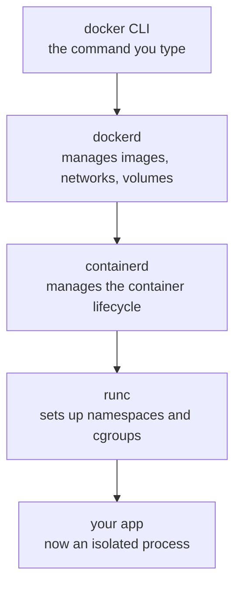
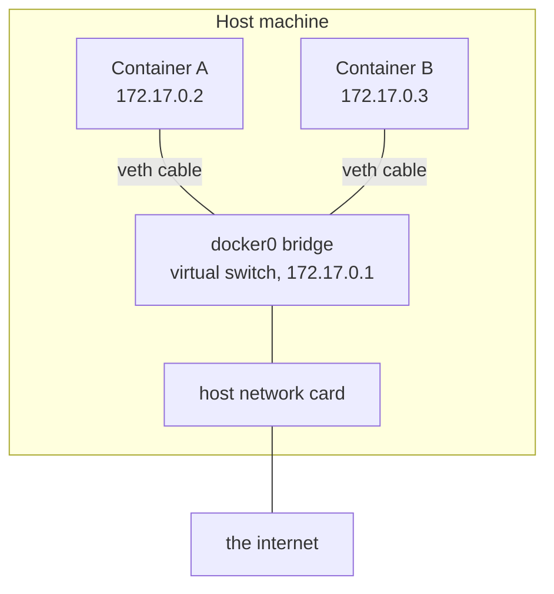
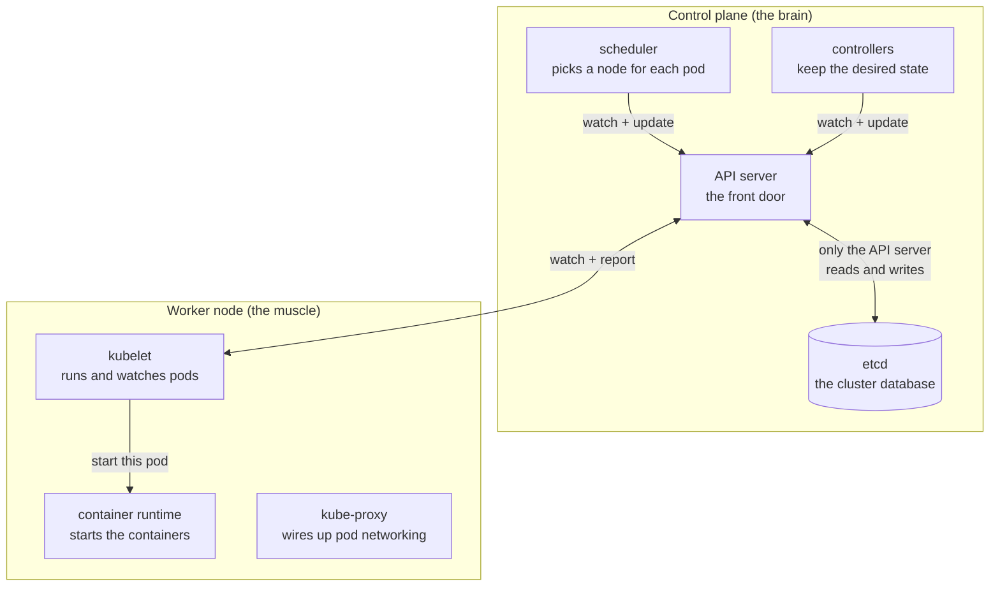
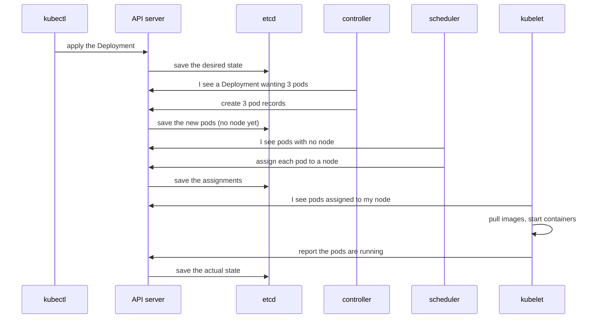
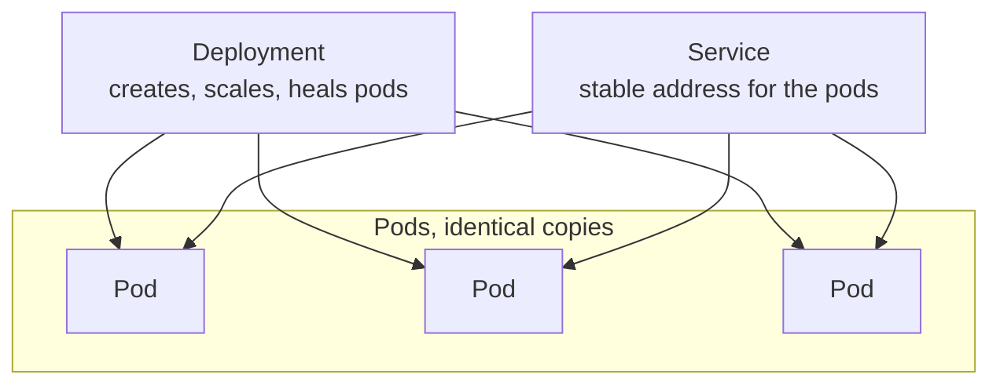
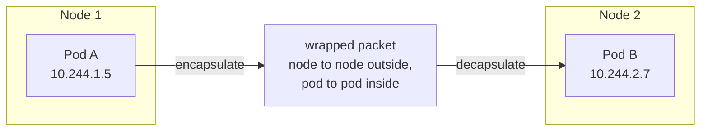
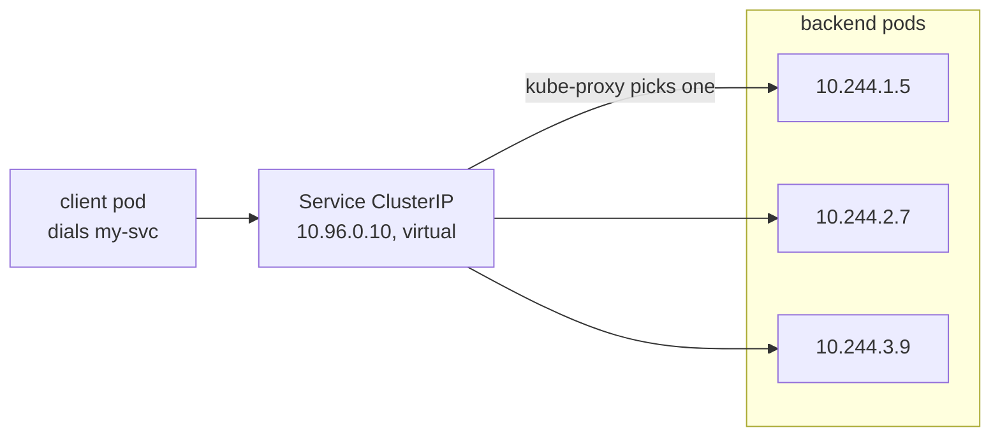
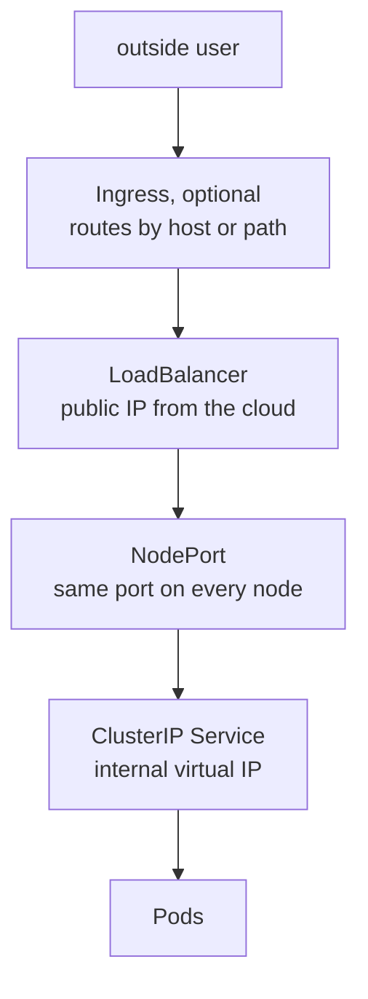

## Introduction

Most people learn Docker as a set of commands. You write a `Dockerfile`, run `docker build`, then `docker run`, and a container appears. That is enough to get work done, but it leaves an important question unanswered: what is actually happening on the machine? And once you have more containers than a single machine can hold, how does Kubernetes take over and run them across a whole fleet?

These notes walk through both. The first half covers Docker: what a container really is, how images are built from layers, what runs when you start a container, and how container networking works. The second half covers Kubernetes: the control plane, the worker nodes, the objects you deploy, and how pods talk to each other across machines. The last section compares the two directly, because a common source of confusion is treating them as competitors when they solve different problems.

## How Docker Works

Docker's entire job happens on a single machine: take an image, turn it into a running, isolated process, and connect it to the network.

### A Container Is Just a Linux Process

The first idea to unlearn is that a container is a small virtual machine. It is not. A container is an ordinary Linux process, the same as any program you run, that has been wrapped in a set of restrictions. There is no second operating system inside it. It borrows the kernel of the host it runs on. That single fact is the biggest difference between a container and a virtual machine.

A virtual machine carries a full guest operating system of its own. That makes it heavy, measured in gigabytes, and slow to boot. A container adds only your application and its libraries on top of the host kernel, so it is small and starts in a fraction of a second.

| | Virtual machine | Container |
| --- | --- | --- |
| Operating system | Full guest OS per machine | Shares the host kernel |
| Size | Gigabytes | Megabytes |
| Startup | Seconds to minutes | Milliseconds |
| Isolation | Strong, hardware level | Process level, through the kernel |

The kernel provides three features that, taken together, turn a normal process into a container.

| Feature | Job | Plain description |
| --- | --- | --- |
| **Namespaces** | Isolation | Control what the process can see. Each type hides one thing: its process list, its network, its filesystem mounts, its hostname, and its user IDs. Inside, the process looks like it is alone on the machine. |
| **Cgroups** | Limits | Control what the process can use. They cap CPU, memory, and disk usage, so one greedy container cannot starve the rest of the machine. |
| **Union filesystem** | Storage | Give the process a private, layered view of files, built from stacked read-only layers with a thin writable layer on top. |

Namespaces decide what a container sees. Cgroups decide what it can take. The union filesystem decides what its disk looks like. Strip those three away and you are left with a plain process again.

### Images and Layers

A Docker image is a stack of read-only layers. Every instruction in a `Dockerfile` (`FROM`, `RUN`, `COPY`, and so on) adds one layer on top of the previous ones. When you start a container from that image, Docker adds a single thin writable layer on top of the stack.

Two properties make this design efficient.

Layers are cached and shared. If ten images all start from `FROM ubuntu:22.04`, that base layer is stored on disk once and reused by all of them. This is why pulling an image you have partly downloaded before is fast, and why disk usage stays reasonable.

Writes use copy-on-write. When the running container reads a file, the read falls down through the layers until it finds it. When the container writes a file, that file is copied up into the writable layer and changed there. The read-only layers underneath are never touched. Delete the container and the writable layer disappears with it, leaving the image untouched and ready to reuse.

This is the reason containers are called ephemeral, and the reason you mount volumes for anything you want to keep. Data written inside the container, without a volume, lives only as long as that container does.

### What Runs When You Type `docker run`

Typing `docker run` does not start one program. Docker is a small stack of processes, each with a narrow job, that hand work down the line.

The `docker` command line is just a client. It sends your request to `dockerd`, the background daemon that manages images, networks, and volumes. `dockerd` does not start containers itself. It hands the job to `containerd`, which manages the container lifecycle. `containerd` in turn calls `runc`, the low level tool that does the real work: it creates the namespaces and cgroups, mounts the layered filesystem, starts your process, and then exits.

One piece is missing from the diagram on purpose. Because `runc` exits after starting the container, a tiny `containerd-shim` process stays behind to act as the container's parent. This is what lets you restart or upgrade `dockerd` without killing every running container. The shims keep the containers alive and reconnect afterward.

So `docker run nginx` really means this: the CLI asks `dockerd`, which pulls any missing layers, then tells `containerd` to start the container, which calls `runc` to build the box and launch the process, which a shim then watches over.

### Docker Networking

Each container lives in its own network namespace, which means it has its own private network stack: its own network card, its own IP address, its own routing table. By default it cannot see anyone else. So how do containers talk to each other and to the outside world?

Docker's answer is a virtual switch on the host, called `docker0`, and a virtual cable for each container.

A **veth pair** is a virtual cable with two ends. One end becomes the network card inside the container, and the other plugs into the `docker0` bridge on the host. The bridge behaves like a physical network switch: anything plugged into it can reach anything else plugged into it. That is why two containers on the same bridge can talk to each other by IP.

Getting out to the internet works through address rewriting. When a container sends a packet outward, the host rewrites the source address to be the host's own IP. This is called **masquerading**. The reply comes back to the host, which forwards it to the right container. So containers reach the internet using the host's identity.

Getting in from the outside is what `-p 8080:80` does. It installs a NAT rule that says: any packet arriving at the host's port `8080`, change its destination to the container's IP on port `80`. The container replies, the rule rewrites the reply on the way back, and the outside client sees the answer coming from the host. The container never knows the translation happened.

> **Note:** Both directions, in and out, are just rewrite rules on the host. That same trick shows up again inside Kubernetes, which is worth keeping in mind for later.

Docker offers a few network modes, chosen with `--network`. The **bridge** mode above is the default. **Host** mode skips the bridge entirely and lets the container use the host's network directly, which is fast but removes isolation and the ability to remap ports. **None** gives the container no network at all. **Container** mode lets one container share another's network namespace.

## How Kubernetes Works

Kubernetes takes those same containers and runs them across many machines, deciding where they run, keeping them alive, and giving them stable addresses.

### Why Kubernetes Exists

Docker runs containers on one machine. Real systems need more than that. They need containers spread across many machines, restarted automatically when they crash, scaled up under load, and load balanced so traffic reaches healthy copies. Doing all of that by hand across dozens of machines is not practical. Kubernetes is the system that does it for you.

The idea at its center is worth memorizing: you declare the state you want, and Kubernetes works continuously to make reality match it. You say "I want three copies of this application running." Kubernetes keeps comparing what you asked for against what is actually running, and fixes the gap whenever it appears. This endless compare and repair cycle is called the **reconciliation loop**, and almost everything Kubernetes does is a version of it.

### The Control Plane and the Worker Nodes

A Kubernetes cluster splits into two halves. The **control plane** is the brain that makes decisions. The **worker nodes** are the machines that actually run your containers.

Here is what each piece does. In the control plane:

- **API server:** the front door. Everything talks through it: you, the other components, and every worker node. It is also the only component allowed to touch `etcd`.
- **`etcd`:** the database. A distributed key value store that holds the entire state of the cluster, both what you asked for and what is actually running. It is the single source of truth, which is why regular backups matter so much. The consensus algorithm that keeps `etcd` consistent across copies is Raft, covered in a separate note.
- **Scheduler:** watches for new pods that have no home yet, and decides which node each one should run on, based on available resources and any rules you set.
- **Controllers:** run the reconciliation loops. The Deployment controller, for example, makes sure the number of running pods matches the number you asked for.

On each worker node:

- **kubelet:** the local agent. It talks to the API server and makes sure the containers it was assigned are actually running.
- **Container runtime:** `containerd` or a similar tool that pulls images and starts containers, using the same low level machinery Docker uses.
- **kube-proxy:** programs the node's networking rules so pods can be reached through stable service addresses.

Notice that nothing gives orders to anything else. Each component watches the API server for changes and reacts. That loose design is why the cluster is hard to break. Kill any single component and the rest keep reconciling, then it catches up when it returns.

### What Happens When You Run `kubectl apply`

Suppose you apply a Deployment asking for three copies of an application. Here is the chain of events, and notice that every step passes through the API server, and only the API server touches `etcd`.

1. `kubectl` sends the Deployment to the API server.
2. The API server validates it and writes it into `etcd`. The desired state is now recorded.
3. The Deployment controller is watching. It sees a Deployment that wants three pods but none exist, so it creates three pod records, written back through the API server into `etcd`. These pods have no node yet.
4. The scheduler is watching for pods with no node. It picks a suitable node for each and writes the assignment back through the API server.
5. The kubelet on each chosen node is watching for pods assigned to it. It sees them and tells its container runtime to pull images and start containers.
6. The kubelet reports status back up. The actual state now matches the desired state.

If a pod later crashes, the kubelet notices, the status changes in `etcd`, the controller sees that actual is less than desired, and it creates a replacement. The loop never stops.

### Pods, Deployments, and Services

Three objects come up constantly, and they are easy to mix up because they sound similar. They are not alternatives. Each solves a different problem, so a normal application uses all three together.

At a glance, here is how the three compare.

| | Pod | Deployment | Service |
| --- | --- | --- | --- |
| What it is | The unit that runs your app | A manager that runs pods for you | A stable address for a set of pods |
| Problem it solves | Something has to run the containers | Pods are fragile and are not replaced on their own | Pod IPs change whenever pods are recreated |
| What it owns | One or more containers sharing an IP | How many pods run, and their health | How traffic reaches the pods |
| Do you create it directly | Rarely on its own | Yes, usually your main object | Yes, to expose the pods |
| Analogy | A worker doing the job | The manager who keeps the team staffed | The front desk with one phone number |

A **Pod** is the thing that actually runs your application: one or more containers that share an IP address and network namespace. A pod on its own is fragile. If it crashes or its node dies, it is simply gone, and it gets a new IP whenever it is recreated. You rarely create a bare pod for this reason.

A **Deployment** is the manager that fixes that fragility. You tell it how many copies you want, and it keeps that true. It creates pods from a template, recreates any that die, changes the count when you scale, and swaps old pods for new ones gradually when you update the application, with no downtime. It does this through a ReplicaSet behind the scenes, but you mostly deal with the Deployment directly. The Deployment owns the lifecycle of the pods.

A **Service** is the stable front door that fixes the changing IP problem. Since pod IPs come and go, the Service gives you one fixed virtual address and DNS name, and spreads traffic across whichever pods are currently healthy. It knows which pods to send to by matching **labels**, not IPs, so as pods are replaced it keeps pointing at the right ones. The Service owns network access to the pods.

A simple way to hold the three in your head: the pod is a worker doing the job, the Deployment is the manager who keeps the team staffed and replaces anyone who quits, and the Service is the front desk with one phone number that forwards each caller to whichever worker is free.

### Kubernetes Networking

Kubernetes replaces Docker's default networking with a simpler promise, often called the flat network model. Every pod gets its own unique IP address. Any pod can reach any other pod, on any node, using that IP directly, with no NAT and no port mapping. From a pod's point of view, the whole cluster looks like one large flat network, as if every pod were a machine on the same office LAN.

First, a smaller question. A pod can hold several containers, so how do they network? They share one network namespace. They have the same pod IP and reach each other over `localhost`. A tiny hidden container called the **pause container** exists only to hold that shared namespace open while the real containers come and go.

Now the bigger question: how does that flat network actually work across many machines? The important detail is that Kubernetes does not implement networking itself. It defines the rules and hands the job to a plugin that follows a standard called **CNI**, the Container Network Interface. Popular ones are Flannel, Calico, and Cilium. When the kubelet creates a pod, it calls the CNI plugin, which gives the pod an IP and sets up routing so that IP is reachable from other nodes.

One common way to do that routing is an **overlay network**. The pod's packet gets wrapped inside an ordinary node to node packet, sent across the real network, and unwrapped on the far side.

Picture putting a letter addressed pod to pod inside a shipping envelope addressed node to node. The physical network only understands node addresses, so it delivers the envelope. The receiving node opens it and hands the inner letter to the right pod. Pod A and Pod B never know any of this happened. They see a direct connection. Some plugins skip the envelope and instead teach every node a route to each pod range, which is a little faster, but the promise is the same either way.

That leaves one problem: pods are disposable and their IPs change, so you cannot rely on a pod's IP. That is what a Service is for, and under the hood it is another rewrite rule.

The surprising part is that the Service address, `10.96.0.10`, is not a real machine. No network card has it. It is a fiction made real by rules. This is where **kube-proxy** comes in. It runs on every node, watches which pods currently back each Service, and programs the node's rules so that any packet heading to the Service address is rewritten to one of the real pod IPs, chosen roughly at random. When a pod dies and a new one appears with a new IP, Kubernetes updates the list, kube-proxy rewrites the rules, and callers keep using the same name. That name works because **CoreDNS** gives every Service a DNS entry.

Everything above is internal to the cluster. To let traffic in from the outside, there is a ladder of options, each building on the one below.

Read that from the bottom up. **ClusterIP** is reachable only inside the cluster. **NodePort** is the first door outward, opening the same high port on every node's real IP and forwarding down to the Service. **LoadBalancer** asks your cloud provider for a real external load balancer with a public IP, spread across the NodePorts, and is the usual way to expose one service publicly. **Ingress** sits on top as a smart HTTP router, a single entry point that routes by hostname or URL path, so you do not need a separate cloud load balancer for every application. In practice you pick one entry method for your case rather than stacking all of them.

## Docker and Kubernetes: How They Compare

The most common misunderstanding is treating Docker and Kubernetes as two tools that do the same thing. They do not. Docker builds and runs containers on a single machine. Kubernetes takes containers and runs them across many machines, keeping them healthy, scaled, and reachable. Kubernetes even uses a container runtime underneath to actually start containers, so it sits one level above, giving orders that something Docker-like carries out.

| | Docker | Kubernetes |
| --- | --- | --- |
| What it is | A tool to build and run containers | A system to orchestrate containers |
| Scope | One machine | A cluster of many machines |
| Smallest unit | A container | A pod, one or more containers |
| Networking | Bridge with NAT and port mapping | Flat network, every pod has a routable IP |
| Restarts a crashed container | Only with a restart policy, on the same host | Yes, anywhere in the cluster |
| Scaling | Manual, one host | Built in, across the cluster |
| Load balancing | Not built in | Built in, through Services |
| State store | None needed | `etcd` holds the whole cluster state |

A useful way to think about it: Docker is about a single container's life on one machine, while Kubernetes is about the life of an application made of many containers spread across many machines. You still use container images built the Docker way inside Kubernetes. Kubernetes just decides where those containers run, how many there are, and how traffic reaches them.

They are not rivals. They are two layers of the same story.

## Conclusion

Underneath the commands, neither of these is magic. Docker turns an ordinary Linux process into a container using three kernel features, packages the filesystem into cached layers, runs it through a short stack of helper programs, and connects it to the network with a virtual switch and a few rewrite rules. Kubernetes takes that idea and stretches it across a fleet. It stores the desired state in `etcd`, watches reality through the API server, and quietly reconciles the two, while a CNI plugin makes every pod reachable and Services give those pods a stable address. Once you see that the same small pieces keep reappearing at every level, isolated processes, rewrite rules, and a compare and repair loop, both systems stop being mysterious.

## References

- [Docker Documentation](https://docs.docker.com/)
- [Docker Overview, how the pieces fit together](https://docs.docker.com/get-started/docker-overview/)
- [Open Container Initiative, the runc and image standards](https://opencontainers.org/)
- [Kubernetes Components, the control plane and node overview](https://kubernetes.io/docs/concepts/overview/components/)
- [The Kubernetes Networking Model](https://kubernetes.io/docs/concepts/services-networking/)
- [Container Network Interface, CNI](https://github.com/containernetworking/cni)
