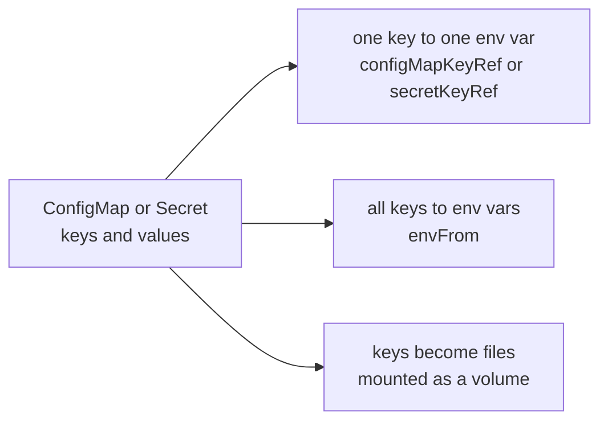
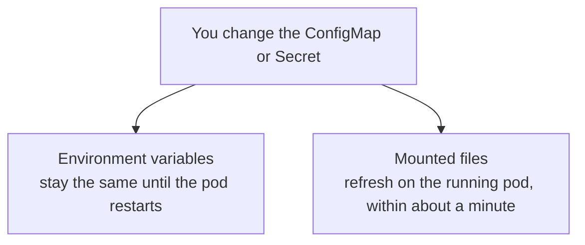
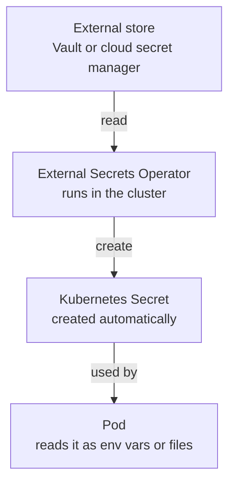

## Introduction

Software needs configuration: a database address, a log level, an API key. The wrong place to put that configuration is inside the container image. If it is baked in, you have to rebuild the image every time a setting changes, and you cannot run the same image in development, staging, and production without three different builds. So both Docker and Kubernetes give you ways to keep configuration outside the image and inject it when the container starts.

These notes cover both. The first part is Docker, where configuration is passed to a container at run time as environment variables or mounted files. The second part is Kubernetes, which stores configuration as its own objects, ConfigMaps and Secrets, and injects them into pods the same two ways. The notes also cover a difference that surprises people (mounted files update on a running pod, but environment variables do not) and the work it takes to actually secure a Secret, since the name promises more than it delivers. This builds on the architecture and storage notes, so the terms container, pod, and node are assumed.

## How Docker Handles Configuration

On a single machine, configuration reaches a container in one of two forms: as environment variables set when the container starts, or as files mounted in from the host.

### Passing Environment Variables

The most common way is the `-e` flag, which sets a variable for the container.

```bash
docker run -e LOG_LEVEL=debug -e MAX_CONNECTIONS=100 myapp:1.0
```

When you have many variables, listing them all becomes tedious, so Docker reads them from a file with `--env-file`.

```bash
docker run --env-file ./app.env myapp:1.0
```

Both set the variables at the moment the container starts. That timing matters, and it is the same in Kubernetes: a variable set this way is fixed for the life of the container.

### Mounting Configuration Files

When an application expects to read a real config file from a path, you mount it in from the host with a bind mount.

```bash
docker run -v /etc/myapp/app.yaml:/etc/myapp/app.yaml:ro myapp:1.0
```

The file on the host appears inside the container at the given path. The `:ro` makes it read-only, which is sensible for configuration the app should never change. This is the file-based counterpart to environment variables, and again Kubernetes mirrors it.

### A Note on Secrets in Docker

Plain `docker run` has no dedicated secret feature. People pass secrets as environment variables or mounted files, and accept that a secret passed with `-e` is visible to anyone who can run `docker inspect` on the container. Two things are worth knowing. First, never put a secret in the image itself, through an `ENV` line or a `COPY`, because it is baked into the layers and anyone can read it back with `docker history`. Second, Docker Swarm and Docker Compose do have a real `secrets` feature: the secret is mounted into the container as a file under `/run/secrets/`, kept in memory rather than on disk, and never placed in the environment. That file-in-memory approach is exactly what Kubernetes does with Secret volumes.

## How Kubernetes Handles Configuration

In a cluster, configuration is not passed on a command line, because there is no single command line; a pod can start on any machine. So Kubernetes stores configuration as its own objects and injects them into pods at run time.

### ConfigMaps and Secrets

There are two objects, and they are nearly identical. A **ConfigMap** holds non-sensitive configuration as key-value pairs, where a value can be a short string or the entire contents of a config file. A **Secret** holds sensitive data and adds a few security behaviors. The important caution, covered in full later, is that a Secret is only base64-encoded by default, which is encoding, not encryption. Functionally the two behave the same, and they inject into pods the same two ways.

### The Two Ways to Inject Them

A ConfigMap or Secret reaches a container either as environment variables or as mounted files. The choice is not a property of the object; the same ConfigMap can feed both. It is decided by where you reference it in the pod definition.



There are three moves in total. You can map a single key to a single environment variable, import every key at once as environment variables with `envFrom`, or mount the object as a volume so that each key becomes a file whose contents are the value.

Start with a small ConfigMap and Secret that just hold a few keys.

```yaml
apiVersion: v1
kind: ConfigMap
metadata:
  name: app-config
data:
  LOG_LEVEL: "debug"      # a plain setting
  app.yaml: |             # a whole config file, stored under one key
    server:
      port: 8080
---
apiVersion: v1
kind: Secret
metadata:
  name: app-secret
type: Opaque
stringData:               # stringData lets you write plaintext; Kubernetes encodes it
  DB_PASSWORD: "s3cr3t"   # a sensitive value
```

Nothing here decides how the values will be used. A ConfigMap and a Secret are just named bags of keys and values. What becomes an environment variable and what becomes a file is chosen later, in the pod, not here.

Now a pod that uses them. It takes `LOG_LEVEL` and `DB_PASSWORD` as environment variables, and mounts `app.yaml` as a file.

```yaml
apiVersion: v1
kind: Pod
metadata:
  name: myapp
spec:
  containers:
    - name: myapp
      image: myapp:1.0

      env:                          # each entry becomes an environment variable
        - name: LOG_LEVEL
          valueFrom:
            configMapKeyRef:
              name: app-config
              key: LOG_LEVEL
        - name: DB_PASSWORD
          valueFrom:
            secretKeyRef:
              name: app-secret
              key: DB_PASSWORD

      volumeMounts:                 # where the file shows up in the container
        - name: config-vol
          mountPath: /etc/myapp     # app.yaml becomes /etc/myapp/app.yaml

  volumes:                          # what that volume actually is
    - name: config-vol
      configMap:
        name: app-config
```

Reading it from top to bottom:

The `env` block creates environment variables. Each entry gives a `name`, the variable the application will see, and a `valueFrom` that points at a key. `configMapKeyRef` reaches into a ConfigMap and `secretKeyRef` into a Secret, each identified by the object `name` and the `key` inside it. The variable name is your choice: it matches the key here, but `LOG_LEVEL` could just as easily feed a variable named `APP_LOG_LEVEL`.

The file part takes two pieces joined by a name. `volumes`, at the pod level, defines a volume called `config-vol` and says its contents come from the `app-config` ConfigMap. `volumeMounts`, inside the container, takes that same `config-vol` and places it at `/etc/myapp`. Every key in the source becomes a file in that directory, so `app.yaml` appears as `/etc/myapp/app.yaml` holding the file contents. The two halves are kept separate because one volume can be mounted into several containers, or at different paths, so the definition sits once at the pod level while the mounting is done per container. Environment variables need no such split, since they go straight into one container.

When you would rather pull every key in at once than name each variable, use `envFrom`.

```yaml
      envFrom:
        - configMapRef:
            name: app-config
        - secretRef:
            name: app-secret
```

This imports every key from both objects as an environment variable named after the key, so you get `LOG_LEVEL` and `DB_PASSWORD` without listing them one by one. Keys that are not valid variable names are skipped, which is why `app.yaml` is left out and stays available only as a file.

Mounting a Secret as a file works in exactly the same way. To deliver a TLS certificate, for example, you would place it in a Secret and swap `configMap:` for `secret:` in the volume. The options are summarized below.

| Source | One key as an env var | All keys as env vars | As files |
| --- | --- | --- | --- |
| **ConfigMap** | `configMapKeyRef` | `envFrom` with `configMapRef` | volume of type `configMap`, then mount it |
| **Secret** | `secretKeyRef` | `envFrom` with `secretRef` | volume of type `secret`, then mount it |

### Files Update Live, Environment Variables Do Not

This is the difference that catches people out. If you change a ConfigMap or Secret, mounted files update on the running pod, but environment variables do not.



The reason is simple once you see it. An environment variable is an ordinary Linux process feature, set when the container starts. A running process's environment cannot be changed from the outside, so the old value stays until the process is replaced, which means a pod restart. Mounted files are different because the kubelet keeps them in sync: it notices the change and rewrites the files, swapping them in atomically so the application never sees a half-written file.

> **Note:** Two things qualify this. A file mounted with `subPath` does not update, so mount the whole directory if you want live changes. And the file refreshing is not the same as the application noticing; the app still has to re-read the file, or be sent a reload signal, to pick up the new value.

## Securing Secrets

The word Secret promises more than the object delivers, so protecting sensitive data takes deliberate work.

### Why a Secret Is Not Secure by Default

A Secret is not encrypted. Its values are base64-encoded, and base64 is an encoding that anyone can reverse in a single command, not encryption. The data sits in `etcd` in that form, readable by anyone who can reach `etcd` on disk or who has permission to read Secrets through the API. Out of the box, a Secret is obscured, not protected.

There is a small silver lining. When you mount a Secret as files, Kubernetes stores them in memory (`tmpfs`) on the node rather than on disk, and Secrets come in types for common jobs.

| Type | Used for |
| --- | --- |
| `Opaque` | Generic secrets like passwords and tokens (the default) |
| `kubernetes.io/tls` | A TLS certificate and key, used by Ingress |
| `kubernetes.io/dockerconfigjson` | Credentials to pull images from a private registry |
| `kubernetes.io/basic-auth`, `ssh-auth` | Basic-auth and SSH credentials |

### The Layers That Fix It

Because the default gives little protection, securing Secrets means adding layers, and you generally want all of them. **Encryption at rest** comes first: you configure the API server so Secrets are encrypted before they are written to `etcd`, using AES or a KMS provider, so a stolen `etcd` file yields ciphertext. **RBAC** comes second, and it is the one people forget: restrict which users and service accounts can read Secrets, since several built-in roles can read them by default. The third layer is to keep the real secret out of the cluster entirely, in a dedicated secret manager, which matters most under GitOps, because a raw Secret must never be committed to Git.

That last point has a standard solution: an external secret manager paired with an operator.



The real secret lives in Vault or a cloud secret manager. The External Secrets Operator runs in the cluster, reads the value from that store, and creates an ordinary Kubernetes Secret for your pods. Your Git repository holds only a pointer that names the secret to fetch, never the value. The alternative is Sealed Secrets, where you encrypt the secret on your own machine, commit the encrypted blob safely, and a controller decrypts it back into a Secret inside the cluster. Both approaches keep the value out of Git, but note that both still create an ordinary Kubernetes Secret, and a Kubernetes Secret always lives in `etcd` (or whatever datastore backs the API server, which on k3s is SQLite by default). So encryption at rest still matters even when the secret originates in Vault.

There is one more option that avoids the datastore entirely. The **Secrets Store CSI Driver** and the **Vault Agent Injector** mount the value from the external store straight into the pod as a file, without ever creating a Secret object, so nothing lands in `etcd` at all. The rule worth remembering is that every Kubernetes Secret is stored in `etcd`, but a secret value does not have to be a Kubernetes Secret.

## Docker and Kubernetes Configuration Compared

The two follow the same shape, and the differences come down to scope and to how much structure each gives you.

| | Docker | Kubernetes |
| --- | --- | --- |
| **Where config lives** | Command-line flags, env-files, mounted files | ConfigMap and Secret objects |
| **Environment variables** | `-e` and `--env-file` | `env` and `envFrom` |
| **Config files** | Bind mount or volume | Mounted ConfigMap or Secret volume |
| **Sensitive data** | No secret object in plain `docker run` | Secret objects, hardened separately |
| **Live updates** | No, restart the container | Files yes, environment variables no |
| **Scope** | One host | The whole cluster |

The through-line is that both keep configuration out of the image and inject it at run time, as environment variables or as files. Kubernetes adds named objects, cluster-wide reach, and live-updating files, and it separates ordinary settings (ConfigMaps) from sensitive ones (Secrets), though securing those Secrets is left to you.

## Conclusion

Configuration is about keeping the changeable parts of a system out of the fixed image. Docker does this on one machine with environment variables and mounted files. Kubernetes does the same across a cluster, storing configuration as ConfigMaps and Secrets and injecting them into pods either as environment variables or as mounted files, where the source is decided by how you reference it, not by the object. The two methods behave differently when you change them: files refresh on a running pod, while environment variables wait for a restart. And a Secret, despite the name, is only base64-encoded until you add encryption at rest, tight access control, and ideally an external manager, so nothing sensitive is left sitting in plain view. The pattern is the familiar one: separate what changes from what does not, and keep the sensitive parts under real protection.

## References

- [Docker: Set Environment Variables](https://docs.docker.com/reference/cli/docker/container/run/#env)
- [Docker Compose: Use Secrets](https://docs.docker.com/compose/how-tos/use-secrets/)
- [Kubernetes ConfigMaps](https://kubernetes.io/docs/concepts/configuration/configmap/)
- [Kubernetes Secrets](https://kubernetes.io/docs/concepts/configuration/secret/)
- [Encrypting Secret Data at Rest](https://kubernetes.io/docs/tasks/administer-cluster/encrypt-data/)
- [External Secrets Operator](https://external-secrets.io/)
- [Secrets Store CSI Driver](https://secrets-store-csi-driver.sigs.k8s.io/)
