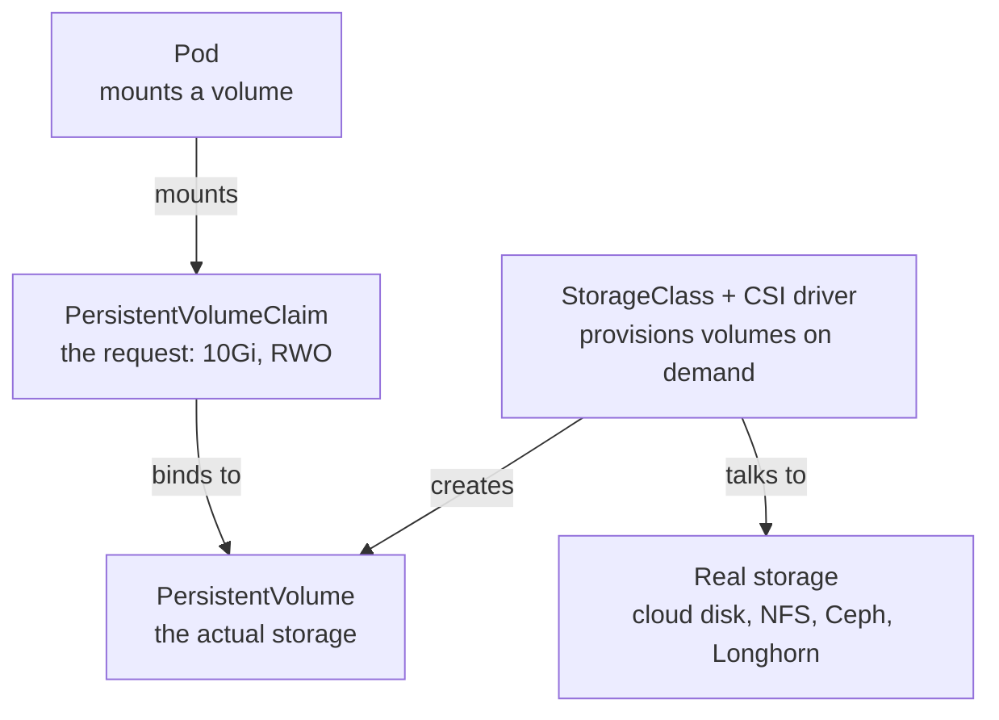
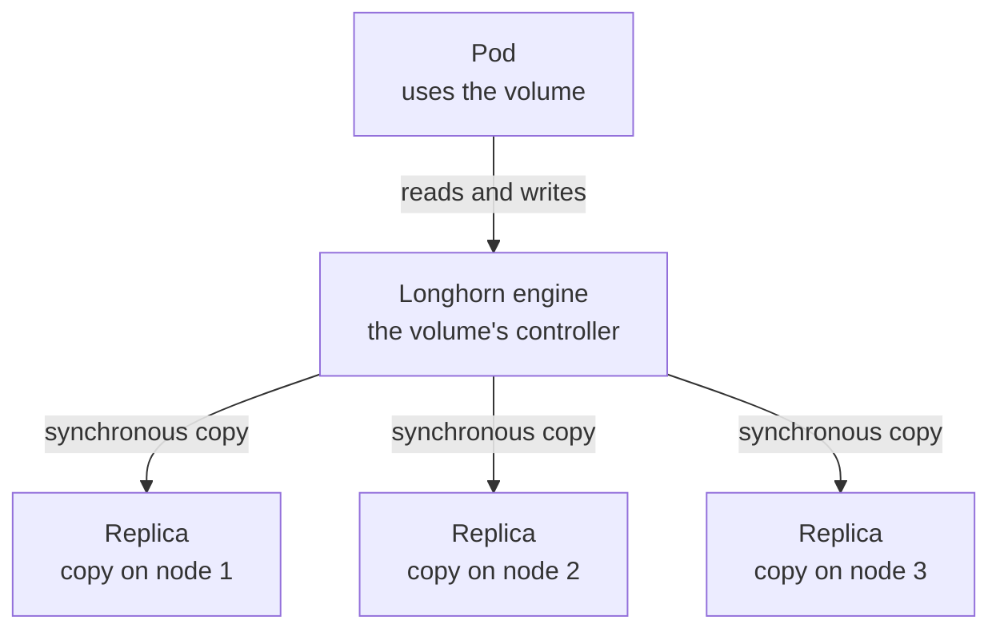

## Introduction

Containers are built to be thrown away. That is a feature, not a flaw: it is what makes them cheap to start, easy to replace, and safe to run in large numbers. But it creates an obvious problem the moment you run something that has to remember data, like a database, a message queue, or a model server that has downloaded gigabytes of weights. That data cannot live inside the container, because the container will not last.

These notes work through how storage is solved at every level. The first part covers Docker, where the whole question fits on a single machine. The second part covers Kubernetes, where storage has to be pulled away from any one machine so a pod can run anywhere. The third part looks at distributed storage with Longhorn, which turns the nodes' own disks into replicated, highly available storage. The fourth part covers machine learning data, which needs a different kind of storage again. The last part compares Docker volumes with the Kubernetes approach directly. The basics of containers, pods, and nodes are assumed throughout; the architecture note covers those.

## How Docker Handles Storage

On a single machine, the storage question is small: how does a container keep data when the part of it that holds writes is thrown away at the end.

### The Writable Layer Is Temporary

A Docker image is a stack of read-only layers, and when you start a container, Docker adds one thin writable layer on top. Every file the container writes goes into that writable layer through copy-on-write. This is efficient, but it has a consequence people learn the hard way: when the container is deleted, the writable layer is deleted with it. Anything the application wrote, with no other arrangement, is gone.

So "storage" in Docker really means one thing: giving the container a place to write that is not the writable layer, a place that outlives the container. Docker offers three.

### Volumes, Bind Mounts, and tmpfs

A **volume** is storage that Docker manages for you. It lives in a directory that Docker controls (on Linux, under `/var/lib/docker/volumes/`), and you attach it to a container at a path. The container writes there as if it were a normal folder, but the data stays behind when the container is removed, and another container can mount the same volume later. Volumes are the recommended way to persist data in Docker.

A **bind mount** is different. Instead of letting Docker manage the location, you point the container at a specific path on the host, and that exact directory appears inside the container. It is handy for development, such as mounting your source code into a container, and for giving a container access to something already on the host, but it ties the container to the host's directory layout.

A **tmpfs mount** does not persist at all. It stores data in the host's memory and disappears when the container stops. It is used for temporary or sensitive data that should never touch the disk.

### Everything Is Tied to One Host

All three share the same hard limit, and it is the most important thing to understand before moving to Kubernetes: Docker storage lives on **one machine**. A volume is a directory on that host's disk. Containers on the same host can share it, but there is no replication, no failover, and no way for a container on another host to reach it. If that machine dies, the volume dies with it. This is fine for a single server, and it is exactly the gap that Kubernetes storage is built to close.

## How Kubernetes Handles Storage

In a cluster, a pod can be scheduled onto any node, and it can be moved to a different node at any time. So storage cannot be tied to a machine the way a Docker volume is. Kubernetes solves this by putting a layer of abstraction between the pod and the actual disk.

### The Volume Abstraction

Rather than pointing a pod at a specific disk, Kubernetes has the pod ask for storage, and something else provides it. The request and the storage are separate objects, which is what makes a manifest portable across clusters.

The chain works like this. The pod mounts a **PersistentVolumeClaim** (PVC), which is only a request: "I need 10Gi that one node can write to." The PVC binds to a **PersistentVolume** (PV), which represents the real piece of storage. The pod only ever refers to the PVC, so it never has to know whether the storage behind it is a cloud disk, an NFS share, or a Longhorn volume. That separation is the whole point.

You rarely create PVs by hand. A **StorageClass** paired with a **CSI driver** (the Container Storage Interface, the same style of plugin as the CNI used for networking) creates them automatically. When a PVC appears, the CSI driver calls the real storage backend, carves out a volume, and produces a matching PV on demand. This is called dynamic provisioning, and it is how almost all Kubernetes storage works today.

### Access Modes

A PVC also states how the volume can be mounted, and this catches people out more than anything else in Kubernetes storage.

| Access mode | Meaning | Typical use |
| --- | --- | --- |
| ReadWriteOnce (RWO) | One node mounts it read-write | Most databases and single-writer apps |
| ReadOnlyMany (ROX) | Many nodes mount it read-only | Shared read-only data |
| ReadWriteMany (RWX) | Many nodes mount it read-write at once | Shared filesystems, needs NFS or CephFS |

The important line is the last one. Ordinary block storage is ReadWriteOnce, so only one node can mount it for writing at a time. If you need many pods on different nodes writing to the same volume at once, you need ReadWriteMany, which requires a shared filesystem underneath rather than a plain block device.

### StatefulSets and Per-Pod Storage

A Deployment treats its pods as identical and disposable, which is wrong for anything that keeps state. A three-node database needs each pod to have its own disk and a stable name, so that the pod which was the primary reattaches to its own data after a restart. That is what a **StatefulSet** provides.

A StatefulSet gives its pods stable, numbered names (`db-0`, `db-1`, `db-2`) instead of random ones. Each pod gets its **own PVC** through a `volumeClaimTemplate`, and that disk follows the pod across restarts and reschedules. Pods are also created and removed in order, and each gets a stable DNS name through a paired headless Service. This is the shape that databases, Milvus, Kafka, and similar systems need.

### hostPath, local, and emptyDir

Not every volume is a persistent, portable one. Three node-level volume types come up often.

A **hostPath** volume mounts a file or directory from the node's own filesystem straight into the pod. It is the Kubernetes equivalent of a Docker bind mount, and it has the same limitation: it is tied to the node. If the pod moves to another node, it mounts that node's directory, which has nothing to do with the first. Because of this, and because mounting host paths is a security risk, hostPath is not used for application data. Its real job is node-level system work, which is why log collectors, monitoring agents, and the NVIDIA device plugin all use it to reach the host they run on.

A **local** volume is the managed version of the same idea: a proper PersistentVolume backed by a node's disk, with node affinity so the pod is always scheduled back to the node that holds its data. It is the correct way to use fast local NVMe when you accept that the data stays on one node.

An **emptyDir** is throwaway scratch space that lives only as long as the pod. It is created empty when the pod starts and deleted when the pod is removed, which makes it ideal for temporary files or a local cache.

## Distributed Storage with Longhorn

On a cloud, the CSI driver hands you a cloud disk and durability is someone else's problem. On a self-hosted cluster you do not have that, so you need something that turns your own nodes' local disks into durable, replicated storage. Longhorn is the common answer.

### How Longhorn Works

Longhorn is distributed block storage built for Kubernetes. It does two jobs at once: it is a CSI driver, so it plugs into the PVC and StorageClass chain, and it is the storage backend itself, pooling the local disks across your worker nodes. Its central trick is replication. When you create a volume, it is split into replicas (three by default), and each replica is a full copy of the data placed on a different node.

Every volume gets its own **engine**, a small controller that presents the volume to the pod as an ordinary block device and runs on whatever node the pod is on. When the pod reads or writes, the engine writes to all replicas at once, over the cluster network, so every copy stays identical. The replicas sit on different nodes, so losing a node does not lose the data.

### What Happens When a Pod Moves

Because the data is already on several nodes, moving a pod is a re-attach, not a copy. When the pod is rescheduled to a new node, Longhorn starts a fresh engine there, and that engine reconnects over the network to the same replicas, which never moved. The pod comes back with its data intact. If the node that failed held one of the replicas, Longhorn rebuilds a new one on a healthy node to restore the count.

> **Note:** There is one wrinkle with unplanned node failures. Because the volume is ReadWriteOnce, Kubernetes will not move it to another node while it still believes it is attached to the failed one, since attaching it in two places could corrupt the data. Longhorn has node-down handling that force-detaches the volume so the pod can move, and it is worth configuring before you need it.

### The Cost of Replication

Replication is not free, and this is the number to keep in mind when sizing a cluster. With three replicas, a 50GB volume stores three full copies, so it uses 150GB of raw disk, and usable capacity is roughly the total raw disk divided by the replica count.

| Replicas | Raw for a 50 GB volume | Usable from 3 TB | Tolerates |
| --- | --- | --- | --- |
| 3 (default) | 150 GB | about 1 TB | losing 2 of the 3 copies |
| 2 | 100 GB | about 1.5 TB | losing 1 copy |
| 1 | 50 GB | about 3 TB | nothing, like a single disk |

Two things soften this. Longhorn is **thin-provisioned**, so you pay for the data actually written, not the size you declared; a 50GB volume holding 5GB of data uses about 15GB of raw disk. And the replica count is a **per-volume setting**, so critical data can stay at three while scratch data runs at two or one. The larger lesson is to keep only what truly needs replicated block storage on Longhorn, and put bulk data elsewhere, which leads straight to the next part.

## Storage for Machine Learning

Model weights and datasets have the opposite profile to a database. They are large, they are mostly read, they are often read by many pods at once (a dozen inference replicas loading the same model), and they are written rarely. That profile is a poor fit for replicated block storage and a good fit for a different class of storage.

### Why Block Storage Is the Wrong Fit

Putting a large dataset on Longhorn wastes space to the threefold replication and runs into the ReadWriteOnce limit, since only one node can mount the volume for writing. Neither matters for a database, but both are wrong for a read-heavy file that many pods want to share. The data needs to be stored once, cheaply, and read by everyone.

### Object Storage and Shared Filesystems

**Object storage** is the primary answer. Self-hosted MinIO, or a cloud store like S3, is cheap, scales out, handles unlimited readers, and uses erasure coding internally so its overhead is closer to one and a half times the data than three times it. This is where model weights, datasets, checkpoints, and MLflow artifacts belong. Code reads from it over the S3 API, and serving frameworks can load models straight from an object-storage URL.

When code expects real files instead of an API, a **shared filesystem** goes in front. The options range from a plain NFS server for simple shared data up to distributed ones.

| Option | Type | Best for |
| --- | --- | --- |
| MinIO / S3 | Object storage | Weights, datasets, checkpoints, MLflow artifacts |
| NFS | Shared filesystem (RWX) | Simple shared read data across pods |
| JuiceFS | POSIX filesystem on object storage | Shared ML data with real files and caching |
| CephFS (via Rook) | Distributed filesystem (RWX) | Scalable, highly available shared storage |
| Lustre / FSx for Lustre | Parallel filesystem | High-throughput training on huge datasets |
| Rook / Ceph | Block, object, and filesystem in one | Replacing several storage systems at once |

The common pattern for weights ties these together. Keep the weights in object storage as the single source of truth, and at pod startup either pull the model onto the node's fast local NVMe (an `emptyDir`), or mount a shared filesystem that already has it. The storage cost is paid once, cheaply, and every replica still gets a fast local read.

## Docker Volumes and Kubernetes Storage: How They Compare

It helps to line the two up directly, because they are often confused, and the difference is really one of scope.

| | Docker volume | Kubernetes distributed storage |
| --- | --- | --- |
| **Scope** | One host | The whole cluster |
| **What it is** | A folder on the host's disk | A replicated virtual disk or a shared store |
| **Survives a node failure** | No | Yes |
| **Follows the workload** | No, tied to the host | Yes, attaches wherever the pod runs |
| **Snapshots and backups** | Manual | Built in, with Longhorn, Ceph, and others |
| **How you use it** | Docker's own volume system | Through the CSI chain (PVC, StorageClass) |

The useful thing to notice is that they are not really the same category. A Docker volume answers "how does this container keep its data across restarts on this machine." Distributed Kubernetes storage answers "how does data stay safe and reachable as pods move around and nodes fail." In fact, the true Kubernetes equivalent of a plain Docker volume is a `hostPath` or `local` volume, which is tied to one node in exactly the same way. Distributed storage like Longhorn exists precisely because that single-node model is not enough once you have a cluster.

## Conclusion

Storage is really a story about scope. On one machine, Docker keeps data in volumes and bind mounts, and the whole problem fits on that machine's disk. In a cluster, Kubernetes pulls storage away from any single node with the PersistentVolumeClaim and StorageClass abstraction, so a pod can ask for storage and still run anywhere. Distributed storage like Longhorn goes further, replicating a volume across nodes so it survives failure and follows the pod. And bulk machine learning data steps outside block storage entirely, into object storage, because it is large, shared, and read far more than it is written. The pattern underneath is the same one that runs through everything else in Kubernetes: as you move from one machine to many, the things a program depends on have to be decoupled from any single machine and made to survive its loss.

## References

- [Docker Storage Overview](https://docs.docker.com/storage/)
- [Docker Volumes](https://docs.docker.com/storage/volumes/)
- [Kubernetes Volumes](https://kubernetes.io/docs/concepts/storage/volumes/)
- [Kubernetes Persistent Volumes and Claims](https://kubernetes.io/docs/concepts/storage/persistent-volumes/)
- [Kubernetes Storage Classes](https://kubernetes.io/docs/concepts/storage/storage-classes/)
- [Container Storage Interface (CSI)](https://kubernetes-csi.github.io/docs/)
- [Longhorn Documentation](https://longhorn.io/docs/)
- [MinIO Documentation](https://min.io/docs/minio/kubernetes/upstream/)
