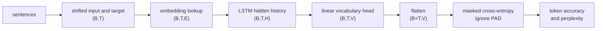
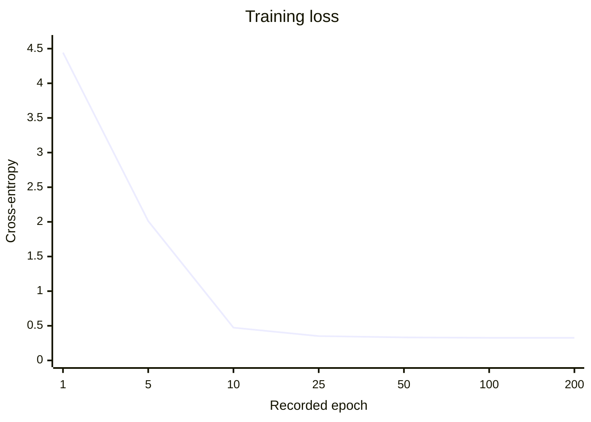
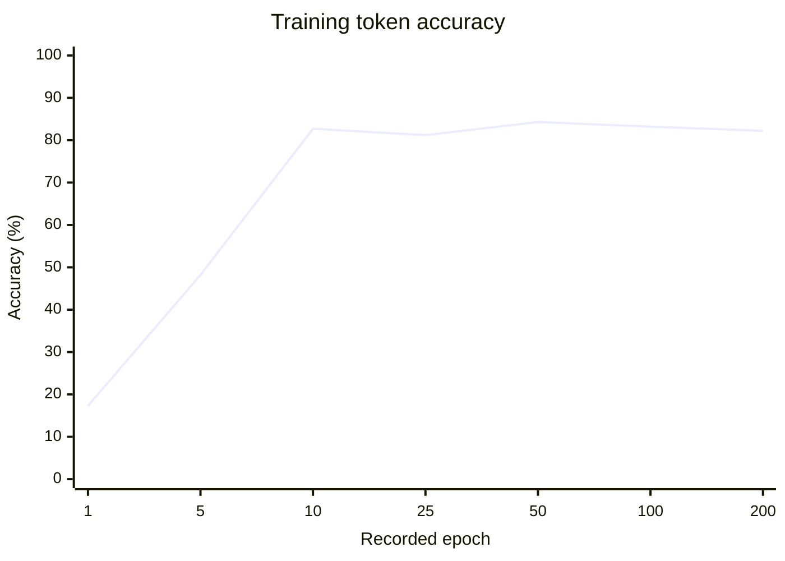

## Introduction



A next-word model receives the words already seen and assigns a score to every possible next word:

```text
cats chase  →  small
birds can   →  fly
```

The model in this note has a small, visible pipeline:

```text
text
  ↓
word IDs
  ↓
embeddings
  ↓
unidirectional LSTM
  ↓
one hidden vector at every position
  ↓
vocabulary logits at every position
  ↓
next-word probabilities
```

The interactive simulator exposes the arithmetic inside one LSTM cell. The runnable implementation uses PyTorch's `nn.Embedding`, `nn.LSTM`, and `nn.Linear`.

This is a teaching language model. A corpus of 48 sentences is enough to expose the complete training path, but not enough to produce a useful general-purpose text generator.

## Build the Intuition First

The simulator owns the exact arithmetic. This section follows the meaning of each stage and the tensor dimensions passed into PyTorch.

### The Causal Task

**Causal** means that a prediction may depend only on the current word and earlier words.

For the prefix:

```text
cats chase
```

the model may use both `"cats"` and `"chase"` to predict the next word. It may not inspect the correct next word before making that prediction.

At each position, the LSTM reads the prefix ending at that position and predicts the following token. The target row is simply the same sentence shifted one place to the left.

The final real word predicts a special end marker instead of another ordinary word.

### Step 1: Shift One Sentence into Inputs and Targets

Start with one sentence and append `<EOS>`:

```text
cats chase small mice <EOS>
```

The input and target are the same sequence shifted by one position:

| Position | Input seen by the LSTM | Correct target |
| ---: | --- | --- |
| `t=0` | `cats` | `chase` |
| `t=1` | `chase` | `small` |
| `t=2` | `small` | `mice` |
| `t=3` | `mice` | `<EOS>` |

Written as two rows:

```text
input:   cats    chase   small   mice
target:  chase   small   mice    <EOS>
```

The target does not enter the LSTM at the same position. It is used only to score the prediction produced at that position.

This example deliberately omits a `<BOS>` token. Therefore:

- the first word is supplied as part of a nonempty prompt;
- the model does not learn to predict the first word of a sentence;
- generation requires at least one prompt token.

Adding `<BOS>` later would make first-word prediction possible.

### Step 2: Give `EOS`, `UNK`, and `PAD` Separate Jobs

The simulator has a tiny vocabulary of 14 tokens. Its three special IDs are `<PAD>=0`, `<UNK>=1`, and `<EOS>=2`; the remaining IDs represent ordinary words.

The three special tokens solve different problems:

- `<EOS>` is a real prediction target. It teaches the model when a sentence ends.
- `<UNK>` replaces a word missing from the training vocabulary.
- `<PAD>` fills unused positions so different-length sequences can share one rectangular tensor.

`<EOS>` contributes to the loss. `<PAD>` does not.

### Step 3: Build a Padded Batch and a Target Mask

The simulator follows three sentences:

```text
cats chase small mice
birds can fly
dogs guard family homes
```

After shifting and padding:

```text
input IDs
S0  [cats,  chase, small,  mice ]
S1  [birds, can,   fly,    PAD  ]
S2  [dogs,  guard, family, homes]

target IDs
S0  [chase, small, mice,   EOS]
S1  [can,   fly,   EOS,    PAD]
S2  [guard, family, homes,  EOS]

target mask
S0  [1, 1, 1, 1]
S1  [1, 1, 1, 0]
S2  [1, 1, 1, 1]
```

The mask is true wherever the target is not `<PAD>`:

```python
mask = target_ids != PAD_ID
```

There are 11 supervised positions, not 12. The last position in `S1` is storage padding rather than a next-word question.

The fixed simulator dimensions are:

| Symbol | Meaning | Value |
| --- | --- | ---: |
| `B` | batch size | `3` |
| `T` | padded sequence length | `4` |
| `E` | embedding size | `3` |
| `H` | LSTM hidden size | `4` |
| `V` | vocabulary size | `14` |

The first tensors are therefore:

| Tensor | Shape |
| --- | --- |
| `input_ids` | `(B,T) = (3,4)` |
| `target_ids` | `(B,T) = (3,4)` |
| `target_mask` | `(B,T) = (3,4)` |
| `lengths` | `(B,) = (3,)` |

### Step 4: Look Up an Embedding for Every Input Token

An integer token ID is an address into a trainable embedding table:

```text
embedding.weight: (V,E) = (14,3)
input_ids:        (B,T) = (3,4)
embedded:       (B,T,E) = (3,4,3)
```

At one timestep, one vector is selected from every batch row:

```text
x_t: (B,E) = (3,3)
```

`nn.Embedding` performs a lookup, not a matrix multiplication over every vocabulary row. Gradients update the embedding rows used by real input words.

Setting `padding_idx=PAD_ID` keeps the `<PAD>` embedding fixed at zero. That does **not** make `nn.LSTM` stop. A normal padded tensor still runs through every timestep. At a padded step:

```text
input contribution = zero
memory contribution + biases = still active
```

The hidden and cell states may therefore change on padding. The target mask prevents those padded output positions from affecting the loss.

For the shorter row, `h_n` and `c_n` describe the state after the padded timestep, not the state at the last real word. That does not affect this next-word loss because the padded target is ignored. A task that needs clean final states should use packed sequences built from the real lengths, or process unpadded sequences separately.

### Step 5: Understand Why an LSTM Keeps Both `c` and `h`

A simple RNN carries one state. An LSTM carries two:

```text
c_t  cell state    protected internal memory
h_t  hidden state  exposed output and recurrent working state
```

The cell state is the longer-lived internal memory. The hidden state is the visible working summary used by the next-word classifier and by the next recurrent step.

At every word, the LSTM makes four feature-by-feature decisions: retain some old memory, propose new content, accept some of that proposal, and expose part of the updated memory. The exact arithmetic is available in the simulator.

```text
current word + previous hidden state
                  │
                  ▼
       four feature-wise decisions
                  │
previous cell ────┴──► updated cell ───► visible hidden state ───► next-word scores
```

The gates do not contain separate memories. They are temporary vectors, with one gate value per hidden feature.

#### What the Input, Forget, Candidate, and Output Vectors Mean

At every timestep, the current word embedding `x_t` and previous hidden state `h_prev` produce four vectors. For the simulator, every vector has shape:

```text
(B,H) = (3,4)
```

Each row belongs to one sentence in the batch. Each column controls one hidden feature. The controls are **soft values**, not binary switches. The table follows PyTorch's packed `i, f, g, o` order; all four vectors are calculated together rather than as four sequential stages.

| Vector | Range | Plain-English job |
| --- | --- | --- |
| Input gate `i` | 0 to 1 | How much candidate content should be written? |
| Forget gate `f` | 0 to 1 | How much old memory should remain? |
| Candidate `g` | -1 to 1 | What signed new content is available? |
| Output gate `o` | 0 to 1 | How much updated memory should become visible? |

The **input gate** does not pass the raw input directly into memory. It controls how much of the candidate proposal is accepted. A value near 0 blocks that candidate feature; a value near 1 writes most of it.

The **forget gate** is better read as a *keep gate*. A value near 1 preserves the corresponding old cell feature, while a value near 0 removes most of it. The input and forget gates are independent: both may be high, both may be low, or each may take a different value.

The **candidate** contains the possible new content. It is often grouped with the “four gates,” but technically it is not a sigmoid gate. Its `tanh` activation permits positive and negative updates. The input gate decides how much of this proposal actually reaches the cell state.

The **output gate** controls visibility, not storage. It exposes part of the updated cell state as `h_t`. Closing this gate can hide information from the next-word classifier and the next recurrent calculation without immediately deleting that information from `c_t`.

For the prefix `cats chase small`, a conceptual update at the word `small` is:

```text
previous cell state  → context accumulated from "cats chase"
input gate           → write more or less of each candidate feature
forget gate          → retain or weaken each old memory feature
candidate            → possible update based on "small" and the previous hidden state
output gate          → expose useful parts for predicting the following word
```

The model learns distributed features, so a single column should not be assumed to mean a literal concept such as “plural subject.” The description above explains the flow, not a fixed semantic assignment.

The same decision process runs independently across all four hidden features and all three batch rows. The simulator shows the exact numbers and calculations for any selected feature.

### Step 6: See How PyTorch Packs the Four Decisions

`nn.LSTM` calculates the four decisions together for efficiency. PyTorch stores their parameters in packed tensors:

| Parameter | Simulator shape | Four row blocks |
| --- | --- | --- |
| `weight_ih_l0` | `(4H,E) = (16,3)` | input, forget, candidate, output |
| `weight_hh_l0` | `(4H,H) = (16,4)` | input, forget, candidate, output |
| `bias_ih_l0` | `(4H,) = (16,)` | four input-side biases |
| `bias_hh_l0` | `(4H,) = (16,)` | four recurrent-side biases |

The exact PyTorch block order is:

```text
i, f, g, o
```

For this batch, each timestep follows this shape journey:

| Value | Shape |
| --- | --- |
| current embeddings | `(B,E) = (3,3)` |
| previous hidden state | `(B,H) = (3,4)` |
| packed result for all four decisions | `(B,4H) = (3,16)` |
| each unpacked decision vector | `(B,H) = (3,4)` |
| updated cell and hidden states | `(B,H) = (3,4)` |

The simulator exposes the exact matrix products, biases, activations, and elementwise updates. The article can therefore stay focused on what each tensor represents and how PyTorch carries it forward.

### Step 7: Propagate Through the Whole Sentence

The same LSTM parameters are reused at all four positions:

```text
t=0                t=1                  t=2                t=3
cats               chase                small              mice
  │                   │                    │                   │
  ▼                   ▼                    ▼                   ▼
LSTM ──(h0,c0)──► LSTM ──(h1,c1)──► LSTM ──(h2,c2)──► LSTM ──►
  │                   │                    │                   │
  ▼                   ▼                    ▼                   ▼
chase logits       small logits         mice logits         EOS logits
```

For the whole simulator batch:

| Value | Shape |
| --- | --- |
| initial hidden state `h_init` | `(1,B,H) = (1,3,4)` |
| initial cell state `c_init` | `(1,B,H) = (1,3,4)` |
| `output` hidden history | `(B,T,H) = (3,4,4)` |
| final `h_n` | `(1,B,H) = (1,3,4)` |
| final `c_n` | `(1,B,H) = (1,3,4)` |

The leading `1` means one LSTM layer. `batch_first=True` changes the input and output layout, but it never changes the state layout.

Unlike a sentence classifier, a next-word model needs the complete hidden history. Every real position has its own target, so every real `h_t` must produce vocabulary scores.

During training, the complete correct input sequence is supplied at once. This is **teacher forcing**: the input at the next position is the true corpus word, not the model's previous prediction.

### Step 8: Turn Every Hidden State into Vocabulary Logits

One shared linear layer maps every hidden vector to vocabulary scores.

The simulator dimensions are:

| Tensor | Shape |
| --- | --- |
| hidden history | `(B,T,H) = (3,4,4)` |
| `output.weight` | `(V,H) = (14,4)` |
| `output.bias` | `(V,) = (14,)` |
| logits | `(B,T,V) = (3,4,14)` |

Each vector of length 14 contains one raw score per vocabulary item.

Softmax can turn those scores into probabilities for inspection or generation. During training, `F.cross_entropy` accepts the raw logits and handles the normalization internally, so training code must not apply softmax before the loss.

### Step 9: Flatten the Valid Positions for Cross-Entropy

PyTorch cross-entropy expects the class dimension in position 1:

```text
logits before flattening:  (B,T,V)
logits after flattening:   (B*T,V)
targets after flattening:  (B*T)
```

For the simulator:

```text
logits:       (3,4,14)
flat logits:  (12,14)
targets:      (3,4)
flat targets: (12)
```

The loss call is:

```python
loss = F.cross_entropy(
    logits.reshape(-1, vocabulary_size),
    target_ids.reshape(-1),
    ignore_index=PAD_ID,
)
```

`ignore_index=PAD_ID` removes the padded target from both the sum and the mean. The tensor still has 12 rows after flattening, but only 11 rows contribute to the simulator loss.

This is the target mask expressed through the loss function.

It does not remove `<PAD>` from the `V`-way vocabulary scores at valid positions. `<PAD>` still has one vocabulary logit and remains a competing class there. The model learns to give it little probability where the target is a real word; the generation helper below also suppresses `<PAD>` explicitly before selecting a token.

### Step 10: Measure Token Accuracy and Perplexity

Token accuracy checks the largest logit at every non-padding position:

```python
mask = target_ids != PAD_ID
predictions = logits.argmax(dim=-1)
accuracy = (predictions[mask] == target_ids[mask]).float().mean()
```

It gives every next-word position equal weight.

Perplexity presents the same average token loss on a different scale. Lower is better, and `1` is the ideal value. Perplexity values are meaningful only under the same vocabulary, tokenizer, and evaluation data.

Accuracy can remain below 100% even after useful learning. A prefix such as `"cats chase"` has several valid continuations in the corpus: `"small"`, `"quick"`, and `"tiny"`. Exact-match accuracy rewards only the single highest-scoring word.

### The Complete Forward Path



The batch and time axes survive all the way to the vocabulary head. Flattening temporarily combines them so cross-entropy can score every position with one call.

## Runnable PyTorch Implementation

The runnable model uses larger dimensions than the simulator:

```text
embedding size E = 24
hidden size H    = 48
vocabulary V     = 110
```

The model still runs entirely on CPU.

### Prepare the Corpus and Vocabulary

#### Imports and Reproducible Settings

```python
import math
import random
import re
from collections import Counter

import torch
import torch.nn as nn
import torch.nn.functional as F

random.seed(23)
torch.manual_seed(23)
device = torch.device("cpu")

print("PyTorch:", torch.__version__)
print("device:", device)
```

Output:

```text
PyTorch: 2.13.0+cpu
device: cpu
```

The outputs below were captured in this CPU environment. A different PyTorch build may print a different version string, and small floating-point differences are possible.

#### A Small Hand-Written Corpus

```python
TRAIN_CORPUS = [
    "cats chase small mice",
    "cats chase quick mice",
    "cats chase tiny mice",
    "cats watch small birds",
    "cats watch bright birds",
    "cats sleep on warm mats",
    "cats rest on soft mats",
    "cats drink fresh milk",
    "dogs guard family homes",
    "dogs guard quiet homes",
    "dogs chase red balls",
    "dogs chase blue balls",
    "dogs watch busy streets",
    "dogs sleep near warm fires",
    "dogs rest near quiet doors",
    "dogs drink cool water",
    "birds can fly",
    "birds can sing",
    "birds build small nests",
    "birds cross wide rivers",
    "birds eat tiny seeds",
    "birds rest in tall trees",
    "fish can swim",
    "fish cross quiet ponds",
    "fish eat small insects",
    "fish hide under dark rocks",
    "children read short books",
    "children read funny stories",
    "children play simple games",
    "children build tall towers",
    "students study new words",
    "students read useful books",
    "students write short notes",
    "students solve simple puzzles",
    "rain falls on quiet streets",
    "snow falls on cold roofs",
    "wind moves tall trees",
    "sunlight warms green fields",
    "farmers grow fresh food",
    "bakers make warm bread",
    "cooks prepare simple meals",
    "artists paint bright pictures",
    "trains carry busy workers",
    "buses carry school children",
    "boats cross wide rivers",
    "planes cross blue skies",
    "lamps light dark rooms",
    "fires warm small homes",
]

TEST_CORPUS = [
    "cats chase bright mice",
    "dogs guard small homes",
    "birds cross quiet rivers",
    "fish eat tiny insects",
    "children read useful stories",
    "students write simple notes",
    "rain falls on cold streets",
    "boats carry busy workers",
]

print("training sentences:", len(TRAIN_CORPUS))
print("test sentences:", len(TEST_CORPUS))
print("shortest training sentence:", min(len(s.split()) for s in TRAIN_CORPUS))
print("longest training sentence:", max(len(s.split()) for s in TRAIN_CORPUS))
```

Output:

```text
training sentences: 48
test sentences: 8
shortest training sentence: 3
longest training sentence: 5
```

The held-out sentences contain words from the training vocabulary in new combinations. This tests more than exact sentence memorization.

The corpus is intentionally tiny. Its repetitions make learning visible, while its alternative continuations keep the task nontrivial.

#### Tokenize and Build the Training Vocabulary

```python
def tokenize(text):
    return re.findall(r"[a-z']+", text.lower())


word_counts = Counter(
    token
    for sentence in TRAIN_CORPUS
    for token in tokenize(sentence)
)

id_to_word = ["<PAD>", "<UNK>", "<EOS>"] + sorted(word_counts)
word_to_id = {
    word: word_id
    for word_id, word in enumerate(id_to_word)
}

PAD_ID = word_to_id["<PAD>"]
UNK_ID = word_to_id["<UNK>"]
EOS_ID = word_to_id["<EOS>"]


def encode_words(text):
    return [
        word_to_id.get(token, UNK_ID)
        for token in tokenize(text)
    ]


print("vocabulary size:", len(id_to_word))
print("special IDs:", PAD_ID, UNK_ID, EOS_ID)
print("first 12 entries:", id_to_word[:12])
print("encoded example:", encode_words("cats chase small mice"))
```

Output:

```text
vocabulary size: 110
special IDs: 0 1 2
first 12 entries: ['<PAD>', '<UNK>', '<EOS>', 'artists', 'bakers', 'balls', 'birds', 'blue', 'boats', 'books', 'bread', 'bright']
encoded example: [17, 18, 84, 52]
```

The vocabulary is built from `TRAIN_CORPUS` only. Evaluation text must not influence the token-to-ID mapping.

#### Shift and Pad a Variable-Length Batch

```python
def make_example(sentence):
    word_ids = encode_words(sentence)

    if not word_ids:
        word_ids = [UNK_ID]

    inputs = word_ids
    targets = word_ids[1:] + [EOS_ID]
    return inputs, targets


def make_batch(sentences):
    examples = [make_example(sentence) for sentence in sentences]

    lengths = torch.tensor(
        [len(inputs) for inputs, targets in examples],
        dtype=torch.long,
    )

    batch_size = len(examples)
    max_length = int(lengths.max())

    input_ids = torch.full(
        (batch_size, max_length),
        PAD_ID,
        dtype=torch.long,
    )
    target_ids = torch.full(
        (batch_size, max_length),
        PAD_ID,
        dtype=torch.long,
    )

    for row, (inputs, targets) in enumerate(examples):
        input_ids[row, :len(inputs)] = torch.tensor(inputs)
        target_ids[row, :len(targets)] = torch.tensor(targets)

    return input_ids, target_ids, lengths


demo_sentences = [
    TRAIN_CORPUS[0],
    TRAIN_CORPUS[16],
    TRAIN_CORPUS[8],
]

demo_inputs, demo_targets, demo_lengths = make_batch(demo_sentences)

print("input shape: ", tuple(demo_inputs.shape))
print("target shape:", tuple(demo_targets.shape))
print("lengths:     ", demo_lengths.tolist())
print("inputs:")
print(demo_inputs)
print("targets:")
print(demo_targets)
```

Output:

```text
input shape:  (3, 4)
target shape: (3, 4)
lengths:      [4, 3, 4]
inputs:
tensor([[17, 18, 84, 52],
        [ 6, 15, 35,  0],
        [25, 42, 30, 44]])
targets:
tensor([[18, 84, 52,  2],
        [15, 35,  2,  0],
        [42, 30, 44,  2]])
```

These are the same three sentences used by the simulator. The longest has four words, so both batch tensors use `T=4`. Another batch may have a different `T`.

The `lengths` tensor is useful for inspection and for an optional packed-sequence implementation. This simple model sends the rectangular tensor directly through the LSTM and masks padded targets in the loss.

### Define and Inspect the Language Model

#### `Embedding → LSTM → Linear`

```python
class NextWordLSTM(nn.Module):
    def __init__(
        self,
        vocabulary_size,
        embedding_size=24,
        hidden_size=48,
    ):
        super().__init__()

        self.embedding = nn.Embedding(
            num_embeddings=vocabulary_size,
            embedding_dim=embedding_size,
            padding_idx=PAD_ID,
        )
        self.lstm = nn.LSTM(
            input_size=embedding_size,
            hidden_size=hidden_size,
            num_layers=1,
            batch_first=True,
        )
        self.output_layer = nn.Linear(
            in_features=hidden_size,
            out_features=vocabulary_size,
        )

    def forward(self, token_ids, state=None):
        embedded = self.embedding(token_ids)
        hidden_history, state = self.lstm(embedded, state)
        logits = self.output_layer(hidden_history)
        return logits, state


random.seed(23)
torch.manual_seed(23)

model = NextWordLSTM(
    vocabulary_size=len(id_to_word),
    embedding_size=24,
    hidden_size=48,
).to(device)

print(model)
```

Output:

```text
NextWordLSTM(
  (embedding): Embedding(110, 24, padding_idx=0)
  (lstm): LSTM(24, 48, batch_first=True)
  (output_layer): Linear(in_features=48, out_features=110, bias=True)
)
```

Passing `state=None` makes PyTorch create zero initial hidden and cell states. During generation, the same forward method accepts an existing `(h, c)` pair.

For an arbitrary batch size `B` and padded length `T`:

| Stage | Runnable-model shape |
| --- | --- |
| token IDs | `(B,T)` |
| embeddings | `(B,T,24)` |
| LSTM hidden history | `(B,T,48)` |
| vocabulary logits | `(B,T,110)` |
| final `h_n` | `(1,B,48)` |
| final `c_n` | `(1,B,48)` |

`nn.Linear` operates on the final dimension, so one layer call maps every `(48,)` hidden vector to a `(110,)` vocabulary-logit vector without an explicit Python loop.

#### Inspect the Packed LSTM Parameters

```python
for name, parameter in model.named_parameters():
    print(f"{name:27s} {tuple(parameter.shape)}")

parameter_count = sum(
    parameter.numel()
    for parameter in model.parameters()
)
print("total parameters:", parameter_count)
```

Output:

```text
embedding.weight            (110, 24)
lstm.weight_ih_l0           (192, 24)
lstm.weight_hh_l0           (192, 48)
lstm.bias_ih_l0             (192,)
lstm.bias_hh_l0             (192,)
output_layer.weight         (110, 48)
output_layer.bias           (110,)
total parameters: 22238
```

The dimension `192` contains four packed groups of `48`, one for each decision in the `i, f, g, o` order. The code calculates the full parameter count directly.

#### Check the Complete Forward Dimensions

This batch uses the following symbols:

```text
B = 3     batch size: three sentences
T = 4     sequence length: four token slots per sentence
E = 24    embedding size: 24 numbers per token
H = 48    hidden size: 48 LSTM features per token position
V = 110   vocabulary size: 110 possible next-word scores
L = 1     number of LSTM layers
```

The layers are called separately below so every intermediate tensor is visible:

```python
with torch.no_grad():
    demo_embeddings = model.embedding(demo_inputs)
    demo_hidden_history, (demo_h_n, demo_c_n) = model.lstm(
        demo_embeddings
    )
    demo_logits = model.output_layer(demo_hidden_history)

flat_logits = demo_logits.reshape(-1, len(id_to_word))
flat_targets = demo_targets.reshape(-1)

print("input IDs:    ", tuple(demo_inputs.shape))
print("embeddings:   ", tuple(demo_embeddings.shape))
print("LSTM output:  ", tuple(demo_hidden_history.shape))
print("logits:       ", tuple(demo_logits.shape))
print("h_n:          ", tuple(demo_h_n.shape))
print("c_n:          ", tuple(demo_c_n.shape))
print("flat logits:  ", tuple(flat_logits.shape))
print("flat targets: ", tuple(flat_targets.shape))
```

Output:

```text
input IDs:     (3, 4)
embeddings:    (3, 4, 24)
LSTM output:   (3, 4, 48)
logits:        (3, 4, 110)
h_n:           (1, 3, 48)
c_n:           (1, 3, 48)
flat logits:   (12, 110)
flat targets:  (12,)
```

Read each shape from left to right:

| Tensor | Dimension meaning | Plain-English meaning |
| --- | --- | --- |
| `input IDs (3,4)` | `batch x sequence` | 3 sentences, each stored in 4 token positions. Each position contains one integer ID, so there is no embedding axis yet. |
| `embeddings (3,4,24)` | `batch x sequence x embedding` | Every integer ID has become a vector of 24 learned numbers. |
| `LSTM output (3,4,48)` | `batch x sequence x hidden` | Every token position now has a 48-number context vector containing information from that word and earlier words. |
| `logits (3,4,110)` | `batch x sequence x vocabulary` | Every position has 110 raw next-word scores, one for each vocabulary token. |
| `h_n (1,3,48)` | `layers x batch x hidden` | Final visible hidden state from 1 LSTM layer, for each of the 3 sentences. |
| `c_n (1,3,48)` | `layers x batch x hidden` | Final cell-memory state from 1 LSTM layer, for each sentence. |
| `flat logits (12,110)` | `(batch x sequence) x vocabulary` | The 3 x 4 token positions become 12 separate next-word questions, each with 110 choices. |
| `flat targets (12,)` | `batch x sequence` | One correct next-token ID for each of those 12 questions. |

The complete propagation is therefore:

```text
input IDs
3 sentences x 4 token positions
(3,4)
        |
        v  embedding lookup
(3,4,24)
batch x sequence x embedding
        |
        v  LSTM
(3,4,48)
batch x sequence x hidden
        |
        v  linear vocabulary layer
(3,4,110)
batch x sequence x vocabulary
        |
        v  flatten batch and sequence
(12,110)
12 next-word questions x 110 word choices
```

The flattened tensors still include padding rows. This demo has `3 x 4 = 12` stored positions, but one position is padding, so only 11 are real next-word questions. `ignore_index=PAD_ID` removes the padded target row from the loss.

### Train with Backpropagation Through Time

Every token loss depends on an LSTM state. Each state depends on earlier states. `loss.backward()` follows those dependencies backward through the unrolled sequence.

The gate weights are shared across all positions. Their gradient tensors accumulate contributions from every valid prediction in the batch.

#### Batch Iterator and Training Loop

```python
def iterate_batches(sentences, batch_size=8, shuffle=True):
    items = list(sentences)

    if shuffle:
        random.shuffle(items)

    for start in range(0, len(items), batch_size):
        yield make_batch(items[start:start + batch_size])


optimizer = torch.optim.Adam(model.parameters(), lr=2e-2)

history = {
    "epoch": [],
    "loss": [],
    "accuracy": [],
    "perplexity": [],
}

for epoch in range(1, 201):
    model.train()

    total_loss = 0.0
    total_correct = 0
    total_tokens = 0

    for input_ids, target_ids, lengths in iterate_batches(
        TRAIN_CORPUS,
        batch_size=8,
        shuffle=True,
    ):
        logits, _ = model(input_ids)                    # (B,T,V)

        loss = F.cross_entropy(
            logits.reshape(-1, len(id_to_word)),        # (B*T,V)
            target_ids.reshape(-1),                     # (B*T,)
            ignore_index=PAD_ID,
        )

        optimizer.zero_grad(set_to_none=True)
        loss.backward()
        nn.utils.clip_grad_norm_(model.parameters(), max_norm=1.0)
        optimizer.step()

        with torch.no_grad():
            mask = target_ids.ne(PAD_ID)
            predictions = logits.argmax(dim=-1)
            number_of_tokens = int(mask.sum())

            total_loss += loss.item() * number_of_tokens
            total_correct += (
                predictions[mask] == target_ids[mask]
            ).sum().item()
            total_tokens += number_of_tokens

    epoch_loss = total_loss / total_tokens
    epoch_accuracy = total_correct / total_tokens
    epoch_perplexity = math.exp(epoch_loss)

    history["epoch"].append(epoch)
    history["loss"].append(epoch_loss)
    history["accuracy"].append(epoch_accuracy)
    history["perplexity"].append(epoch_perplexity)

    if epoch in {1, 5, 10, 25, 50, 100, 200}:
        print(
            f"epoch {epoch:3d} | "
            f"loss {epoch_loss:.4f} | "
            f"token accuracy {epoch_accuracy:.1%} | "
            f"perplexity {epoch_perplexity:.3f}"
        )
```

Output:

```text
epoch   1 | loss 4.4429 | token accuracy 17.3% | perplexity 85.025
epoch   5 | loss 2.0118 | token accuracy 48.2% | perplexity 7.477
epoch  10 | loss 0.4736 | token accuracy 82.7% | perplexity 1.606
epoch  25 | loss 0.3517 | token accuracy 81.2% | perplexity 1.421
epoch  50 | loss 0.3329 | token accuracy 84.3% | perplexity 1.395
epoch 100 | loss 0.3267 | token accuracy 83.2% | perplexity 1.386
epoch 200 | loss 0.3261 | token accuracy 82.2% | perplexity 1.386
```

Gradient clipping limits the combined gradient norm to `1.0`. It does not change the forward pass; it only prevents one update from becoming excessively large.

The small accuracy movement after epoch 10 is expected. Training batches are shuffled, and several prefixes have multiple correct continuations. Loss remains the more informative signal because it measures the complete probability assigned to each target.

#### Learning Curves Rendered Directly from Markdown

The plots below use Mermaid data stored in this note. No separate plot image is required.

<span id="lstm-next-word-curve-marker"></span>

<style>
.mermaid g[class^="line-plot-"] path {
  stroke: #1d4ed8 !important;
  stroke-width: 4px !important;
  stroke-linecap: round;
  stroke-linejoin: round;
  opacity: 1;
  vector-effect: non-scaling-stroke;
}

.dark .mermaid g[class^="line-plot-"] path {
  stroke: #60a5fa !important;
}

@media (prefers-contrast: more) {
  .mermaid g[class^="line-plot-"] path {
    stroke-width: 5px !important;
  }
}
</style>





### Evaluate Held-Out Sentences

Evaluation disables gradient tracking and preserves the same target mask:

```python
def evaluate(sentences):
    model.eval()
    input_ids, target_ids, lengths = make_batch(sentences)

    with torch.no_grad():
        logits, _ = model(input_ids)
        loss = F.cross_entropy(
            logits.reshape(-1, len(id_to_word)),
            target_ids.reshape(-1),
            ignore_index=PAD_ID,
        )

        mask = target_ids.ne(PAD_ID)
        predictions = logits.argmax(dim=-1)
        accuracy = (
            predictions[mask] == target_ids[mask]
        ).float().mean().item()

    return loss.item(), accuracy, math.exp(loss.item())


test_loss, test_accuracy, test_perplexity = evaluate(TEST_CORPUS)

print(f"test loss: {test_loss:.4f}")
print(f"test token accuracy: {test_accuracy:.1%}")
print(f"test perplexity: {test_perplexity:.3f}")
```

Output:

```text
test loss: 3.6766
test token accuracy: 48.5%
test perplexity: 39.514
```

The large train-to-test gap is real. The model learns the 48 training sentences well but assigns weak probabilities to unfamiliar word combinations.

For example, `"birds cross wide rivers"` occurs in training, while `"birds cross quiet rivers"` occurs only in testing. Every word is known, but that does not make the complete transition familiar.

This weak result is more informative than hiding the limitation behind training accuracy. More diverse data is required before the model can generalize combinations reliably.

### Inspect the Next-Word Distribution

```python
def next_word_candidates(prompt, k=5, temperature=1.0):
    prompt_ids = encode_words(prompt)

    if not prompt_ids:
        raise ValueError("prompt must contain at least one token")

    model.eval()
    with torch.no_grad():
        logits, _ = model(torch.tensor([prompt_ids]))
        next_logits = logits[0, -1].clone()
        next_logits[[PAD_ID, UNK_ID]] = -torch.inf
        probabilities = (next_logits / temperature).softmax(dim=-1)
        values, indices = probabilities.topk(k)

    return [
        (id_to_word[index], probability)
        for probability, index in zip(values.tolist(), indices.tolist())
    ]


for word, probability in next_word_candidates("cats chase", k=5):
    print(f"{word:>8s}  {probability:.3f}")
```

Output:

```text
   small  0.389
    tiny  0.348
   quick  0.257
    blue  0.001
     red  0.001
```

The three strong candidates match the three continuations after `"cats chase"` in the training corpus. The model has learned a distribution rather than one compulsory answer.

### Generate with Greedy or Top-K Decoding

Generation differs from teacher-forced training:

1. The prompt is processed once.
2. One next token is selected from the final logits.
3. That selected token becomes the next input.
4. The returned `(h, c)` state is carried forward.
5. Generation stops at `<EOS>` or at a length limit.

#### Why the Prompt Is Not Fed Again

After processing `"cats chase"`, the returned state already carries the prompt:

```text
"cats chase"
      │
      ▼
LSTM state after the prompt
  h = visible working summary
  c = longer-lived cell memory
      │
      ▼
predict "small"
```

The next call therefore receives two separate inputs:

```text
new token:  "small" ─► embedding ─┐
                                  ├─► LSTM ─► new state ─► predict "mice"
saved state after "cats chase" ───┘
```

The new state now represents the longer prefix `"cats chase small"`. The same process repeats:

```text
"mice" + state after "cats chase small"
        ↓
state after "cats chase small mice"
        ↓
predict <EOS>
```

For one generated token in the runnable model:

| Value | Shape |
| --- | --- |
| new token ID | `(1,1)` |
| new token embedding | `(1,1,24)` |
| incoming `h` | `(1,1,48)` |
| incoming `c` | `(1,1,48)` |
| new LSTM output | `(1,1,48)` |
| next-word logits | `(1,1,110)` |

Two generation strategies are valid:

```text
Efficient:
new token + saved state

Valid but slower:
complete prefix + fresh zero state
```

The invalid combination is:

```text
complete prefix + state that already contains that prefix
```

That combination counts the earlier words twice. The implementation below uses the efficient strategy: process the prompt once, then feed one new token per iteration while carrying `(h, c)`.

```python
def generate(
    prompt,
    max_new_tokens=6,
    temperature=1.0,
    top_k=1,
    seed=23,
):
    prompt_ids = encode_words(prompt)

    if not prompt_ids:
        raise ValueError("prompt must contain at least one token")

    generated_ids = list(prompt_ids)
    generator = torch.Generator().manual_seed(seed)
    model.eval()

    with torch.no_grad():
        # Process the prompt once and retain its final (h, c) state.
        logits, state = model(torch.tensor([prompt_ids]))
        next_logits = logits[0, -1]

        for _ in range(max_new_tokens):
            next_logits = next_logits.clone()
            next_logits[[PAD_ID, UNK_ID]] = -torch.inf
            scaled_logits = next_logits / temperature

            k = min(top_k, scaled_logits.numel())
            top_values, top_indices = scaled_logits.topk(k)
            top_probabilities = top_values.softmax(dim=-1)

            sampled_position = torch.multinomial(
                top_probabilities,
                num_samples=1,
                generator=generator,
            )
            next_id = int(top_indices[sampled_position])

            if next_id == EOS_ID:
                break

            generated_ids.append(next_id)

            # Feed only the new token while carrying the previous state.
            one_token = torch.tensor([[next_id]])
            step_logits, state = model(one_token, state)
            next_logits = step_logits[0, -1]

    return " ".join(id_to_word[word_id] for word_id in generated_ids)


print("greedy:", generate("cats chase", top_k=1))
print(
    "top-k: ",
    generate("birds", temperature=0.8, top_k=4, seed=5),
)
```

Output:

```text
greedy: cats chase small mice
top-k:  birds build small nests
```

`top_k=1` is greedy decoding: the largest logit always wins.

With `top_k>1`, sampling is restricted to the strongest candidates. Temperature controls the sharpness of that restricted distribution:

- temperature below `1` makes high-scoring choices more dominant;
- temperature above `1` makes the distribution flatter;
- temperature does not add knowledge missing from the model.

The helper processes the prompt once and then feeds only each newly generated token while carrying `(h, c)`. Refeeding the entire prefix together with the old state would count the same context twice.

## Bidirectional LSTM: Useful, but Not for Causal Next-Word Prediction

### What `bidirectional=True` Changes

A bidirectional LSTM contains two independent recurrent directions:

```text
forward:   x0 → x1 → x2 → x3
backward:  x0 ← x1 ← x2 ← x3
```

At each position, PyTorch joins the forward and backward hidden vectors. The feature size therefore doubles from `H` to `2H`.

With one layer and `batch_first=True`:

| Tensor | Unidirectional | Bidirectional |
| --- | --- | --- |
| input | `(B,T,E)` | `(B,T,E)` |
| output | `(B,T,H)` | `(B,T,2H)` |
| `h_n` | `(1,B,H)` | `(2,B,H)` |
| `c_n` | `(1,B,H)` | `(2,B,H)` |
| vocabulary head input | `H` | `2H` |

The first state row belongs to the forward direction and the second to the backward direction. With multiple layers, the leading state axis is `num_layers * 2`.

`batch_first=True` still does not change the `h_n` or `c_n` layout.

### A Shape-Only PyTorch Example

```python
B, T, E, H, V = 3, 4, 5, 7, 20
sample_embeddings = torch.zeros(B, T, E)

bidirectional_lstm = nn.LSTM(
    input_size=E,
    hidden_size=H,
    batch_first=True,
    bidirectional=True,
)

output, (h_n, c_n) = bidirectional_lstm(sample_embeddings)
classifier = nn.Linear(2 * H, V)
logits = classifier(output)

print("input: ", tuple(sample_embeddings.shape))
print("output:", tuple(output.shape))
print("h_n:   ", tuple(h_n.shape))
print("c_n:   ", tuple(c_n.shape))
print("logits:", tuple(logits.shape))
```

Output:

```text
input:  (3, 4, 5)
output: (3, 4, 14)
h_n:    (2, 3, 7)
c_n:    (2, 3, 7)
logits: (3, 4, 20)
```

For sequence-level classification, the last layer's final forward and backward states can be concatenated:

```python
num_layers = bidirectional_lstm.num_layers
states = h_n.view(num_layers, 2, B, H)
final_forward = states[-1, 0]     # (B,H)
final_backward = states[-1, 1]    # (B,H)
sentence_state = torch.cat(
    [final_forward, final_backward],
    dim=-1,
)                                  # (B,2H)
```

There is an important indexing detail. In `output`:

```python
forward_final = output[:, -1, :H]
backward_final = output[:, 0, H:]
```

The final backward state is aligned with the first sequence position, not the last. `output[:, -1, H:]` is only the backward state aligned with the final token.

Right padding needs extra care in a bidirectional LSTM. Lengths can locate the final real **forward** output, but they cannot undo the padded steps already traversed by the reverse recurrence. Clean final states in both directions require packed sequences or separate unpadded processing.

### Why It Leaks the Answer in This Training Objective

Consider the shifted example:

```text
input x = [the, cat, sat]
target y = [cat, sat, EOS]
```

At `t=0`, the forward direction has seen only `"the"`. That is valid context for predicting `"cat"`.

The backward direction at `t=0` has already processed the later input tokens, including `"cat"` and `"sat"`. The target at `t=0` is `"cat"`, so the answer is already present inside the backward context.

```text
prediction at t=0
target: cat

forward context:   [the]
backward context:  [the, cat, sat]
                        ↑
                  target leaked
```

This makes `bidirectional=True` invalid for the shifted **per-position causal objective used in this note**. Training loss would look artificially good because future input words reveal current targets.

The actual next-word model must therefore remain unidirectional:

```python
nn.LSTM(
    input_size=24,
    hidden_size=48,
    batch_first=True,
    bidirectional=False,
)
```

### Where a Bidirectional LSTM Is Valid

A bidirectional LSTM is appropriate when the complete input sequence is already known and each decision may use both sides of a position. Common examples include:

- token tagging over a complete sentence;
- sequence labeling;
- sentence classification;
- feature extraction from a fixed text passage.

There is also a narrow distinction: scoring only one new token **after** a fully observed prompt does not reveal that unseen token. A bidirectional encoder can summarize the observed prompt for that separate setup. It is not the shifted per-position autoregressive training objective above, where later input positions contain earlier targets.

## What This Model Can and Cannot Learn

### Teacher Forcing Creates Exposure Bias

Training always supplies the correct previous corpus word. Generation supplies the model's own selected word.

```text
training:   correct word → next prediction
generation: model word   → next prediction
```

One mistaken generated token can move the hidden and cell states into a context absent from training. Later errors can then compound. This train-generation mismatch is called **exposure bias**.

### A Word-Level Vocabulary Loses Unknown Words

Every unseen word becomes the same `<UNK>` ID:

```text
kitten  → <UNK>
puppy   → <UNK>
garden  → <UNK>
```

Their distinct spelling and meaning disappear. Modern language models normally use subword tokenization to reduce this problem.

### The Corpus Controls the Learned Distribution

The model gives `"small"`, `"tiny"`, and `"quick"` most of the probability after `"cats chase"` because those are the observed continuations.

No training signal explains facts outside the 48 sentences. Larger hidden vectors or longer training cannot replace missing data.

### Token Accuracy Has a Strict Definition

Natural language often permits several reasonable next words. The loss rewards probability assigned to the corpus target, while token accuracy counts only whether the single top choice exactly matches it.

Generation quality therefore needs more than one scalar metric. Held-out loss, perplexity, sample inspection, repetition checks, and task-specific evaluation all provide different evidence.

### This Is Not a Modern Large Language Model

The example uses:

- word tokens rather than subword tokens;
- one LSTM layer rather than Transformer blocks;
- 48 training sentences rather than a large curated corpus;
- 22,238 parameters rather than billions.

The learning objective is still the same core idea used in causal language modeling: predict the next token from earlier tokens.

## The Core Picture

```text
1. Tokenize a sentence.
2. Shift it into input words and next-word targets.
3. Pad variable-length rows into one batch.
4. Convert every input ID into an embedding.
5. Carry both cell state c and hidden state h from left to right.
6. Produce V logits at every timestep.
7. Flatten (B,T,V) into (B*T,V).
8. Ignore PAD targets in cross-entropy and token metrics.
9. Generate one token at a time while carrying the returned LSTM state.
10. Keep the language model unidirectional so future targets cannot leak.
```
