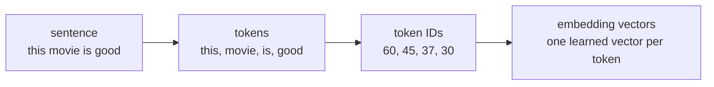
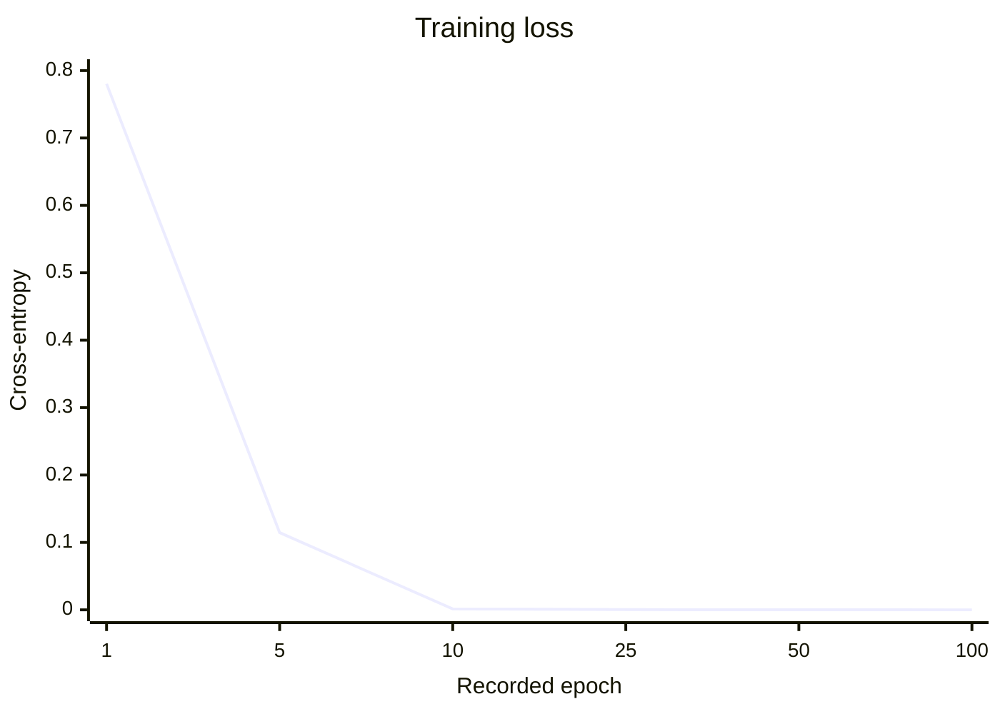
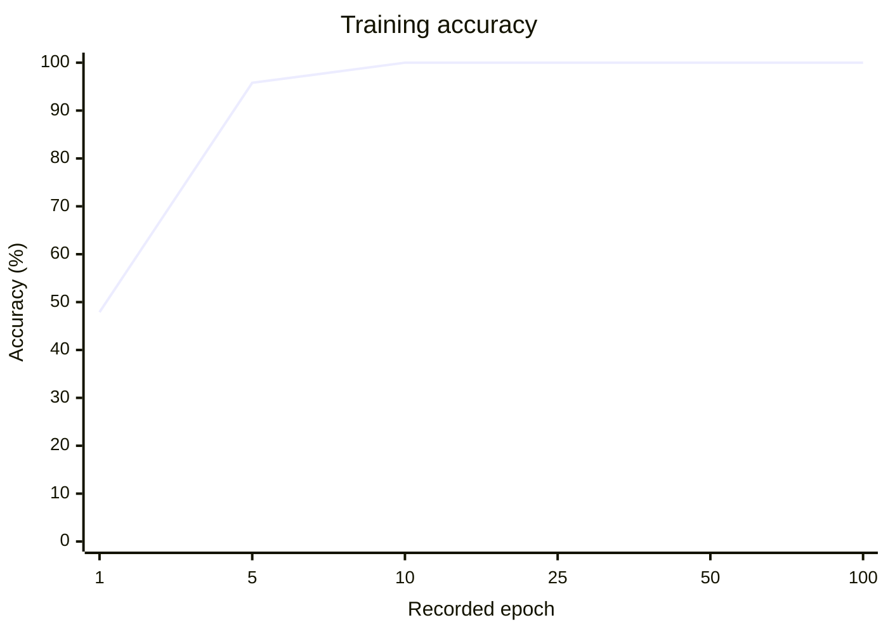

## Introduction



This example classifies short English sentences as either negative or positive:

```text
"the acting was excellent"  → positive
"the acting was poor"       → negative
```

The final model is small:

```text
sentence
   ↓
tokenize
   ↓
word IDs
   ↓
word embeddings
   ↓
RNN
   ↓
final sentence memory
   ↓
two class scores
```

The RNN is first explained through its underlying matrix operations. This makes the memory update and dimensions visible. The runnable implementation uses PyTorch's `nn.Embedding`, `nn.RNN`, and `nn.Linear`.

This is a teaching example, not a production sentiment system. Its small size keeps every operation visible.

## Understand the Sentence Classifier from Scratch

### The Classification Task

There are two classes:

| Label | Meaning |
| ---: | --- |
| `0` | Negative |
| `1` | Positive |

Each training example is a `(sentence, label)` pair:

```python
("this movie is good", 1)
("this movie is awful", 0)
```

The sentence is the input. The label is the correct answer. The model never receives the label as part of the sentence. The label is used only after prediction to measure the error.

At the end of the forward pass, the model produces two raw scores:

```text
[negative score, positive score]
```

These scores are called **logits**. The larger logit becomes the predicted class.

### Text Must Become Numbers

A matrix multiplication cannot operate on the string:

```text
"this movie is good"
```

Four conversions are required:



Tokenization decides which text fragment occupies one sequence position. The vocabulary gives that fragment an integer address. The embedding table turns the address into a trainable vector.

These are different jobs. It is worth keeping them separate.

### Step 1: Tokenization

For this example, a token is one lowercase English word:

```python
import re


def tokenize(sentence):
    return re.findall(r"[a-z']+", sentence.lower())


print(tokenize("The movie was surprisingly good!"))
```

Output:

```text
['the', 'movie', 'was', 'surprisingly', 'good']
```

Lowercasing means `"Movie"` and `"movie"` become the same token. The regular expression keeps letters and apostrophes, while punctuation is discarded.

The output is a list, so word order remains intact:

```text
t=0     t=1       t=2    t=3
this → movie → is → good
```

The RNN will read that list from left to right. Its hidden state after `"movie"` depends on both `"this"` and `"movie"`.

This tokenizer is deliberately limited. It drops capitalization, emoji, most punctuation, and any character outside the small pattern. Modern language models normally use subword tokenizers, but a word tokenizer keeps this first example easy to inspect.

### Step 2: Vocabulary, `PAD`, and `UNK`

The vocabulary maps every training word to an integer ID:

```text
"good"  → 30
"movie" → 45
"the"   → 59
```

An ID is an address, not a measurement. ID `59` is not greater, stronger, or more positive than ID `30`.

Two special entries come first:

```text
0 → <PAD>
1 → <UNK>
```

`<PAD>` fills unused positions when sentences in the same batch have different lengths.

`<UNK>` means “this word was not in the training vocabulary.” Every unseen word maps to the same ID in this simple system.

The vocabulary must be built from the training set only. Reading the test set while creating it would leak information from evaluation data into model preparation.

```python
from collections import Counter


word_counts = Counter(
    word
    for sentence, label in TRAIN_DATA
    for word in tokenize(sentence)
)

id_to_word = ["<PAD>", "<UNK>"] + sorted(word_counts)
word_to_id = {
    word: word_id
    for word_id, word in enumerate(id_to_word)
}

PAD_ID = word_to_id["<PAD>"]
UNK_ID = word_to_id["<UNK>"]


def encode(sentence):
    tokens = tokenize(sentence)

    # Give an empty or punctuation-only sentence one usable position.
    if not tokens:
        return [UNK_ID]

    return [
        word_to_id.get(word, UNK_ID)
        for word in tokens
    ]
```

Suppose `"surprisingly"` did not occur in the training set:

```text
"the movie was surprisingly good"
                  ↓
["the", "movie", "was", "surprisingly", "good"]
                  ↓
[59, 45, 66, 1, 30]
```

The ID `1` marks the word as unknown. It does not preserve the original unknown word.

### Step 3: Put Different-Length Sentences in One Batch

A batch processes several sentences together. The difficulty is that sentences rarely contain the same number of words:

```text
"movie was good"                    length 3
"acting was very bad"               length 4
"the story is quite wonderful"      length 5
```

A tensor must be rectangular, so the shorter rows are padded to the longest length in that batch:

```text
                    t=0      t=1      t=2     t=3       t=4
sentence 0         movie    was      good     PAD        PAD
sentence 1         acting   was      very     bad        PAD
sentence 2         the      story    is       quite      wonderful
real length        3        4        5
```

After vocabulary lookup, the token tensor has shape:

```text
(batch, time) = (B,T)
```

For the three sentences above:

```text
token_ids: (3,5)
lengths:   (3,)
labels:    (3,)
```

`lengths` stores where each real sentence ends. This information is needed after the RNN.

### The Small Dimensions Used in the Simulator

The interactive walkthrough uses deliberately tiny values:

```text
batch size B       = 3
sequence length T  = 5
embedding size E   = 3
hidden size H      = 4
classes C          = 2
```

This produces the complete path:

```text
token IDs       (3,5)
embeddings      (3,5,3)
one timestep    (3,3)
hidden history  (3,5,4)
sentence memory (3,4)
logits          (3,2)
```

Its complete vocabulary is small enough to display:

```text
0  <PAD>       1  <UNK>       2  movie       3  was
4  good        5  acting      6  very        7  bad
8  the         9  story      10  is         11  quite
12 wonderful
```

The padded ID batch is:

```text
S0: [2, 3,  4,  0,  0]   length 3   label 1
S1: [5, 3,  6,  7,  0]   length 4   label 0
S2: [8, 9, 10, 11, 12]   length 5   label 1
```

The simulator uses fixed illustrative parameters so the values remain repeatable. It does not train in the browser. Use **Play** for the whole forward pass, or choose one stage to inspect the actual values and matrix calculations.

### Step 4: The Embedding Lookup

An embedding layer is a trainable lookup table:

```text
embedding table: (vocabulary size, E)
```

In the simulator, `E=3`. Every vocabulary item therefore owns one row containing three trainable numbers:

```text
row for "good" → [three learned numbers]
row for "bad"  → [three learned numbers]
```

At the start of real training, those numbers are random.

If the batch of word IDs has shape `(3,5)`, looking up one three-number vector per ID gives:

$$
(B,T) \rightarrow (B,T,E)
$$

$$
(3,5) \rightarrow (3,5,3)
$$

No multiplication by the integer ID takes place. The ID only selects a row.

At timestep \(t\), one word vector is taken from every sentence:

```text
x_t = embedded[:, t, :]
```

Its shape is:

```text
x_t: (B,E) = (3,3)
```

The same word always selects the same embedding row. If `"good"` occurs in twenty sentences, gradients from all twenty occurrences update that shared row.

`padding_idx=PAD_ID` makes PyTorch keep the padding row at zero and prevents it from receiving normal embedding updates.

A zero `PAD` embedding does **not** freeze the RNN state. The recurrent contribution and biases can still change the hidden state on a padded timestep. Therefore, real lengths are recorded so each row's last real-word state can be selected later.

### Step 5: One RNN Memory Update from Scratch

At one timestep, a basic RNN combines:

- the current word vector \(x_t\),
- the previous hidden state \(h_{t-1}\),
- learned weights and biases.

PyTorch's exact simple-RNN update is:

$$
h_t = \tanh
\left(
x_tW_{ih}^{T} + b_{ih}
+
h_{t-1}W_{hh}^{T} + b_{hh}
\right)
$$

The hidden state is the model's running sentence memory.

For the simulator:

| Value | Shape | Meaning |
| --- | --- | --- |
| \(x_t\) | `(3,3)` | Current word vector from all three sentences |
| \(W_{ih}\) | `(4,3)` | Input-to-hidden weights stored by PyTorch |
| \(h_{t-1}\) | `(3,4)` | Previous memory |
| \(W_{hh}\) | `(4,4)` | Hidden-to-hidden weights |
| \(b_{ih}\) | `(4,)` | Input-path bias |
| \(b_{hh}\) | `(4,)` | Recurrent-path bias |
| \(h_t\) | `(3,4)` | Updated memory |

PyTorch stores `W_ih` as `(H,E)`, so it uses its transpose during the multiplication:

$$
x_tW_{ih}^{T}
:
(3,3)(3,4) = (3,4)
$$

The old-memory path is:

$$
h_{t-1}W_{hh}^{T}
:
(3,4)(4,4) = (3,4)
$$

Both paths now have the same shape:

$$
(3,4) + (3,4) + (4) + (4) = (3,4)
$$

Each bias vector is broadcast across the three batch rows. `tanh` changes every value independently and keeps the shape `(3,4)`.

In plain English:

```text
new memory =
    tanh(
        contribution from the current word
        + contribution from the previous memory
        + learned offsets
    )
```

The matrices are shared at every timestep. The RNN learns one memory-update rule and applies it to every word position.

### Step 6: Propagate Through the Whole Sentence

PyTorch starts with a zero hidden state when no initial state is supplied:

```text
h_initial: (3,4), all zeros
```

It then repeats the same update:

```text
t=0: x_0 (3,3) + h_initial (3,4) → h_0 (3,4)
t=1: x_1 (3,3) + h_0       (3,4) → h_1 (3,4)
t=2: x_2 (3,3) + h_1       (3,4) → h_2 (3,4)
t=3: x_3 (3,3) + h_2       (3,4) → h_3 (3,4)
t=4: x_4 (3,3) + h_3       (3,4) → h_4 (3,4)
```

`nn.RNN` returns every hidden state:

```text
hidden_history: (B,T,H) = (3,5,4)
```

The entries have a precise meaning:

```text
hidden_history[0, 2, :]
```

is the four-number memory for sentence `0` after its token at timestep `2`.

The RNN also returns `h_n`:

```text
h_n: (num_layers,B,H) = (1,3,4)
```

For equal-length sequences, `h_n[0]` is the last hidden state of each row. In a padded batch, that is not necessarily the last **real-word** state.

### Step 7: Select Each Sentence's Real Ending

Consider a sentence whose real length is four inside a five-column batch:

```text
word  word  word  word  PAD
 t=0   t=1   t=2   t=3  t=4
```

Its useful final state is at index `3`, not index `4`.

Because indices start at zero:

```text
last_word_index = length - 1
```

For the simulator's three lengths:

```text
lengths:         [3, 4, 5]
last_word_index: [2, 3, 4]
```

The selection is:

```python
row_index = torch.arange(batch_size)
last_word_index = lengths - 1

final_h = hidden_history[
    row_index,
    last_word_index,
]
```

Advanced indexing pairs the values by row:

```text
row 0 → hidden_history[0,2,:]
row 1 → hidden_history[1,3,:]
row 2 → hidden_history[2,4,:]
```

The result is:

```text
final_h: (B,H) = (3,4)
```

`nn.RNN` still calculates the padded timesteps, but those later states are not used. For a large workload, `pack_padded_sequence` can skip this wasted recurrent work. Direct indexing keeps the first implementation easier to understand.

### Step 8: Turn Sentence Memory into Class Scores

The classifier is a linear layer:

$$
\text{logits} = \text{final\_h}W_c^T + b_c
$$

For the simulator:

| Value | Shape |
| --- | --- |
| `final_h` | `(3,4)` |
| classifier weight \(W_c\) | `(2,4)` |
| classifier bias \(b_c\) | `(2,)` |
| `logits` | `(3,2)` |

The multiplication is:

$$
(3,4)(4,2) + (2) = (3,2)
$$

Each row now has two scores:

```text
                    class 0     class 1
sentence 0          negative    positive
sentence 1          negative    positive
sentence 2          negative    positive
```

Logits are not probabilities. Softmax converts each row into probabilities that sum to one:

$$
p_i = \frac{e^{z_i}}{\sum_j e^{z_j}}
$$

Softmax is useful for inspection. During training, `cross_entropy(logits, labels)` expects raw logits and applies the stable log-softmax calculation internally. Applying softmax before cross-entropy would be a mistake.

### The Complete Forward Path

The dimensions from start to finish are:

```mermaid
flowchart LR
    A["sentences<br/>3 Python strings"]
    B["token lists<br/>lengths 3, 4, 5"]
    C["token IDs<br/>ragged Python lists"]
    D["padding<br/>(3,5)"]
    E["embedding lookup<br/>(3,5,3)"]
    F["RNN recurrence<br/>hidden history (3,5,4)"]
    G["select each real ending<br/>(3,4)"]
    H["linear classifier<br/>logits (3,2)"]
    I["softmax<br/>probabilities (3,2)"]
    J["predictions and labels<br/>metrics"]
    A --> B --> C --> D --> E --> F --> G --> H --> I --> J
```



The batch dimension stays `3`. The time dimension exists through the embedding and RNN history, then disappears when one final memory is selected per sentence.

## Runnable PyTorch Implementation

### Build the Classifier in PyTorch

The simulator uses tiny `E=3` and `H=4` values so every cell fits on screen. The runnable model uses:

```text
embedding size E = 16
hidden size H    = 24
classes C        = 2
```

These are still small, but give the model more room to learn. Changing `E` or `H` does not change the pipeline.

#### Imports and Reproducible Settings

```python
import random
import re
from collections import Counter

import matplotlib.pyplot as plt
import torch
import torch.nn as nn
import torch.nn.functional as F

random.seed(7)
torch.manual_seed(7)

device = torch.device("cpu")

print("PyTorch:", torch.__version__)
print("device:", device)
```

Output:

```text
PyTorch: 2.13.0+cpu
device: cpu
```

The outputs below were captured with this CPU environment. The PyTorch version string and small floating-point details may differ across installations.

#### A Small Labeled Dataset

The dataset contains separate training and test sentences. Only the training sentences may update the model.

```python
TRAIN_DATA = [
    ("this movie is good", 1),
    ("this movie is great", 1),
    ("this film is amazing", 1),
    ("i loved this movie", 1),
    ("i enjoyed this film", 1),
    ("the story was wonderful", 1),
    ("the acting was excellent", 1),
    ("what a fantastic movie", 1),
    ("the ending made me happy", 1),
    ("this book is very good", 1),
    ("the show was really great", 1),
    ("the characters were amazing", 1),
    ("i liked the story", 1),
    ("the music was wonderful", 1),
    ("this was a fun movie", 1),
    ("the film felt warm and joyful", 1),
    ("the plot was interesting", 1),
    ("i would watch this again", 1),
    ("the performance was excellent", 1),
    ("every scene was enjoyable", 1),
    ("the book made me smile", 1),
    ("this is a lovely story", 1),
    ("the ending was satisfying", 1),
    ("we enjoyed the show", 1),

    ("this movie is bad", 0),
    ("this movie is awful", 0),
    ("this film is terrible", 0),
    ("i hated this movie", 0),
    ("i disliked this film", 0),
    ("the story was boring", 0),
    ("the acting was poor", 0),
    ("what a horrible movie", 0),
    ("the ending made me angry", 0),
    ("this book is very bad", 0),
    ("the show was really awful", 0),
    ("the characters were terrible", 0),
    ("i disliked the story", 0),
    ("the music was annoying", 0),
    ("this was a dull movie", 0),
    ("the film felt cold and lifeless", 0),
    ("the plot was confusing", 0),
    ("i would not watch this again", 0),
    ("the performance was poor", 0),
    ("every scene was painful", 0),
    ("the book made me frustrated", 0),
    ("this is an unpleasant story", 0),
    ("the ending was disappointing", 0),
    ("we hated the show", 0),
]

TEST_DATA = [
    ("the movie was fantastic", 1),
    ("i really enjoyed the story", 1),
    ("the acting made me happy", 1),
    ("what a wonderful film", 1),
    ("this book is excellent", 1),
    ("the ending was great", 1),
    ("i loved every minute", 1),
    ("the show was surprisingly good", 1),

    ("the movie was horrible", 0),
    ("i really hated the story", 0),
    ("the acting made me angry", 0),
    ("what a terrible film", 0),
    ("this book is awful", 0),
    ("the ending was bad", 0),
    ("i disliked every minute", 0),
    ("the show was painfully boring", 0),
]

print("training sentences:", len(TRAIN_DATA))
print("test sentences:", len(TEST_DATA))
```

Output:

```text
training sentences: 48
test sentences: 16
```

There are 48 training sentences and 16 held-out test sentences. This is much too small for a reliable language system. It is enough to exercise the complete training path.

#### Tokenize and Build the Training Vocabulary

```python
def tokenize(sentence):
    return re.findall(r"[a-z']+", sentence.lower())


word_counts = Counter(
    word
    for sentence, label in TRAIN_DATA
    for word in tokenize(sentence)
)

id_to_word = ["<PAD>", "<UNK>"] + sorted(word_counts)
word_to_id = {
    word: word_id
    for word_id, word in enumerate(id_to_word)
}

PAD_ID = word_to_id["<PAD>"]
UNK_ID = word_to_id["<UNK>"]


def encode(sentence):
    tokens = tokenize(sentence)

    if not tokens:
        return [UNK_ID]

    return [
        word_to_id.get(word, UNK_ID)
        for word in tokens
    ]


print("vocabulary size:", len(id_to_word))
print("PAD ID:", PAD_ID)
print("UNK ID:", UNK_ID)
print("encoded example:", encode("this movie is good"))
```

Output:

```text
vocabulary size: 71
PAD ID: 0
UNK ID: 1
encoded example: [60, 45, 37, 30]
```

With this data, the vocabulary contains 71 entries, including `PAD` and `UNK`.

#### Create a Padded Batch

```python
def make_batch(examples):
    encoded_sentences = [
        encode(sentence)
        for sentence, label in examples
    ]

    lengths = torch.tensor(
        [len(ids) for ids in encoded_sentences],
        dtype=torch.long,
    )                                                   # (B,)

    batch_size = len(examples)
    max_length = int(lengths.max())

    token_ids = torch.full(
        (batch_size, max_length),
        PAD_ID,
        dtype=torch.long,
    )                                                   # (B,T)

    for row, ids in enumerate(encoded_sentences):
        token_ids[row, :len(ids)] = torch.tensor(
            ids,
            dtype=torch.long,
        )

    labels = torch.tensor(
        [label for sentence, label in examples],
        dtype=torch.long,
    )                                                   # (B,)

    return token_ids, lengths, labels


demo_examples = [
    TRAIN_DATA[0],
    TRAIN_DATA[8],
    TRAIN_DATA[15],
]

demo_ids, demo_lengths, demo_labels = make_batch(demo_examples)

print("token IDs:", tuple(demo_ids.shape))
print("lengths: ", tuple(demo_lengths.shape), demo_lengths.tolist())
print("labels:  ", tuple(demo_labels.shape), demo_labels.tolist())
print(demo_ids)
```

Output:

```text
token IDs: (3, 6)
lengths:  (3,) [4, 5, 6]
labels:   (3,) [1, 1, 1]
tensor([[60, 45, 37, 30,  0,  0],
        [59, 20, 43, 44, 32,  0],
        [59, 27, 26, 63,  7, 38]])
```

The maximum sentence length is calculated separately for each batch. A different batch may therefore have a different `T`. `nn.RNN` is fine with that.

#### Define `Embedding → RNN → Linear`

```python
class SentenceRNN(nn.Module):
    def __init__(
        self,
        vocabulary_size,
        embedding_size=16,
        hidden_size=24,
        number_of_classes=2,
    ):
        super().__init__()

        self.embedding = nn.Embedding(
            num_embeddings=vocabulary_size,
            embedding_dim=embedding_size,
            padding_idx=PAD_ID,
        )

        self.rnn = nn.RNN(
            input_size=embedding_size,
            hidden_size=hidden_size,
            num_layers=1,
            nonlinearity="tanh",
            batch_first=True,
        )

        self.classifier = nn.Linear(
            in_features=hidden_size,
            out_features=number_of_classes,
        )

    def forward(self, token_ids, lengths, return_details=False):
        # (B,T) -> (B,T,E)
        embedded = self.embedding(token_ids)

        # PyTorch creates a zero h_initial because none is supplied.
        # output: (B,T,H), h_n: (1,B,H)
        hidden_history, h_n = self.rnn(embedded)

        batch_size = token_ids.shape[0]
        row_index = torch.arange(
            batch_size,
            device=token_ids.device,
        )
        last_word_index = lengths.to(token_ids.device) - 1

        # Select the hidden state after each row's final real word.
        final_h = hidden_history[
            row_index,
            last_word_index,
        ]                                               # (B,H)

        logits = self.classifier(final_h)               # (B,2)

        if return_details:
            return logits, embedded, hidden_history, final_h

        return logits


# Reset here so model initialization is repeatable even if earlier cells rerun.
random.seed(7)
torch.manual_seed(7)

model = SentenceRNN(
    vocabulary_size=len(id_to_word),
    embedding_size=16,
    hidden_size=24,
).to(device)

print(model)
```

Output:

```text
SentenceRNN(
  (embedding): Embedding(71, 16, padding_idx=0)
  (rnn): RNN(16, 24, batch_first=True)
  (classifier): Linear(in_features=24, out_features=2, bias=True)
)
```

`batch_first=True` means the RNN expects `(B,T,E)`. Without it, `nn.RNN` expects `(T,B,E)`.

No `h_initial` value is passed, so PyTorch creates zeros with shape `(num_layers,B,H)`.

#### Inspect Every Parameter

```python
for name, parameter in model.named_parameters():
    print(f"{name:25s} {tuple(parameter.shape)}")

parameter_count = sum(
    parameter.numel()
    for parameter in model.parameters()
)
print("total parameters:", parameter_count)
```

Output:

```text
embedding.weight          (71, 16)
rnn.weight_ih_l0          (24, 16)
rnn.weight_hh_l0          (24, 24)
rnn.bias_ih_l0            (24,)
rnn.bias_hh_l0            (24,)
classifier.weight         (2, 24)
classifier.bias           (2,)
total parameters: 2194
```

The parameter count is:

$$
\begin{aligned}
\text{embedding} &= 71 \times 16 = 1136 \\
\text{RNN input weights} &= 24 \times 16 = 384 \\
\text{RNN memory weights} &= 24 \times 24 = 576 \\
\text{RNN biases} &= 24 + 24 = 48 \\
\text{classifier} &= (2 \times 24) + 2 = 50 \\
\text{total} &= 2194
\end{aligned}
$$

#### Check the Forward Dimensions

```python
logits, embedded, hidden_history, final_h = model(
    demo_ids,
    demo_lengths,
    return_details=True,
)

print("token IDs:      ", tuple(demo_ids.shape))
print("word vectors:   ", tuple(embedded.shape))
print("hidden history: ", tuple(hidden_history.shape))
print("final memory:   ", tuple(final_h.shape))
print("logits:         ", tuple(logits.shape))
print("labels:         ", tuple(demo_labels.shape))
```

Output:

```text
token IDs:       (3, 6)
word vectors:    (3, 6, 16)
hidden history:  (3, 6, 24)
final memory:    (3, 24)
logits:          (3, 2)
labels:          (3,)
```

For this particular three-sentence batch, the longest sentence contains six words.

### Train with Backpropagation Through Time

The final loss depends on the final selected hidden states. Those states depend on earlier hidden states, which depend on still earlier states.

During `loss.backward()`, gradients follow that dependency chain backward:

```text
cross-entropy loss
        ↓
classifier
        ↓
selected final hidden states
        ↓
later RNN updates
        ↓
earlier RNN updates
        ↓
embedding rows used by the sentences
```

This is **backpropagation through time**, or BPTT.

The RNN weights are reused at every timestep. Their `.grad` tensors receive the sum of all contributions from every use in the unrolled sequence. PyTorch builds and traverses this graph automatically.

`optimizer.zero_grad()` is still required before every batch because PyTorch parameter gradients accumulate by default.

#### Batch Iterator and Training Loop

```python
def iterate_batches(examples, batch_size=8, shuffle=True):
    items = list(examples)

    if shuffle:
        random.shuffle(items)

    for start in range(0, len(items), batch_size):
        yield make_batch(items[start:start + batch_size])


optimizer = torch.optim.Adam(model.parameters(), lr=2e-2)

history = {
    "epoch": [],
    "loss": [],
    "accuracy": [],
}

for epoch in range(1, 101):
    model.train()

    total_loss = 0.0
    total_correct = 0
    total_examples = 0

    for token_ids, lengths, labels in iterate_batches(
        TRAIN_DATA,
        batch_size=8,
        shuffle=True,
    ):
        logits = model(token_ids, lengths)          # (B,2)
        loss = F.cross_entropy(logits, labels)      # scalar

        optimizer.zero_grad(set_to_none=True)
        loss.backward()
        nn.utils.clip_grad_norm_(
            model.parameters(),
            max_norm=1.0,
        )
        optimizer.step()

        current_batch_size = labels.shape[0]
        predictions = logits.argmax(dim=-1)         # (B,)

        total_loss += loss.item() * current_batch_size
        total_correct += (
            predictions == labels
        ).sum().item()
        total_examples += current_batch_size

    epoch_loss = total_loss / total_examples
    epoch_accuracy = total_correct / total_examples

    history["epoch"].append(epoch)
    history["loss"].append(epoch_loss)
    history["accuracy"].append(epoch_accuracy)

    if epoch in {1, 5, 10, 25, 50, 100}:
        print(
            f"epoch {epoch:3d} | "
            f"loss {epoch_loss:.4f} | "
            f"accuracy {epoch_accuracy:.1%}"
        )
```

Output:

```text
epoch   1 | loss 0.7804 | accuracy 47.9%
epoch   5 | loss 0.1146 | accuracy 95.8%
epoch  10 | loss 0.0013 | accuracy 100.0%
epoch  25 | loss 0.0003 | accuracy 100.0%
epoch  50 | loss 0.0001 | accuracy 100.0%
epoch 100 | loss 0.0000 | accuracy 100.0%
```

Gradient clipping limits the norm of the combined gradient to `1.0`. Simple RNNs can produce large gradients across recurrent steps, so this is a useful safety measure.

On the stated seed, the training run reaches `100%` training accuracy. That only says the model fits these 48 sentences. It does not prove that it understands sentiment.

#### Plot the Learning Curves

```python
fig, axes = plt.subplots(1, 2, figsize=(10, 3.5))

axes[0].plot(history["epoch"], history["loss"])
axes[0].set_title("Training loss")
axes[0].set_xlabel("epoch")
axes[0].set_ylabel("cross-entropy")
axes[0].grid(alpha=0.25)

axes[1].plot(history["epoch"], history["accuracy"])
axes[1].set_title("Training accuracy")
axes[1].set_xlabel("epoch")
axes[1].set_ylabel("accuracy")
axes[1].set_ylim(0, 1.05)
axes[1].grid(alpha=0.25)

plt.tight_layout()
plt.show()
```

The same learning curves can be drawn directly from the Markdown source. The recorded checkpoints keep the browser-rendered plots compact and readable.

<style>
.mermaid g[class^="line-plot-"] path {
  stroke: #1d4ed8 !important;
  stroke-width: 4px !important;
  stroke-linecap: round;
  stroke-linejoin: round;
  opacity: 1;
  vector-effect: non-scaling-stroke;
}

.dark .mermaid g[class^="line-plot-"] path {
  stroke: #60a5fa !important;
}

@media (prefers-contrast: more) {
  .mermaid g[class^="line-plot-"] path {
    stroke-width: 5px !important;
  }
}
</style>





Loss and accuracy show different things:

- Cross-entropy measures how much probability the model assigns to the correct class.
- Accuracy only checks whether the largest logit belongs to the correct class.

A prediction can become more confident while remaining correct. Its loss improves, while its accuracy stays unchanged.

### Evaluate on Unseen Sentences

Evaluation must not update weights. This requires `model.eval()` and `torch.no_grad()`:

```python
model.eval()

test_ids, test_lengths, test_labels = make_batch(TEST_DATA)

with torch.no_grad():
    test_logits = model(test_ids, test_lengths)
    test_probabilities = test_logits.softmax(dim=-1)
    test_predictions = test_logits.argmax(dim=-1)

test_loss = F.cross_entropy(
    test_logits,
    test_labels,
).item()

test_accuracy = (
    test_predictions == test_labels
).float().mean().item()

print(f"test loss: {test_loss:.4f}")
print(f"test accuracy: {test_accuracy:.1%}")
```

Output:

```text
test loss: 1.0862
test accuracy: 81.2%
```

Then inspect each decision:

```python
for (sentence, true_label), predicted_label, probabilities in zip(
    TEST_DATA,
    test_predictions.tolist(),
    test_probabilities.tolist(),
):
    result = "correct" if predicted_label == true_label else "WRONG"

    print(
        f"{result:7s} | "
        f"true={true_label} predicted={predicted_label} | "
        f"P(positive)={probabilities[1]:.3f} | "
        f"{sentence}"
    )
```

Output:

```text
correct | true=1 predicted=1 | P(positive)=0.922 | the movie was fantastic
correct | true=1 predicted=1 | P(positive)=1.000 | i really enjoyed the story
correct | true=1 predicted=1 | P(positive)=1.000 | the acting made me happy
WRONG   | true=1 predicted=0 | P(positive)=0.000 | what a wonderful film
correct | true=1 predicted=1 | P(positive)=0.999 | this book is excellent
correct | true=1 predicted=1 | P(positive)=0.987 | the ending was great
correct | true=1 predicted=1 | P(positive)=0.997 | i loved every minute
correct | true=1 predicted=1 | P(positive)=1.000 | the show was surprisingly good
WRONG   | true=0 predicted=1 | P(positive)=0.998 | the movie was horrible
correct | true=0 predicted=0 | P(positive)=0.001 | i really hated the story
correct | true=0 predicted=0 | P(positive)=0.000 | the acting made me angry
WRONG   | true=0 predicted=1 | P(positive)=0.854 | what a terrible film
correct | true=0 predicted=0 | P(positive)=0.000 | this book is awful
correct | true=0 predicted=0 | P(positive)=0.000 | the ending was bad
correct | true=0 predicted=0 | P(positive)=0.000 | i disliked every minute
correct | true=0 predicted=0 | P(positive)=0.000 | the show was painfully boring
```

The run reaches `100%` training accuracy and `81.2%` test accuracy, or 13 correct decisions out of 16. The three errors are useful. The model fits every training sentence but still mishandles some rearrangements of known words. Training accuracy alone hid that weakness.

For a balanced two-class test set, plain accuracy is readable. An imbalanced dataset also requires a confusion matrix, precision, recall, and F1 score. A model that predicts only the majority class can have deceptively high accuracy.

### Classify a New Sentence

```python
def classify_sentence(sentence):
    model.eval()

    token_ids, lengths, _ = make_batch([(sentence, 0)])

    with torch.no_grad():
        probabilities = model(
            token_ids,
            lengths,
        ).softmax(dim=-1)[0]

    predicted_label = probabilities.argmax().item()
    predicted_name = (
        "positive"
        if predicted_label == 1
        else "negative"
    )

    print("sentence:", sentence)
    print("tokens:  ", tokenize(sentence))
    print("IDs:     ", encode(sentence))
    print("result:  ", predicted_name)
    print("P(negative):", f"{probabilities[0].item():.3f}")
    print("P(positive):", f"{probabilities[1].item():.3f}")


classify_sentence("the product is excellent")
```

Output:

```text
sentence: the product is excellent
tokens:   ['the', 'product', 'is', 'excellent']
IDs:      [59, 1, 37, 24]
result:   positive
P(negative): 0.000
P(positive): 1.000
```

`"product"` is not in the training vocabulary, so it becomes `UNK`. The known word `"excellent"` can still push the classifier toward positive.

The supplied label `0` inside `make_batch` is only a dummy value here. Prediction does not use it.

## What the Model Can and Cannot Learn

The embedding and RNN weights are trained together. Positive examples can move embeddings such as `"excellent"` and `"wonderful"` toward representations that help produce a positive final state. Negative examples do the same for `"awful"` and `"poor"`.

The RNN can also use order because every hidden state depends on the previous one. That does not mean this tiny dataset teaches it English.

### Negation Is Hard

Compare:

```text
"good"
"not good"
"not bad"
```

The word `"not"` changes the role of the word after it. A model can only learn that interaction if the training data contains enough varied negation examples. This dataset has almost none, so predictions for these phrases are not trustworthy.

### Every Unknown Word Collapses to One Vector

This vocabulary treats:

```text
"masterful" → UNK
"dreadful"  → UNK
```

as the same input vector, even though their sentiment is opposite. Subword tokenization reduces this problem by representing unfamiliar words as smaller known pieces.

### The Final Hidden State Is a Bottleneck

The entire sentence must be compressed into one vector of size `H=24`. Information from early words can fade over a long sequence. Simple RNNs are particularly vulnerable to vanishing gradients.

LSTMs and GRUs add gates that protect useful memory. Attention goes further by allowing direct access to earlier positions.

### Confidence Is Not Reliability

Softmax can produce `0.99` on a wrong answer. It only describes the model's relative logits for that input. It does not prove that the prediction is correct or calibrated.

### The Dataset Is the Main Limitation

Forty-eight hand-written training examples cannot cover English sentiment. A useful system needs:

- substantially more varied and carefully labeled data,
- a tokenizer that handles unseen words well,
- validation data for model selection,
- test cases for negation, ambiguity, domain shifts, and class imbalance,
- comparison against simple baselines.

## The Core Picture

The whole model can be reduced to five ideas:

1. Tokenization turns a sentence into an ordered list.
2. A vocabulary turns tokens into integer addresses.
3. An embedding table turns each address into a learned vector.
4. An RNN repeatedly combines the current vector with previous memory.
5. A linear layer turns the final real-word memory into class logits.

The central shape propagation is:

```text
(B,T) token IDs
   ↓ embedding lookup
(B,T,E) word vectors
   ↓ recurrent updates
(B,T,H) hidden history
   ↓ output[row, length - 1]
(B,H) sentence memories
   ↓ linear classifier
(B,C) logits
```

The scratch equations explain what `nn.RNN` computes. The PyTorch layer performs the same recurrence, registers the parameters, and lets autograd carry BPTT through the entire unrolled sequence.
