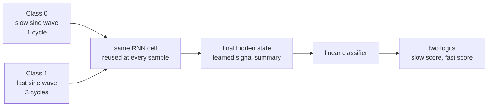
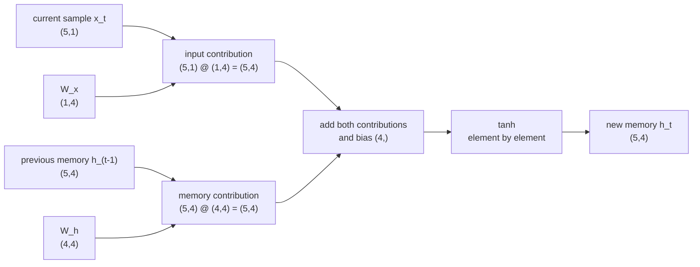
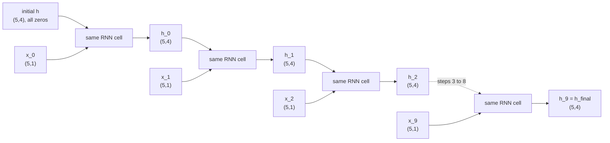
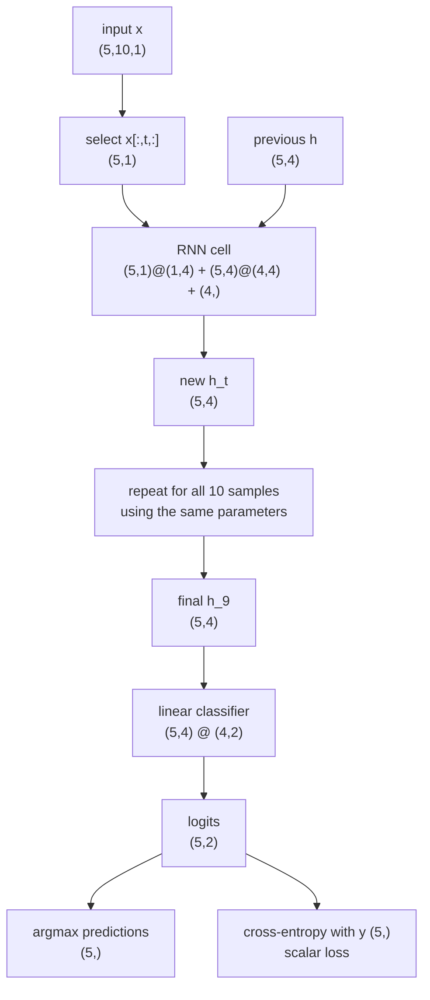
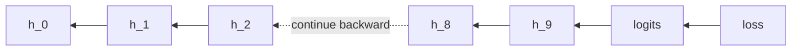
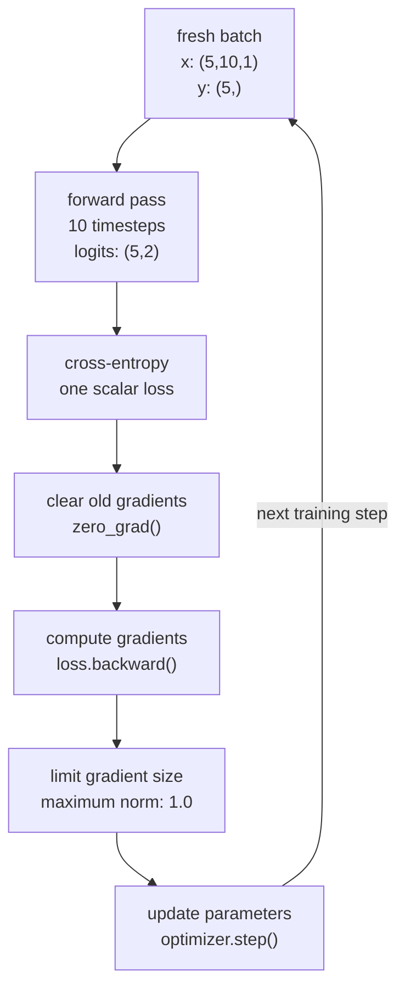

## Introduction

A recurrent neural network, or RNN, is a neural network for ordered data. Instead of receiving a complete sequence as one flat vector, it reads one item at a time and carries a hidden state forward. That hidden state is its working memory.

This note builds the smallest useful signal-classification example:

- **Class 0:** a slow sine wave that completes one cycle.
- **Class 1:** a fast sine wave that completes three cycles.

The model receives one amplitude at each timestep. After the final sample, it decides whether the complete signal was slow or fast.

The goal is not to build the best frequency classifier. A Fourier transform would solve this synthetic problem more directly. The goal is to make the RNN data flow, matrix dimensions, training loop, and evaluation metrics concrete.

## The Task

Every signal contains 10 samples. The two classes occupy the same time window but oscillate at different rates.



The RNN is not given frequency, peak locations, or zero-crossing counts. It only receives the raw amplitudes in order. It must learn some internal representation that separates slow waves from fast waves.

## How One Signal Becomes a Tensor

One signal might look like this:

```text
[0.10, 0.64, 0.94, 0.89, 0.49, -0.10, -0.64, -0.94, -0.89, -0.49]
```

That is not treated as 10 features arriving together. It is treated as:

```text
10 timesteps × 1 feature at each timestep
```

PyTorch uses the layout:

```text
(batch, time, features)
```

Therefore:

| Situation | Tensor shape |
| --- | --- |
| One 10-sample signal | `(1, 10, 1)` |
| One batch of five signals | `(5, 10, 1)` |
| One timestep from all five signals | `(5, 1)` |
| One target per signal | `(5,)` |

The batch dimension and time dimension mean different things. All examples in a batch can be processed together. Time remains sequential because hidden state \(h_t\) depends on \(h_{t-1}\).

## The Dimensions Used Everywhere

The animation, diagrams, and PyTorch code all use the same dimensions:

```text
batch size B       = 5
sequence length T  = 10
input features F   = 1
hidden size H      = 4
classes C          = 2
```

The input has shape:

```text
x: (5, 10, 1)
```

At timestep \(t\), this slice:

```text
x_t = x[:, t, :]
```

has shape:

```text
x_t: (5, 1)
```

It contains one amplitude from each of the five signals.

The interactive walkthrough below uses real values and follows all ten timesteps. Pick one signal row and one hidden feature to trace. You can jump to any timestep, inspect the exact scalar arithmetic, or press **Play**.



## Inside One RNN Cell

A simple RNN cell performs one memory update:

$$
h_t = \tanh(x_tW_x + h_{t-1}W_h + b)
$$

In plain English:

```text
new memory =
    tanh(
        information from the current sample
        +
        transformed previous memory
        +
        a learned bias
    )
```

For the model used throughout:

| Value | Shape | Meaning |
| --- | --- | --- |
| \(x_t\) | `(5, 1)` | Current amplitude from each signal |
| \(W_x\) | `(1, 4)` | Converts one amplitude into four hidden features |
| \(h_{t-1}\) | `(5, 4)` | Previous memory for all five signals |
| \(W_h\) | `(4, 4)` | Transforms the previous memory |
| \(b\) | `(4,)` | Learned offset, broadcast across the batch |
| \(h_t\) | `(5, 4)` | New memory |

The input path is:

$$
(5 \times 1)(1 \times 4) = (5 \times 4)
$$

The recurrent path is:

$$
(5 \times 4)(4 \times 4) = (5 \times 4)
$$

Both results have the same shape, so they can be added:

$$
(5 \times 4) + (5 \times 4) + (4) = (5 \times 4)
$$

The bias has shape `(4,)`. PyTorch broadcasts it across all five rows. `tanh` changes the values but not the shape.



### What the Two Weight Matrices Learn

\(W_x\) answers:

> How should the current amplitude be written into hidden memory?

\(W_h\) answers:

> How should the old memory be transformed before the next sample arrives?

The hidden state is not a hand-written frequency counter. It is a learned vector. During training, slow and fast waves push this vector along different paths. The final states only need to be different enough for a linear classifier to separate them.

### Why Reuse the Same Cell?

The same \(W_x\), \(W_h\), and bias are used at every timestep:

```text
h_0 = cell(x_0, zeros)
h_1 = cell(x_1, h_0)
h_2 = cell(x_2, h_1)
...
h_9 = cell(x_9, h_8)
```

This is temporal weight sharing. It is similar to a convolution filter being reused at every image location. The RNN learns one general memory-update rule rather than a separate rule for every sample position.



## Full Forward Propagation

The complete model uses:

```text
B = 5 examples per training batch
T = 10 samples
F = 1 input feature
H = 4 hidden features
C = 2 classes
```

The complete dimension flow is:



The time dimension is not flattened or averaged. It disappears because the RNN repeatedly folds each sample into the hidden state. After sample 9, the final `(5,4)` hidden matrix is the learned summary of all ten samples.

## Build the Classifier in PyTorch

The following cells can be run in order in a Jupyter notebook. Everything runs comfortably on CPU.

### Imports and Settings

```python
import math

import matplotlib.pyplot as plt
import torch
import torch.nn as nn
import torch.nn.functional as F

torch.manual_seed(7)

device = torch.device("cpu")
batch_size = 5
sequence_length = 10
input_size = 1
hidden_size = 4
num_classes = 2
```

### Generate Slow and Fast Sine Waves

```python
def make_sine_batch(noise_std=0.03):
    # Class 0 uses 1 cycle. Class 1 uses 3 cycles.
    y = torch.randint(0, 2, (batch_size,), device=device)
    cycles = 1.0 + 2.0 * y.float()                 # (5,)

    time = (
        torch.arange(sequence_length, device=device).float()
        / sequence_length
    )                                              # (10,)

    # Each signal starts at a different point in its cycle.
    phase = 2.0 * math.pi * torch.rand(batch_size, device=device)  # (5,)

    signal = torch.sin(
        2.0 * math.pi * cycles[:, None] * time[None, :]
        + phase[:, None]
    )                                              # (5,10)

    signal += noise_std * torch.randn_like(signal)

    x = signal.unsqueeze(-1)                       # (5,10,1)
    return x, y                                    # y: (5,)
```

Why add random phase? If every signal started at the same point, the model could learn shortcuts tied to exact sample positions. Random phase changes where the wave starts while keeping its frequency unchanged.

Why add noise? Perfect mathematical signals are too clean. A small amount of noise makes the model learn the general oscillation pattern instead of exact sample values.

The broadcasting inside the sine expression is:

```text
cycles[:, None]: (5,1)
time[None, :]:   (1,10)
phase[:, None]:  (5,1)

result:           (5,10)
```

We add the final feature dimension with `unsqueeze(-1)`:

```text
(5,10) → (5,10,1)
```

The live animation fixes one label pattern so its numbers never move. The training function samples new labels, phases, and noise each time, but every returned batch still has shape `(5,10,1)`.

### Plot a Few Generated Signals

```python
x_demo, y_demo = make_sine_batch()

fig, axes = plt.subplots(2, 1, figsize=(9, 5), sharex=True)

for target_class, axis in enumerate(axes):
    indices = (y_demo == target_class).nonzero(as_tuple=True)[0]
    for index in indices[:3]:
        axis.plot(x_demo[index, :, 0].cpu())

    name = "slow: 1 cycle" if target_class == 0 else "fast: 3 cycles"
    axis.set_title(f"Class {target_class} — {name}")
    axis.set_ylabel("amplitude")
    axis.grid(alpha=0.25)

axes[-1].set_xlabel("time step")
plt.tight_layout()
plt.show()
```

### Implement One RNN Step

```python
class ScratchRNNCell(nn.Module):
    def __init__(self, input_size, hidden_size):
        super().__init__()

        self.weight_x = nn.Parameter(
            torch.empty(input_size, hidden_size)
        )                                           # (1,4)

        self.weight_h = nn.Parameter(
            torch.empty(hidden_size, hidden_size)
        )                                           # (4,4)

        self.bias = nn.Parameter(
            torch.zeros(hidden_size)
        )                                           # (4,)

        nn.init.xavier_uniform_(self.weight_x)
        nn.init.orthogonal_(self.weight_h)

    def forward(self, x_t, h_previous):
        input_part = x_t @ self.weight_x            # (5,1) @ (1,4)
        memory_part = h_previous @ self.weight_h    # (5,4) @ (4,4)
        return torch.tanh(input_part + memory_part + self.bias)
```

The cell handles exactly one timestep. It does not contain the sequence loop and it does not produce class predictions.

### Build the Sequence Model

```python
class SineRNNClassifier(nn.Module):
    def __init__(self, input_size=1, hidden_size=4, num_classes=2):
        super().__init__()
        self.hidden_size = hidden_size
        self.cell = ScratchRNNCell(input_size, hidden_size)
        self.classifier = nn.Linear(hidden_size, num_classes)

    def forward(self, x):
        batch_size, number_of_steps, _ = x.shape

        h = x.new_zeros(batch_size, self.hidden_size)  # (5,4)

        for time_step in range(number_of_steps):
            x_t = x[:, time_step, :]                   # (5,1)
            h = self.cell(x_t, h)                      # (5,4)

        logits = self.classifier(h)                    # (5,2)
        return logits


model = SineRNNClassifier(
    input_size=input_size,
    hidden_size=hidden_size,
    num_classes=num_classes,
).to(device)

print(model)
print("Parameters:", sum(p.numel() for p in model.parameters()))
```

The model has only 34 trainable parameters:

| Parameter | Shape | Count |
| --- | ---: | ---: |
| \(W_x\) | `(1,4)` | 4 |
| \(W_h\) | `(4,4)` | 16 |
| RNN bias | `(4,)` | 4 |
| Classifier weight | `(2,4)` | 8 |
| Classifier bias | `(2,)` | 2 |
| **Total** |  | **34** |

PyTorch stores `nn.Linear(4, 2).weight` with shape `(2,4)`. During the forward calculation it effectively uses the transpose:

$$
(5 \times 4)(4 \times 2) = (5 \times 2)
$$

## Evaluation Metrics

We will track three measurements.

| Metric | Shape | What it tells us |
| --- | ---: | --- |
| Cross-entropy loss | scalar `()` | Whether the correct class has a high score, including confidence |
| Accuracy | scalar `()` | Fraction of signals classified correctly |
| Confusion matrix | `(2,2)` | Which true class was predicted as which class |

The confusion-matrix rows are true classes and columns are predicted classes:

```text
                  predicted slow   predicted fast
true slow             [0,0]            [0,1]
true fast             [1,0]            [1,1]
```

```python
@torch.no_grad()
def evaluate(model, number_of_batches=100):
    model.eval()

    total_loss = 0.0
    total_correct = 0
    total_examples = 0
    confusion = torch.zeros(
        2, 2, dtype=torch.long, device=device
    )

    for _ in range(number_of_batches):
        x, y = make_sine_batch()                     # (5,10,1), (5,)
        logits = model(x)                            # (5,2)
        predictions = logits.argmax(dim=-1)          # (5,)

        total_loss += F.cross_entropy(logits, y).item()
        total_correct += (predictions == y).sum().item()
        total_examples += y.numel()

        # Pair (true, predicted) becomes one index from 0 to 3.
        confusion += torch.bincount(
            2 * y + predictions,
            minlength=4,
        ).reshape(2, 2)

    model.train()
    mean_loss = total_loss / number_of_batches
    accuracy = total_correct / total_examples
    return mean_loss, accuracy, confusion.cpu()

loss_before, accuracy_before, confusion_before = evaluate(model)

print(f"Before training — loss: {loss_before:.3f}")
print(f"Before training — accuracy: {accuracy_before:.1%}")
print(confusion_before)
```

Every evaluation forward pass still receives exactly `(5,10,1)`. Repeating it 100 times gives metrics over 500 fresh signals, which is more reliable than judging the model from only five examples.

The labels are sampled with equal probability, so an untrained model averages toward 50% accuracy across many batches. Its cross-entropy is often near:

$$
-\log(0.5) \approx 0.693
$$

The exact initial value depends on the random weights.

For one training batch of five, accuracy can only be `0%`, `20%`, `40%`, `60%`, `80%`, or `100%`. That is why the training-accuracy curve will look jagged.

## Train with Backpropagation Through Time

The loss is attached to the final prediction, but the final hidden state depends on every earlier hidden state. PyTorch records the whole recurrent computation graph during the forward loop.

When `loss.backward()` runs, gradients travel backward through time:



Because the same RNN parameters are used at every timestep, their gradient contributions are added together before the optimizer updates them.



```python
optimizer = torch.optim.Adam(model.parameters(), lr=1e-2)

history = {
    "step": [],
    "loss": [],
    "accuracy": [],
}

for step in range(1, 1501):
    x, y = make_sine_batch()                       # (5,10,1), (5,)

    logits = model(x)                               # (5,2)
    loss = F.cross_entropy(logits, y)               # scalar

    optimizer.zero_grad(set_to_none=True)
    loss.backward()

    # RNN gradients can occasionally grow very large.
    nn.utils.clip_grad_norm_(model.parameters(), max_norm=1.0)

    optimizer.step()

    if step == 1 or step % 25 == 0:
        accuracy = (
            logits.argmax(dim=-1) == y
        ).float().mean().item()

        history["step"].append(step)
        history["loss"].append(loss.item())
        history["accuracy"].append(accuracy)
```

One optimizer step uses this sequence:

```text
fresh batch
→ x has shape (5,10,1)
→ forward through all 10 samples
→ one scalar loss
→ backward through all 10 hidden-state updates
→ combine gradients from the batch and all timesteps
→ clip if necessary
→ update each parameter once
```

## Plot the Learning Curves

```python
fig, axes = plt.subplots(1, 2, figsize=(10, 3.5))

axes[0].plot(history["step"], history["loss"])
axes[0].set(
    title="Training loss",
    xlabel="optimizer step",
    ylabel="cross-entropy",
)
axes[0].grid(alpha=0.25)

axes[1].plot(history["step"], history["accuracy"])
axes[1].axhline(
    0.5,
    color="gray",
    linestyle="--",
    label="chance",
)
axes[1].set(
    title="Training accuracy",
    xlabel="optimizer step",
    ylabel="accuracy",
    ylim=(0, 1.05),
)
axes[1].legend()
axes[1].grid(alpha=0.25)

plt.tight_layout()
plt.show()
```

Each batch is generated from scratch. Because it contains only five signals, its accuracy moves in 20-point jumps and may bounce temporarily. The important pattern is that loss trends down and accuracy trends up.

## Test on Fresh Signals

```python
test_loss, test_accuracy, confusion = evaluate(model)

print(f"Test loss: {test_loss:.4f}")
print(f"Test accuracy: {test_accuracy:.1%}")
print("Confusion matrix:")
print(confusion)
```

One seeded run produced:

```text
Test loss: 0.0018
Test accuracy: 100.0%
Confusion matrix:
tensor([[266,   0],
        [  0, 234]])
```

This evaluation contains 100 separate forward passes. Every pass uses `(5,10,1)`, so the confusion matrix summarizes 500 signals without changing the model dimensions.

Your exact numbers may differ. This model is intentionally tiny, so another random seed may learn more slowly or settle on a worse solution. The values above are from the complete seeded run shown in the code.

The diagonal entries are correct predictions. The off-diagonal entries are mistakes. In the result above, every slow signal and every fast signal was classified correctly.

## Inspect Individual Probabilities

Cross-entropy trains with raw logits. For human-readable output, softmax converts each pair of logits into probabilities that sum to one.

```python
x, y = make_sine_batch()                           # (5,10,1), (5,)

model.eval()
with torch.no_grad():
    logits = model(x)                               # (5,2)
    probabilities = logits.softmax(dim=-1)          # (5,2)
    predictions = probabilities.argmax(dim=-1)      # (5,)

for index in range(len(y)):
    print(
        f"true={y[index].item()}  "
        f"predicted={predictions[index].item()}  "
        f"P(slow)={probabilities[index, 0].item():.3f}  "
        f"P(fast)={probabilities[index, 1].item():.3f}"
    )
```

## What the Model Actually Learned

We did not tell the RNN to count peaks or zero crossings. Training only said whether its final answer was right or wrong.

The likely internal strategy is some learned combination of:

- how quickly amplitudes change;
- how often their direction changes;
- how frequently they cross zero;
- how recent samples relate to earlier samples.

Slow and fast signals create different hidden-state trajectories. By the final timestep, those trajectories land in different regions of the four-dimensional hidden space. The linear classifier learns a boundary between those regions.

## What This Example Does Not Prove

This is a deliberately controlled demonstration:

- There are only two well-separated frequencies.
- Labels are sampled with equal probability, although one batch of five cannot be perfectly balanced.
- Every signal has the same length.
- Ten samples are enough for this demo, but the fast wave has only about 3.3 samples per cycle.
- Noise is small.
- Training and test data come from the same generator.

A harder experiment would move the frequencies closer together, add stronger noise, vary signal length, or test frequencies not seen during training.

Simple RNNs also become difficult to train on long sequences. Their gradients repeatedly pass through \(W_h\) and `tanh`, so they can shrink or grow. LSTMs add a separate cell state and gates to protect useful memory. Transformers remove the recurrent loop and let positions communicate through attention.

## The Core Picture

```text
signal batch (5,10,1)
        ↓
take one sample from every signal: (5,1)
        ↓
combine it with previous memory: (5,4)
        ↓
repeat 10 times using shared weights
        ↓
final memory: (5,4)
        ↓
two class scores: (5,2)
        ↓
cross-entropy trains the complete recurrent chain
```

The essential RNN idea is simple:

> At each timestep, combine what is happening now with what the model remembered before.

## References

- [PyTorch `nn.Module` documentation](https://docs.pytorch.org/docs/stable/generated/torch.nn.Module)
- [PyTorch autograd fundamentals](https://docs.pytorch.org/tutorials/beginner/introyt/autogradyt_tutorial.html)
- [PyTorch cross-entropy documentation](https://docs.pytorch.org/docs/stable/generated/torch.nn.functional.cross_entropy.html)
- [PyTorch gradient clipping documentation](https://docs.pytorch.org/docs/stable/generated/torch.nn.utils.clip_grad_norm_.html)
