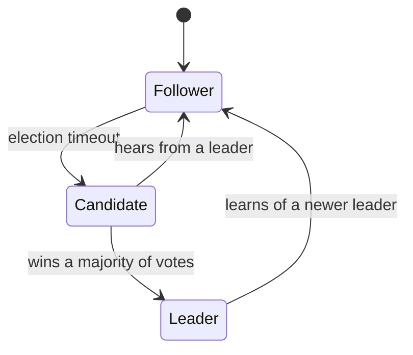
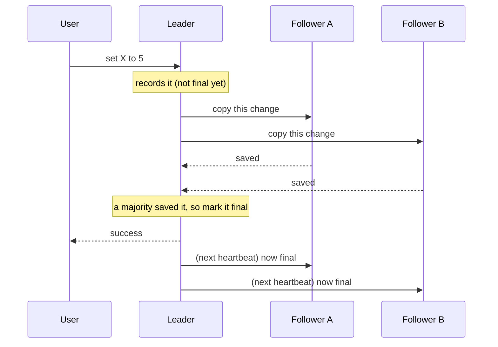
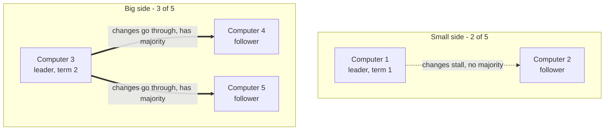
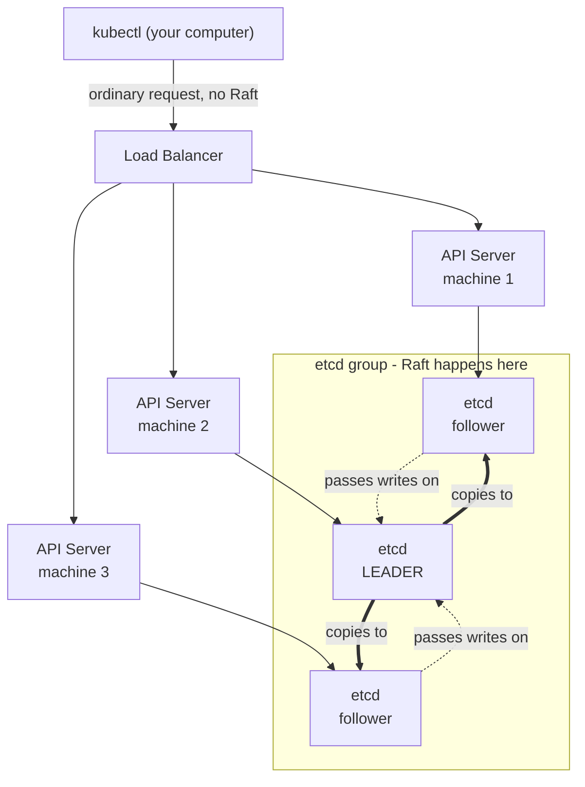

## Introduction

Any system that spreads data across several computers eventually runs into the same question: how do those computers agree on the same information when any of them might crash or briefly lose their network connection? This agreement problem is called **consensus**, and **Raft** is one of the most widely used ways to solve it. Anyone running Kubernetes already depends on Raft. It keeps `etcd`, the database behind the cluster, consistent.

## What Problem Does Raft Solve?

Imagine the same small database copied onto three computers. A user says "set the value of X to 5." If each computer accepted changes in whatever order they happened to arrive, the three copies would gradually drift apart, and the data could no longer be trusted.

Raft makes sure every computer applies the same changes in the same order. To manage that, every computer keeps a shared list of changes. Think of that list as a logbook. If all the logbooks are identical, and each computer follows its logbook step by step, then every computer ends up in exactly the same state. So the whole problem reduces to one goal: keep the logbooks identical.

Raft splits that goal into two jobs:

- **Leader election:** choose one computer to be in charge.
- **Log replication:** the leader accepts changes and copies them to every other computer.

## Core Concepts

A handful of terms come up again and again. Understanding these makes the rest straightforward.

| Term | What it means |
| --- | --- |
| **Follower** | A computer that listens and waits. It follows the leader and votes when asked. This is the normal, resting state. |
| **Candidate** | A follower that has stopped hearing from the leader and is now asking the others to vote for it. |
| **Leader** | The one computer in charge. It handles every change and shares it with the rest. |
| **Term** | A counting number that increases by one with each election, similar to a season number in sports. It lets computers tell a new leader apart from an old, out-of-date one. |
| **Majority** | More than half the computers. In a group of 3 that means 2; in a group of 5 it means 3. Nothing becomes official without a majority. |
| **Election timeout** | A short, random countdown each follower runs. If it reaches zero without hearing from a leader, that follower runs for leader. |
| **Committed** | A change is committed once a majority of computers have saved it. Committed changes are permanent and are never undone. |

Two facts drive almost everything in Raft: nothing counts as official without a majority, and a higher term number always beats a lower one. Nearly every rule in the algorithm follows from those two.

## Leader Election

When the group first starts up, every computer is a follower. Each follower runs its own countdown timer, and each timer is set to a slightly different, random length. Because the lengths differ, one timer almost always reaches zero first. The randomness is deliberate. Without it, every computer might try to become leader at the same instant and the group would deadlock.

The computer whose timer runs out first raises the term number, votes for itself, becomes a **candidate**, and asks every other computer for a vote. Each computer gives its vote to the first suitable candidate it hears from in that term, and only one vote per term. Win votes from a **majority**, and that candidate becomes the new leader.

Once a computer is leader, it sends short "I am still here" messages, called **heartbeats**, to everyone else at a steady interval. Each heartbeat resets the followers' countdown timers, which is what keeps them from starting their own election. If the heartbeats stop, the timers run out and a fresh election begins. That is exactly what happens when a leader crashes.

> **Note:** The random timing matters. If every computer used the exact same countdown, they would all run for leader at once, split the vote evenly, and never settle on a winner.

## How the Leader Shares Changes

Once a leader exists, it is the only computer allowed to accept changes. A single change moves through five steps:

1. **Receive:** a user sends the leader a change, such as "set X to 5."
2. **Record it:** the leader adds it to its own logbook, marked as not final yet.
3. **Share:** the leader sends the change to all the followers.
4. **Confirm:** each follower writes it into its own logbook and replies that it has saved it.
5. **Make it final:** once a majority have saved it, the leader marks the change as final (committed) and tells the user it succeeded.

> **Note:** In practice the leader does not send a separate "it is final now" message. It carries that information in the next heartbeat instead. The diagram shows it as its own step only to keep the idea clear.

Every time the leader shares a change, it also mentions the change that came just before it. A follower accepts the new change only if its own logbook matches at that point. A follower that has fallen behind gets repaired the same way: the leader steps back one change at a time until the two logbooks line up, then brings the follower forward again.

## The Rule That Keeps Data Safe

This rule is easy to overlook, but it is the reason Raft can be trusted at all.

**A computer will not vote for a candidate that has less data than it does.** When a candidate asks for votes, it states how up to date its own logbook is. A computer votes yes only if the candidate is at least as up to date as itself.

Consider what would happen without the rule. A computer that is missing some final changes could win an election and become the new leader. It would then force everyone to erase those changes to match its own out-of-date logbook, quietly destroying data that was meant to be permanent. The voting rule prevents this by guaranteeing that only a computer that already holds every final change can win. Because of that, changing leaders never loses committed data.

Term numbers take care of the rest. Every message carries a term number. If a computer ever sees a term higher than its own, it immediately steps down to follower and adopts the newer number. So an old leader that was cut off from the group and missed an election will recognize that it has been replaced the moment it reconnects.

## When Things Go Wrong

**A follower crashes.** This causes no disruption. The leader keeps trying to reach it, and the rest of the group continues, because a majority are still working. When the follower returns, it is brought back up to date automatically.

**The leader crashes.** The heartbeats stop, a follower's timer runs out, and the group elects a new leader, usually within a second or two.

**The network splits in two.** This is the most delicate case, and it is where the majority requirement proves its worth. Suppose a group of 5 computers is cut into a group of 2 (which happens to include the old leader) and a group of 3.

The small side still believes it has a leader, but that leader cannot reach a majority, so it cannot make any change final. Requests sent to it simply hang and never complete. The big side, meanwhile, notices the missing heartbeats, elects a new leader with a higher term number, and continues normally. For a short time it looks as though there are two leaders, but only the one with a majority can make progress.

When the network heals, the old leader sends a heartbeat carrying its now-outdated term number. The big side rejects it and replies with the newer number. Seeing a higher term, the old leader steps down to follower, and any unfinished changes it was holding are discarded and replaced with the correct, final data. Nothing that was ever made final is lost.

This is the **golden rule of Raft**: only the leader on the majority side, holding the highest term number, can permanently save data.

## Raft in the Real World: etcd and Kubernetes

A detail that often surprises Kubernetes users is that `kubectl` and the API servers know nothing about Raft. All of the agreement machinery sits in one place, `etcd`, the database that holds the entire state of the cluster.

A "highly available" Kubernetes setup usually means three main machines. Each one runs an **API server** (a front desk that receives requests) and an **`etcd` node**. The API servers are interchangeable, so a request can go to any of them. The `etcd` nodes form a Raft group, so exactly one of them is the leader at any moment and the other two are followers.

When a request is made to Kubernetes:

1. The request goes to whichever API server the load balancer selects. No Raft yet.
2. That API server needs to save the change, so it hands it to `etcd`.
3. If it reached a follower `etcd` node, the change is passed along to the `etcd` leader.
4. The `etcd` leader copies the change to the other `etcd` nodes using Raft. Once a majority confirm, it becomes final.
5. `etcd` tells the API server the change is saved, and the API server reports success.

So "multiple masters" in Kubernetes really means several interchangeable front desks in front of one carefully protected database. Whoever holds the `etcd` leader role effectively controls the cluster. Kubernetes also uses the same `etcd` group to make sure only one copy of its background helpers is active at a time. Those are the parts that scale and repair applications.

Running applications do not depend on `etcd` to stay up. If the entire `etcd` group fails, the programs already running keep serving their users, but the control system can no longer make changes or decisions. New changes cannot be applied, and Kubernetes cannot repair or scale anything until `etcd` returns. That is what makes regular `etcd` backups one of the most important routine tasks on a self-managed cluster.

## What Real Systems Add on Top

The ideas above are the core of Raft. Real systems such as `etcd` add a few more things so they hold up against real hardware and unreliable networks:

- **Saving to disk.** A computer writes down its term number, its vote, and its logbook to disk before replying, so that a restart cannot cause it to break the rules.
- **Trimming the logbook.** The list of changes would otherwise grow without limit, so computers periodically take a snapshot of the current state and discard the old history. A computer that is far behind can then be caught up with a snapshot instead of replaying everything from the beginning.
- **Adding and removing computers.** Changing the size of the group has to be done carefully, in steps, so that there is never a moment when two different majorities could exist at once.

None of these change the basic picture. Majority plus term number still decides everything. The rest is the engineering needed to keep the system reliable over time.

## Conclusion

Raft takes a hard problem, getting a group of computers to agree even when some of them fail, and reduces it to two ideas that are easy to picture: choose one leader, and copy an ordered list of changes to a majority. Randomized timers keep elections from stalling. Term numbers and the voting rule keep finished data safe when leaders change or the network splits. Once these ideas are clear, the behavior of any Raft-based system starts to make sense, including the `etcd` group that sits behind every Kubernetes cluster.

## References

- [In Search of an Understandable Consensus Algorithm (the Raft paper), by Ongaro and Ousterhout](https://raft.github.io/raft.pdf)
- [The Raft Consensus Algorithm, official site](https://raft.github.io/)
- [The Secret Lives of Data, an interactive step-by-step Raft visualization](http://thesecretlivesofdata.com/raft/)
- [etcd Documentation](https://etcd.io/docs/)
- [Kubernetes Components, where etcd sits in the control plane](https://kubernetes.io/docs/concepts/overview/components/)
